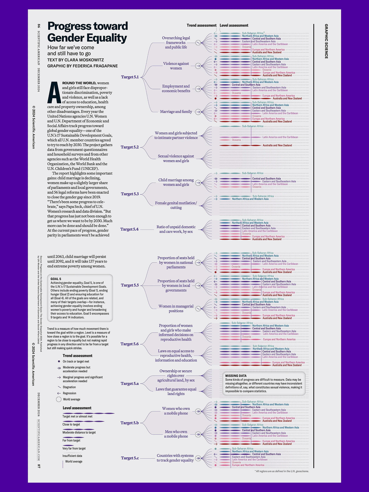
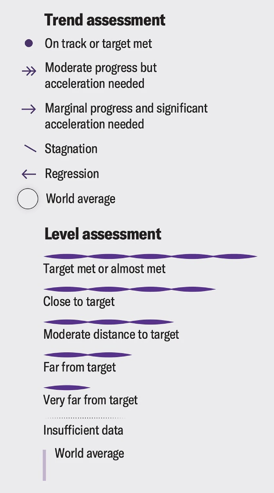

+++
author = "Yuichi Yazaki"
title = "Visualizing Progress Toward Gender Equality"
slug = "progress-toward-gender-equality"
date = "2025-10-05"
description = ""
categories = [
    "consume"
]
tags = [
    "オリジナルのビジュアル変換",
]
image = "images/cover.png"
+++

This visualization by **Federica Fragapane** appeared in the December 2024 issue of **Scientific American**. It shows regional progress toward the United Nations Sustainable Development Goal 5: **Gender Equality**.

Based mainly on reports from **UN Women** and **UN DESA**, it compares progress by region and indicator using two dimensions: trend and level. The accompanying text was written by **Clara Moskowitz**.

<!--more-->

## Why the Visualization Matters

Fragapane's flowing lines and layered structure make uneven global progress visible. The work shows not only where gender equality is improving, but also where progress is too slow, stagnant, or reversing.

The design helps readers compare delays in Sub-Saharan Africa and Southern Asia, partial stagnation in Europe and Northern America, and the broader unevenness of global gender policy.

## How to Read the Legend

The graphic uses two assessment systems.

### Trend Assessment

Trend marks show the direction and speed of change:

- **On track or target met**
- **Moderate progress but acceleration needed**
- **Marginal progress and significant acceleration needed**
- **Stagnation**
- **Regression**
- **World average**

### Level Assessment

The level marks show how close a region is to the target:

- Target met or almost met
- Close to target
- Moderate distance to target
- Far from target
- Very far from target
- Insufficient data
- World average

## SDG Goal 5

Goal 5 covers a broad policy field: discrimination, violence, early and forced marriage, unpaid care work, political participation, reproductive rights, economic resources, technology access, and legal frameworks.

Some indicators suffer from missing data, which is itself a major issue. The visualization calls attention to this through the "missing data" sections.

## Regional Classification

The regions follow the United Nations geoscheme used in the SDG framework, including:

- Sub-Saharan Africa
- Northern Africa and Western Asia
- Central and Southern Asia
- Eastern and Southeastern Asia
- Latin America and the Caribbean
- Oceania
- Europe and Northern America

## Summary

This work makes clear that gender equality is not a single metric but a multidimensional policy challenge. By combining trend and level, it allows readers to see both current distance from targets and the speed at which regions are moving.

## References

- [Tracking Gender Equality — Behance](https://www.behance.net/gallery/214611933/Tracking-Gender-Equality)
- [Scientific American: See How Close We Are to Gender Equality around the World](https://www.scientificamerican.com/article/see-how-close-we-are-to-gender-equality-around-the-world/)
- [SDGs Japan: Goal 5](https://www.sdgs-japan.net/goal5)
- [Our World in Data: World regions in the SDG framework](https://ourworldindata.org/grapher/world-regions-sdg-united-nations)
