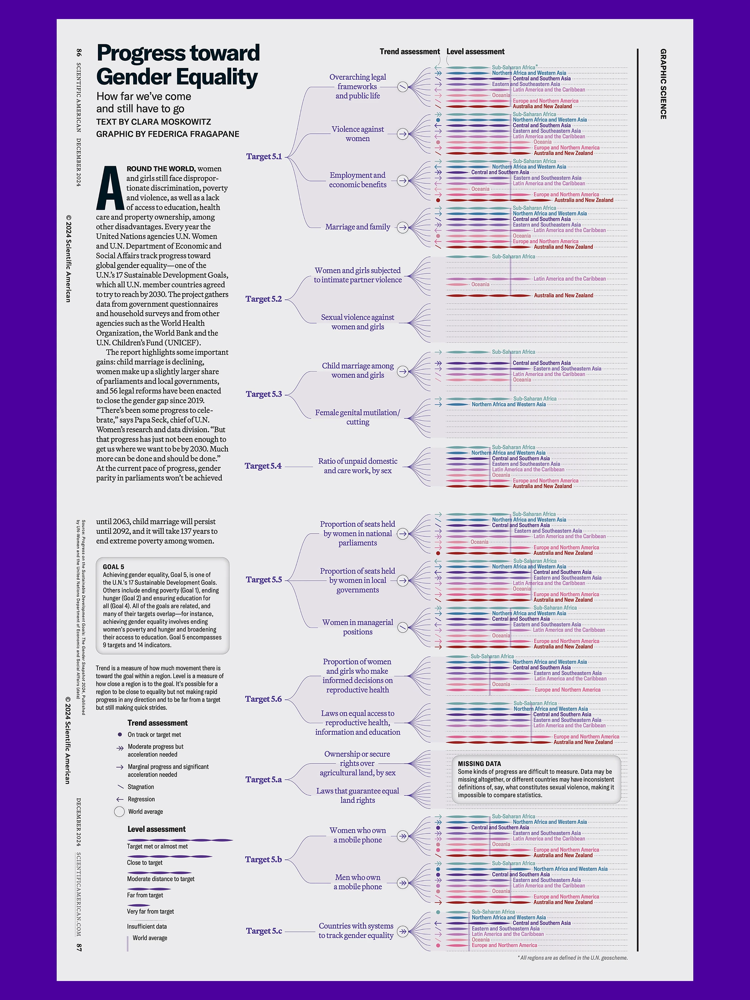
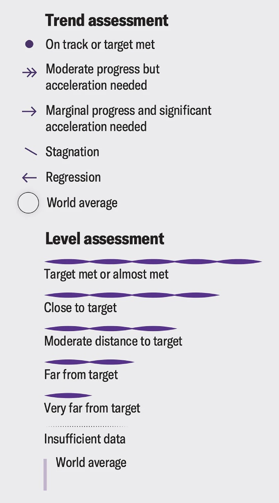

+++
author = "Yuichi Yazaki"
title = "ジェンダー平等への進展の可視化"
slug = "progress-toward-gender-equality"
date = "2025-10-05"
description = ""
categories = [
    "consume"
]
tags = [
    ""
]
image = "images/cover.png"
+++

本作は Federica Fragapane による作品で **Scientific American (2024年12月号)** に掲載されたものです。  
国連の **持続可能な開発目標（SDGs）Goal 5「ジェンダー平等を実現しよう」** に関する達成度を、地域別・指標別に体系的に可視化したデータ可視化作品です。  
データは主に **UN Women** および **UN DESA（国連経済社会局）** のレポートに基づき、各地域の進展状況を「トレンド（変化の方向）」と「レベル（目標達成度）」の2軸で比較しています。  
テキストは **Clara Moskowitz** によるもので、男女平等の現状と課題を科学誌読者向けに要約しています。

<!--more-->

## この可視化の意義

Fragapaneの特徴である「 **柔らかく流れるライン構成と多層データの視覚統合** 」がここでも発揮されています。  
線の分岐と色のグラデーションが、**政策領域間の関係性**を直感的に理解させるとともに、  
数値以上に「世界全体の進展のムラ」を印象づけます。  
特に **サハラ以南アフリカや南アジアの遅れ** 、 **欧州・北米の部分的停滞** などが可視的に比較できます。  

本作品は、単なる統計の集積ではなく **ジェンダー平等をめぐる構造的不均衡を美しく、同時に批判的に描く** 情報デザインとして評価されます。

## 凡例の見方

本作品の評価は2軸構成で示されています。

### Trend assessment（進展傾向）

各指標における「変化の方向と速さ」を示します。  
矢印の形状と向きで、進展・停滞・後退の度合いを視覚化しています。

- ● **On track or target met**  
  目標をすでに達成、または順調に達成軌道にある。

- ⇛ **Moderate progress but acceleration needed**  
  一定の進展はあるが、目標到達には加速が必要。

- → **Marginal progress and significant acceleration needed**  
  ごくわずかな進展のみで、大幅な加速が求められる。

- ⟍ **Stagnation**  
  停滞、進展が見られない。

- ← **Regression**  
  後退、状況が悪化している。

- ○ **World average**  
  世界平均の基準値を示す。

### Level assessment（現状レベル）

各地域が目標達成にどれだけ近いかを表します。  
線の長さと濃淡で「距離感」を段階的に表現しています。

- **Target met or almost met**  
  目標を達成、もしくはほぼ達成している。

- **Close to target**  
  目標に近い水準。

- **Moderate distance to target**  
  目標から中程度に離れている。

- **Far from target**  
  目標から遠い。

- **Very far from target**  
  目標から非常に遠い。

- ····· **Insufficient data**  
  データが不十分なため評価できない。

- │ **World average**  
  世界平均を示す基準線。

## 背景知識：SDG目標5と指標の体系

- **目標5: ジェンダー平等を実現しよう**  
  SDGsの中でも特に包括的な目標で、法制度、暴力撤廃、教育、経済、政治参加など、多領域を横断します。  

- 5.1 あらゆる場所における全ての女性及び少女に対するあらゆる形態の差別を撤廃する。
- 5.2 人身売買や性的、その他の種類の搾取など、全ての女性及び少女に対する、公共・私的空間におけるあらゆる形態の暴力を排除する。
- 5.3 未成年者の結婚、早期結婚、強制結婚及び女性器切除など、あらゆる有害な慣行を撤廃する。
- 5.4 公共のサービス、インフラ及び社会保障政策の提供、並びに各国の状況に応じた世帯・家族内における責任分担を通じて、無報酬の育児・介護や家事労働を認識・評価する。
- 5.5 政治、経済、公共分野でのあらゆるレベルの意思決定において、完全かつ効果的な女性の参画及び平等なリーダーシップの機会を確保する。
- 5.6 国際人口・開発会議（ICPD）の行動計画及び北京行動綱領、並びにこれらの検証会議の成果文書に従い、性と生殖に関する健康及び権利への普遍的アクセスを確保する。
- 5.a 女性に対し、経済的資源に対する同等の権利、並びに各国法に従い、オーナーシップ及び土地その他の財産、金融サービス、相続財産、天然資源に対するアクセスを与えるための改革に着手する。
- 5.b 女性の能力強化促進のため、ICTをはじめとする実現技術の活用を強化する。
- 5.c ジェンダー平等の促進、並びに全ての女性及び少女のあらゆるレベルでの能力強化のための適正な政策及び拘束力のある法規を導入・強化する。

これらの指標の中には **国・地域単位でデータの欠損が多い** ことが課題のものもあり、図中の「MISSING DATA」枠でその点が注意喚起されています。

## 背景知識：地域区分について

本図で使用されている地域名は **国連統計部（UNSD: United Nations Statistics Division）による「UN geoscheme（国連地理的地域区分）」** に基づいています。この分類は、地理的・統計的整合性を保つために設計されたもので、政治的・文化的な境界とは必ずしも一致しません。

- Sub-Saharan Africa
- Northern Africa and Western Asia
- Central and Southern Asia
- Easten and Southeasten Asia
- Latin America and the Caribbean
- Oceania
- Europe and Northern America

## まとめ

この作品は、ジェンダー平等の達成がいかに多次元的な課題であるかを可視化したものです。  
「進展の速度」と「到達レベル」という二重の視点は、政策評価の枠組みを理解するうえで極めて有効です。  
またFragapaneらしい繊細な構成によって、複雑な国際指標データが一枚で俯瞰できるデザインとして仕上がっています。  

## 参考・出典

- [Tracking Gender Equality :: Behance](https://www.behance.net/gallery/214611933/Tracking-Gender-Equality)
- [See How Close We Are to Gender Equality around the World :: Scientific American](https://www.scientificamerican.com/article/see-how-close-we-are-to-gender-equality-around-the-world/)
- [目標5 | SDGsジャパン](https://www.sdgs-japan.net/goal5)
- [World regions in the SDG framework of the United Nations](https://ourworldindata.org/grapher/world-regions-sdg-united-nations)
