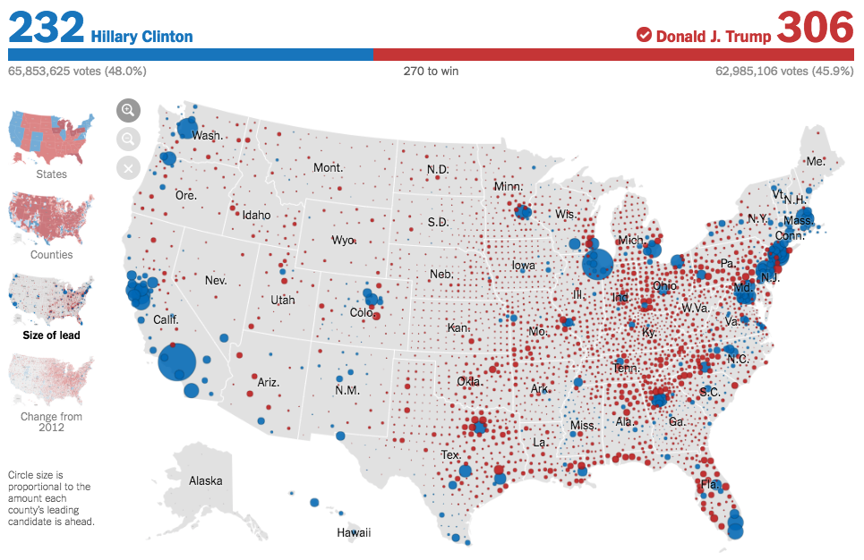

+++
author = "Yuichi Yazaki"
title = "比例シンボル・マップ(Proportional Symbol Map)"
slug = "proportional-symbol-map"
date = "2020-08-04"
categories = [
    "chart"
]
tags = [
    "地図",
]
image = "images/1_sVDldGcKHfB10ZU31PfgWg.png"
+++

## どんな地図？

**離散データを階級分類せず**、シンボルの大きさという視覚的変数で表現する地図です。階級分類するものは等級シンボル・マップと呼ばれます。

シンボルの形状は円がよく利用されますが、円だけに限定されるものではなく、三角形や四角形も利用されます。円グラフが用いられる場合もあります（その場合、チャート・グラフと呼ばれます）。

サイズは、表現されるデータ値に比例しますが、それが存在する地理的領域に依存しないため、コロプレスマップで発生してしまうデータ値と地理的領域の大きさの混乱問題を回避することができます。

## 作例

#### 大統領選挙の結果：ドナルドJ.トランプ氏が勝利

<figure>

<figcaption>

[Presidential Election Results: Donald J. Trump Wins](https://www.nytimes.com/elections/results/president)

</figcaption>

</figure>

#### カリフォルニアの各郡（county）にはコロナウイルスの症例がいくつあるのか？

<figure>

<figcaption>

[How Many Coronavirus Cases Are in Each California County?](https://www.nytimes.com/2020/04/04/us/coronavirus-cases-california-county.html)

</figcaption>

</figure>

## 参考文献

- Isabel Meirelles — Design For Information
