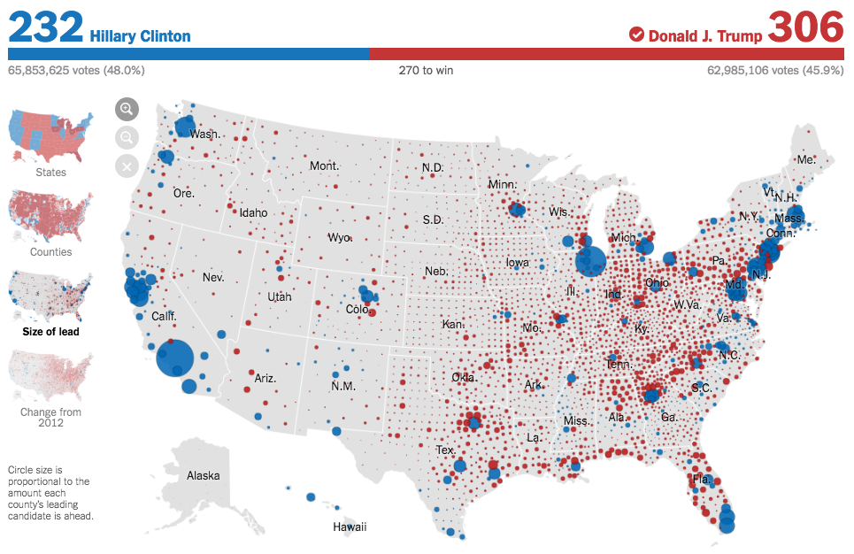
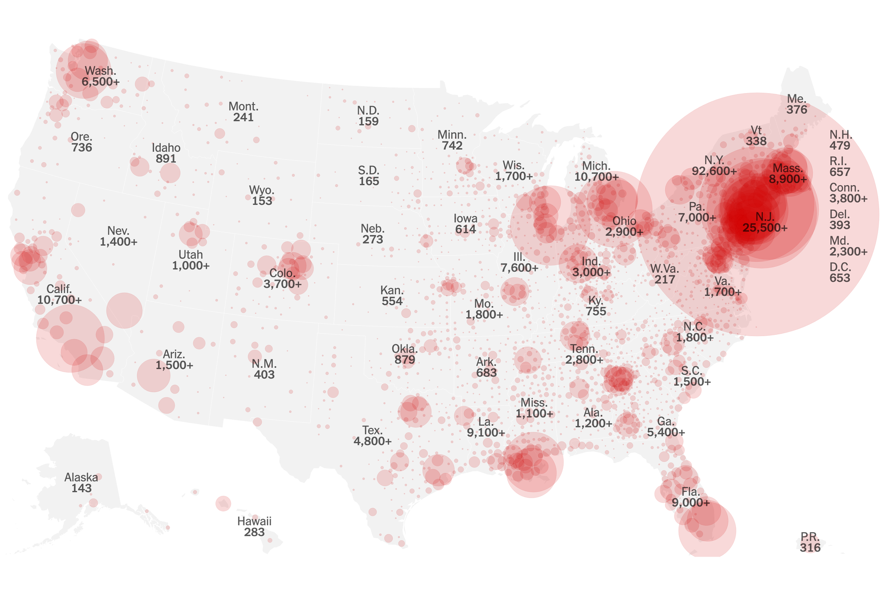

+++
author = "Yuichi Yazaki"
title = "比例的シンボル・マップ（Proportional Symbol Map）"
slug = "proportional-symbol-map"
date = "2020-08-04"
categories = [
    "chart"
]
tags = [
    "地図",
]
image = "images/1_sVDldGcKHfB10ZU31PfgWg.png"
+++

比例的シンボル・マップ（Proportional Symbol Map）は、**離散データを階級分類せずに、データ値に直接比例したサイズのシンボルで地図上に表現する手法**です。シンボルの大きさがデータの数量を直接反映するため、個々の地点間の値の違いを連続的に比較することができます。データを階級分類して段階的なサイズを割り当てるものは、段階的シンボル・マップ（Graduated Symbol Map）と呼ばれ、区別されます。

<!--more-->

<figure>



<figcaption>

[Presidential Election Results: Donald J. Trump Wins](https://www.nytimes.com/elections/results/president)

</figcaption>

</figure>



## 別名

なし

## 歴史的経緯

比例シンボルを用いた地図表現は、19世紀半ばに統計データの地図化が進む中で発展しました。初期の事例として、アイルランドの鉄道エンジニアHenry Drury Harnessが1837年に交通量を円の大きさで表した地図が知られています。20世紀に入ると、Jacques Bertinが視覚変数の理論（1967年）を体系化し、サイズが数量表現に適した視覚変数であることを明確に位置づけました。現在ではGISソフトウェアやWebマッピングライブラリにより、比例シンボル・マップを容易に作成できるようになっています。

## データ構造

| 項目 | 内容 |
|------|------|
| 地点識別子 | 各データポイントの位置を示す名称・コード（例：都市名、国名） |
| 緯度（Latitude） | データポイントの地理的な緯度座標 |
| 経度（Longitude） | データポイントの地理的な経度座標 |
| 数量値 | 各地点に対応する数値データ（例：人口、感染者数、投票数） |

数量値がシンボルのサイズに直接比例して反映されます。階級分類は行いません。

## 目的

比例的シンボル・マップの主な目的は、各地点のデータ値の大小を、シンボルのサイズを通じて連続的かつ直感的に比較することです。階級分類を行わないため、データの粒度を損なうことなく、個々の値の違いを忠実に表現できます。また、シンボルのサイズが地理的領域の面積に依存しないため、コロプレスマップで生じるデータ値と地理的面積の混同を回避できます。

## ユースケース

- 各国・各都市の人口規模の比較表示
- 感染症の地域別感染者数の可視化
- 選挙における各選挙区の投票数の表示
- 企業の拠点ごとの売上や従業員数の比較
- 地震のマグニチュードの地理的分布の表現

## 特徴

- データ値に直接比例したシンボルサイズを表示するため、階級分類による情報の損失がありません
- シンボルのサイズが地理的領域の面積に依存しないため、面積バイアスを回避できます
- シンボルの形状は円が最も一般的ですが、三角形や四角形も利用されます
- 円グラフをシンボルとして用いる場合はチャート・マップと呼ばれることもあります
- 段階的シンボル・マップと比較して、値の連続的な変化を表現できますが、正確な値の読み取りはやや困難になります

## チャートの見方

| 要素 | 説明 |
|------|------|
| シンボルの位置 | データポイントの地理的位置を示します |
| シンボルの大きさ | データ値に直接比例します。大きいほど値が大きいことを意味します |
| 凡例 | 代表的なサイズと対応する数値を示し、読者がスケールを理解するための参照となります |
| シンボルの色 | カテゴリの区別や追加属性の表現に使われることがあります |

シンボル間の大きさの比較によって、地点ごとのデータ値の相対的な差異を読み取ります。凡例の参照値を基準にして、おおよその数量を推定します。

## デザイン上の注意点

- シンボルの面積（円の場合は面積）でデータ値を表現するのが一般的です。半径や直径に比例させると、大きな値が過度に強調されてしまいます
- 人間の知覚はシンボルの面積を過小評価する傾向があるため、Flanneryの知覚的スケーリングなどの補正手法を検討することが推奨されます
- シンボルが密集する地域では重なりが生じるため、透明度の設定や小さいシンボルを前面に配置するなどの工夫が必要です
- 凡例には複数の参照サイズを表示し、読者がスケールを直感的に理解できるようにします
- 極端に大きい値と小さい値の差が大きい場合、小さいシンボルが見えにくくなるため、最小サイズの設定を検討します

## 応用例

- 大統領選挙結果の可視化：各郡の投票数を比例シンボルで表現し、面積に左右されない選挙結果の把握に活用された事例があります
- コロナウイルス感染者数マップ：各地域の感染者数を円の大きさで表現し、感染拡大の状況をリアルタイムに可視化した事例が多数あります
- 地震マグニチュード分布：地震の発生地点とマグニチュードを比例シンボルで表示し、地震活動の空間パターンを把握する分析に活用されています

## 代替例

- **段階的シンボル・マップ（Graduated Symbol Map）**：データ値を階級分類して段階的なサイズのシンボルで表現する手法です。読み取りやすさが向上しますが、データの粒度は低下します
- **コロプレスマップ（Choropleth Map）**：地域の面積を色の濃淡で塗り分けて数量を表現する手法です
- **カルトグラム（Cartogram）**：地域の面積そのものをデータ値に応じて変形させる手法です
- **ドット密度マップ（Dot Density Map）**：ドットの密度で数量を表現する手法です

## まとめ

比例的シンボル・マップは、データ値に直接比例したシンボルのサイズで数量を表現するため、階級分類による情報の損失がなく、値の連続的な比較が可能な手法です。コロプレスマップの面積バイアスを回避できる利点がある一方で、シンボルの重なりや知覚的なスケーリングの問題には注意が必要です。正確な値の読み取りよりも相対的な比較を重視する場面に適しています。

## 参考・出典

```
- [Proportional symbol map - Wikipedia](https://en.wikipedia.org/wiki/Proportional_symbol_map)
- [Proportional symbology - ArcGIS Pro Documentation](https://pro.arcgis.com/en/pro-app/latest/help/mapping/layer-properties/proportional-symbology.htm)
- [Proportional Symbols - Axis Maps Guide](https://www.axismaps.com/guide/proportional-symbols)
- [Thematic map - Wikipedia](https://en.wikipedia.org/wiki/Thematic_map)
```
