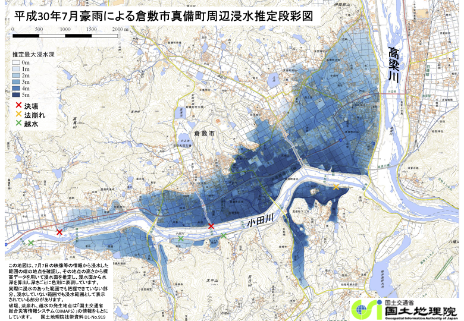
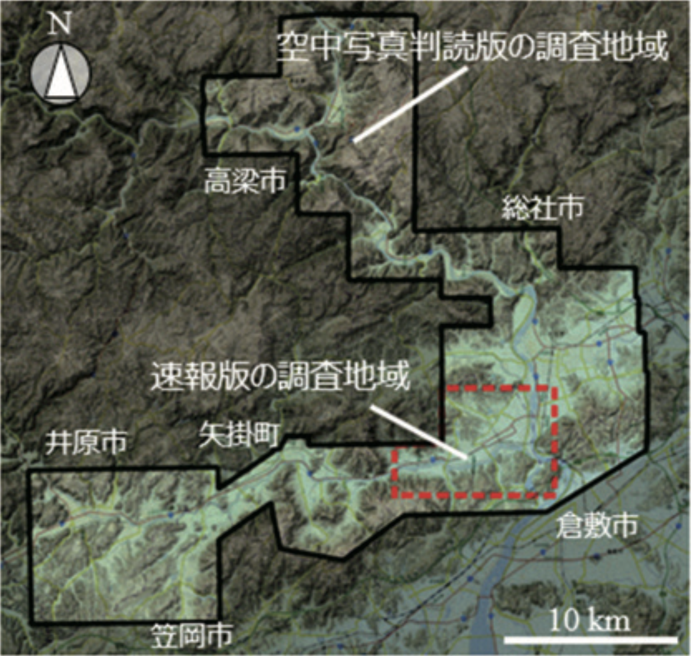
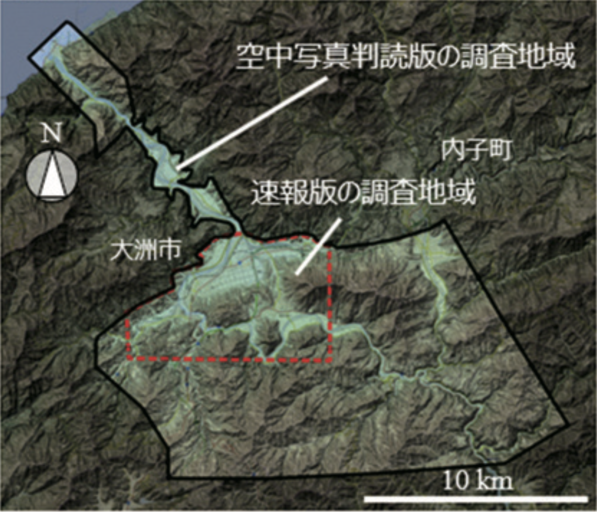

+++
author = "Yuichi Yazaki"
title = "浸水推定図とは？ 国土地理院が生んだ新しい水害可視化の手法"
slug = "provisional-inundation-depth-map"
date = "2025-09-24"
description = ""
categories = [
    "consume"
]
tags = [
    "",
]
image = "images/provisional-inundation-depth-map.png"
+++

平成30年7月の豪雨では、西日本各地で大規模な氾濫が発生しました。倉敷市真備町や大洲市では、市街地を含む広範な地域が水没し、被害は甚大でした。

このとき国土地理院の職員が着目したのが SNSに投稿された被災現場の写真や映像 でした。市民が投稿した画像から水際の位置を特定し、航空レーザ測量による標高データ（5m DEM）と組み合わせることで、浸水範囲と水深を即座に推定。こうして試作されたのが 「浸水推定段彩図（速報版）」 です。

<!--more-->

7月7日に作成され、翌8日には関係機関に提供、9日には非常災害対策本部で水害対応の判断資料として使われました。そして10日には国土地理院ウェブサイトで一般公開されます。
これはトップダウンの指示ではなく、**現場職員のアイデアから始まった「ボトムアップの挑戦」** でした。

## 従来手法と速報版 ― 補完的な位置づけ

従来の浸水把握には、航空機による空撮や空中写真判読が使われてきました。これは浸水範囲を的確に捉える確実な方法ですが、発災直後には天候や飛行準備の制約から撮影まで時間がかかる場合があります。

この課題を補うために導入されたのが、SNS投稿＋標高データを活用する速報版でした。
速報版は、現場の「いま」を迅速に把握するのに役立ち、その後に実施される空中写真や衛星画像、現地調査など他の手法とあわせて、被害の全体像を捉えるための重要な情報のひとつとなりました。

## どうやって作られるのか

速報版の仕組みはシンプルですが、効果的でした。

- 1. SNS画像の位置を特定...投稿された写真の撮影地点をウェブ地図で同定し、水がどこまで達しているかを把握。
- 2. 水面標高を読み取る...水際の標高をDEMから取得し、堤防ごとに異なる水位を複数計測。
- 3. 浸水範囲と水深を可視化...水面標高より低い範囲を浸水域とし、標高差を水深として青の濃淡で表現。

市民の一枚の写真が、地域全体の“面”の浸水状況へと変換される仕組みです。

一方で、空中写真を利用した手法は引き続き実施され、浸水痕跡から最大浸水範囲を把握するなど、より精度の高い情報を提供しました 。

## 実績としての「速報性」

国交省の白書でも、浸水推定図の速報性は高く評価されています。
たとえば 令和2年7月豪雨 では、災害発生当日の 7月4日16時に第一報を公開。その後も追加の図を段階的に公開し、被災地の初動対応に役立ちました【国交省白書2021】。

この「数時間以内に浸水状況を可視化できる」という即時性は、従来の空中写真や現地調査では実現が難しかった点であり、浸水推定図の最大の特徴です。

## 定着と現在

SNS投稿を利用した速報版は、その有効性がすぐに認められ、以後の災害でも繰り返し活用されるようになりました。
現在では PDF・地理院タイル・GeoJSON として公開され、行政・報道・研究者・市民が自由に利用できる「水害可視化の共通基盤」となっています。

ここで重要なのは、浸水推定図が他の水害対策や調査手法を置き換えるものではないということです。
むしろ、さまざまな手法のひとつとして組み合わされ、初動から復旧までの判断を支える存在になっているのです。

## まとめ

浸水推定図は、従来の確実な調査手法に新しく加わった“速報性重視のアプローチ”です。
市民の発信と国が保有する地形データを組み合わせるという発想が、いまや災害対応の即時性を支える重要なツールとなりました。

その出発点には、公式手順の外から「やってみよう」と挑んだ職員の工夫と、市民が撮影した一枚の写真がありました。

## 参考・出典

- [吉田和樹: 平成30年7月豪雨における浸水推定段彩図の作成（国土地理院時報132号）](https://www.gsi.go.jp/REPORT/JIHO/vol132-abst-05.html?utm_source=chatgpt.com)  
- [国交省: 国土交通白書2021 コラム 水害発生時における浸水推定図の作成について](https://www.mlit.go.jp/hakusyo/mlit/r03/hakusho/r04/html/nj020c02.html?utm_source=chatgpt.com)  
- [国土地理院: 平成30年7月豪雨に関する情報](https://www.gsi.go.jp/BOUSAI/H30.taihuu7gou.html?utm_source=chatgpt.com)  
- [国土地理院: 浸水推定図の地理院タイル一覧](https://maps.gsi.go.jp/development/ichiran.html#suisui?utm_source=chatgpt.com)  
- [国土地理院: 防災関連情報（災害別ページ）](https://www.gsi.go.jp/BOUSAI/index.html?utm_source=chatgpt.com)  