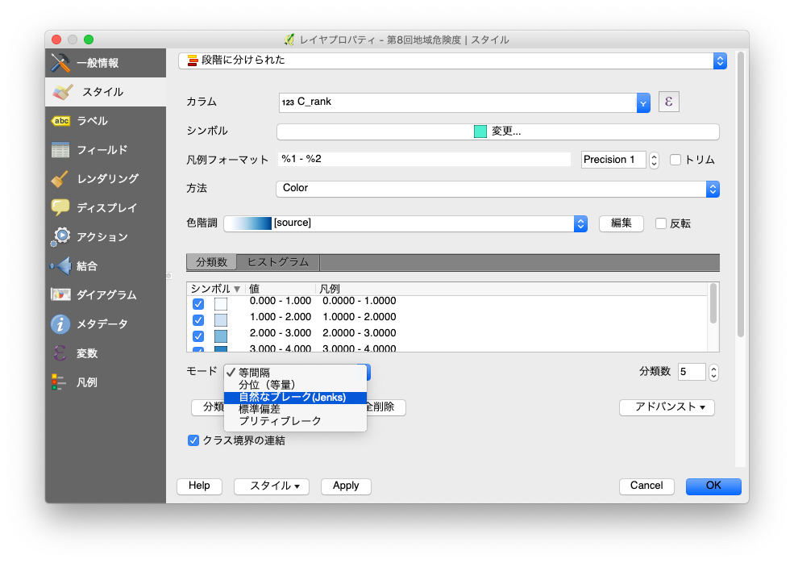

+++
author = "Yuichi Yazaki"
title = "QGISにおける階級分類"
slug = "qgis-classification"
date = "2020-02-27"
categories = [
    "technology"
]
tags = [
    "qgis","地図"
]
image = "images/qgis_jenks.png"
+++

QGISでの階級分類をご紹介します。アプリケーション上では「モード」と呼ばれています。

**等間隔**：各階級のサイズが同じです（例：0〜16および4つのクラスの値、各クラスのサイズは4）。

**分位（等量）**：各階級の内部には同じ数の要素があります（箱ひげ図の考え方）。

**自然なブレーク（Jenks）**：各階級内の分散は最小ですが、階級間の分散は最大です。

**標準偏差**：階級は、値の標準偏差に基づいて構築されます。

**プリティブレーク**：xの値の範囲をカバーする約n+1個の等間隔のnice値のシーケンスを計算します。値は、10の累乗の1、2、または5倍になるように選択されます（R統計環境の値に基づいています）。
