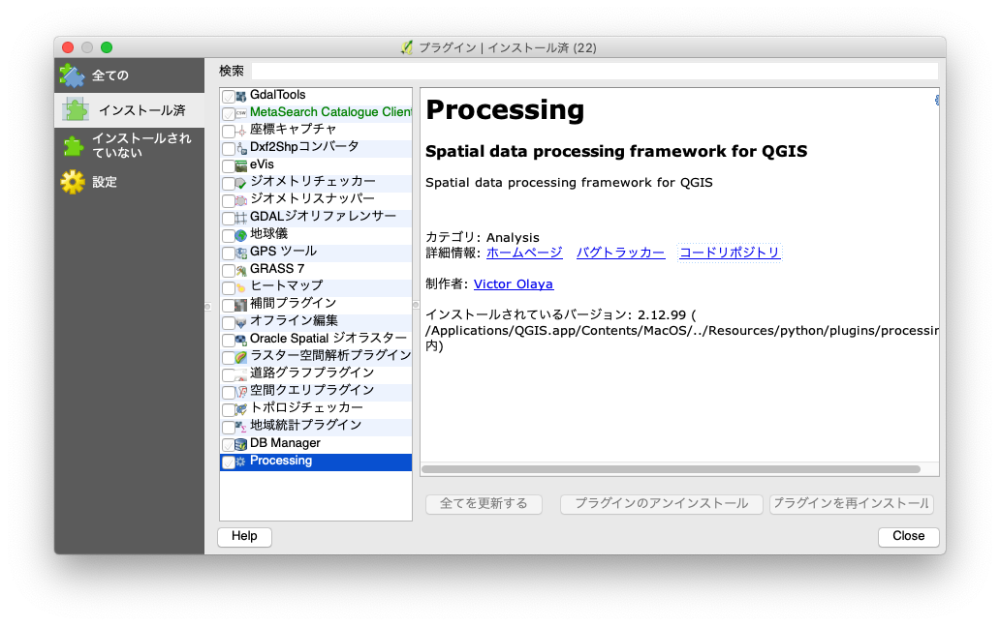

+++
author = "Yuichi Yazaki"
title = "QGISで、fToolsとGDALToolsが見当たらない?"
slug = "qgis-processing"
date = "2020-02-23"
categories = [
    "technology"
]
tags = [
    "qgis","地図"
]
image = "images/qgis_processing.png"
+++

QGISのfToolsとGDALToolsの両プラグインはQGISのコアプラグインから削除され、Processingフレームワークへ統合されました。

QGISをインストールしたタイミングによっては、お使いのQGIS上で利用可能かもしれませんが、今後はこの形態では提供されないことになります。

[QEP 54: Dropping fTools and GDALTools core plugins in favor of the Processing · Issue #54 · qgis/QGIS-Enhancement-Proposals](https://github.com/qgis/QGIS-Enhancement-Proposals/issues/54)

メニュー項目として後ろから3番目あたりに「プロセッシング」というメニューが表示されていれば、そちらから利用できます。

表示されていない場合は、「プラグインの管理とインストール」から入手します。

