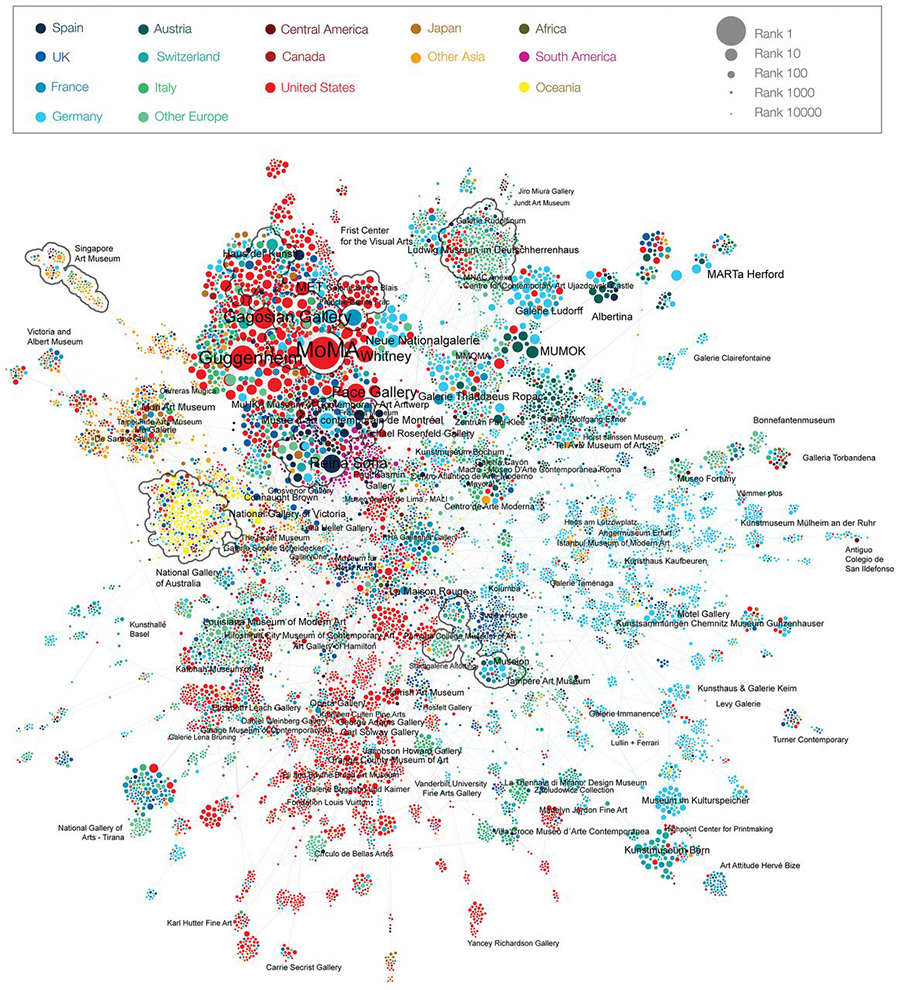

+++
author = "Yuichi Yazaki"
title = "The Structure of the Art World Revealed by Network Science"
slug = "quantifying-reputation-and-success-in-art"
date = "2025-11-20"
categories = [
    "consume"
]
tags = [
    "",
]
image = "images/cover_quantifying-reputation-and-success-in-art.png"
+++

This visualization shows a large network built from exhibition histories at museums and galleries around the world. It quantitatively reveals which institutions occupy the center of the art world and which sit at the periphery.

<!--more-->

The figure comes from the co-exhibition network published in the 2018 *Science* paper "Quantifying reputation and success in art" by Albert-Laszlo Barabasi and collaborators.

Barabasi is known for work on scale-free networks and preferential attachment. This study was notable because it showed that artistic careers also follow measurable network structures.

## Data Background

The research assembled exhibition histories spanning decades, countries, institutions, and hundreds of thousands of artists. Institutions are connected when they exhibit the same artists, creating a network of shared reputation and mobility.

## Why It Matters

The visualization suggests that success in art is not only an individual matter. Institutional position and network access strongly affect career trajectories. Moving through central institutions can shape visibility and opportunity.

## How to Read It

Clusters indicate groups of institutions with shared exhibition patterns. Central nodes are more strongly connected to other influential institutions. Peripheral nodes are less connected to the core network.

## Summary

This work demonstrates how network science can quantify reputation systems that often feel qualitative or opaque. It reveals the art world as a structured network of institutions and career pathways.
