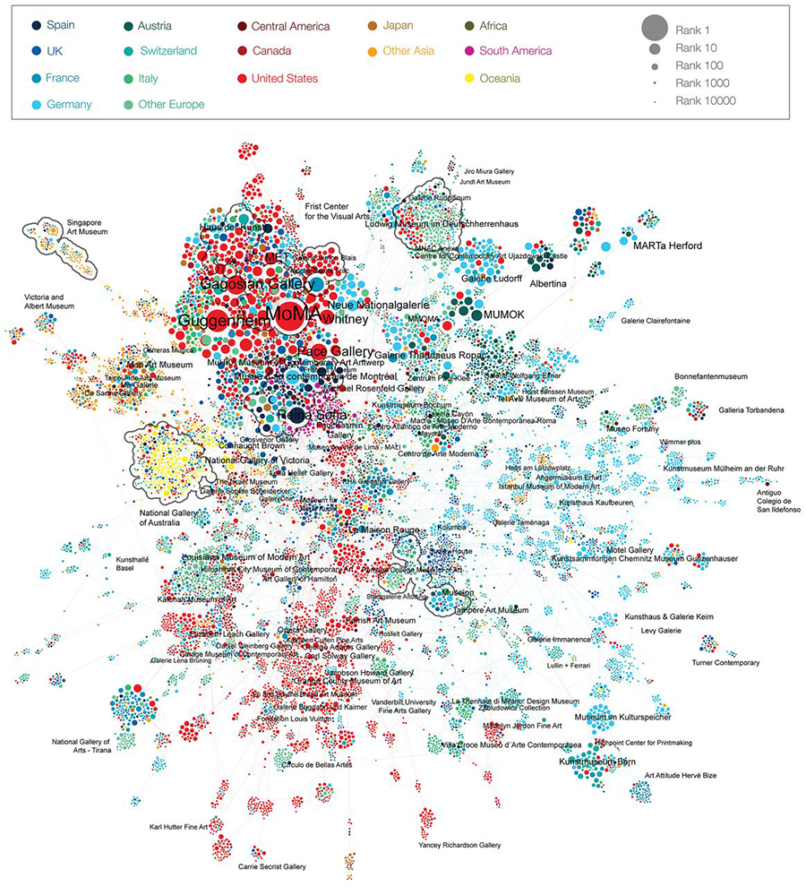
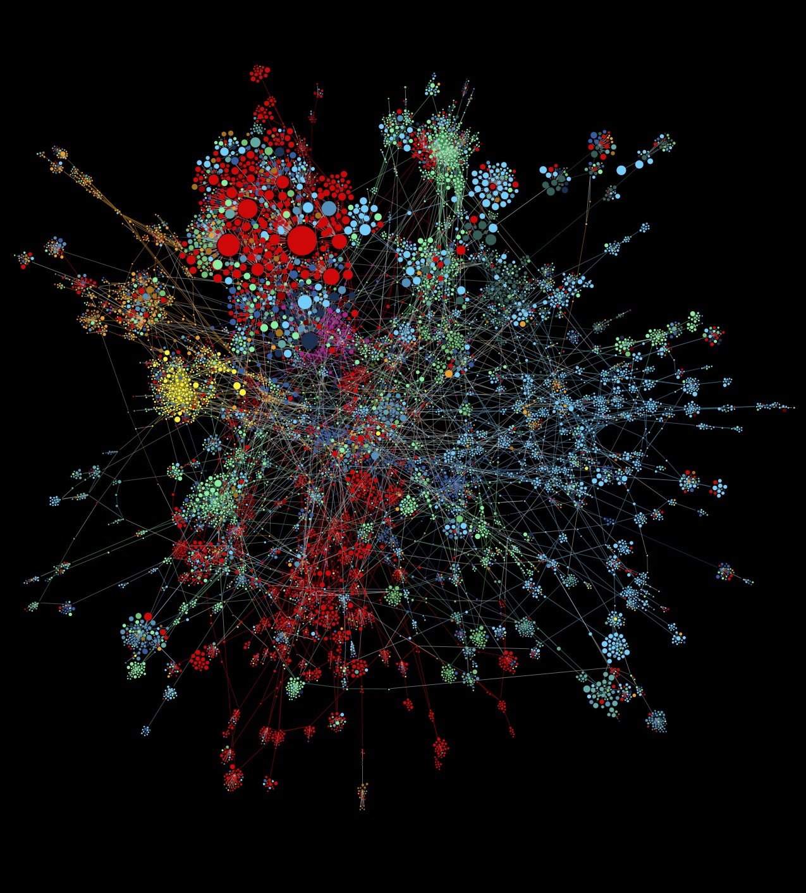

+++
author = "Yuichi Yazaki"
title = "ネットワーク科学の大家 Barabási が明らかにした「アート界の構造」"
slug = "quantifying-reputation-and-success-in-art"
date = "2025-11-20"
categories = [
    "consume"
]
tags = [
    "",
]
image = "images/cover_quantifying-reputation-and-success-in-art.png"
+++

この可視化は、世界中の美術館・ギャラリーの展示履歴を基に形成された巨大なネットワークを視覚化し、どのインスティテューションが「中心」で、どこが「周縁」かを定量的に示したものです。

<!--more-->

この可視化は、Albert-László Barabási（アルベルト＝ラズロ・バラバシ） を中心とする研究チームが、Science（2018）に発表した論文 “Quantifying reputation and success in art” に掲載された Coexhibition Network（共展示ネットワーク） の図です。

バラバシは「スケールフリー・ネットワーク」「優先的選択（preferential attachment）」の理論で知られ、複雑ネットワーク研究の世界的権威です。この研究は、アート界のキャリア形成もネットワーク科学の法則に従う ことを初めて実証的に示した点で画期的です。

## データの背景：36年・143か国・50万人のアーティストを結びつけた「全地球規模のネットワーク」

研究は 1980–2016 年の 36 年間にわたり、

- 143か国
- 16,002 ギャラリー
- 7,568 美術館
- 1,239 オークションハウス
- 約 50 万人のアーティスト

の展示履歴を、全世界レベルで収集し、Barabási Lab が専門とする ネットワークモデル化 によって分析しています。

“アーティストがいつ・どこで展示されたか” という経路を時系列でつなげることで、美術館・ギャラリー間の「共起（co-exhibition）」関係が明らかになり、その総体がこの巨大ネットワークを形成しています。

バラバシの研究領域である「ネットワーク中心性」「スケールフリー構造」「階層的クラスター」の概念が、そのままアート界に適用されているのが特徴です。

## 図の読み方：点（ノード）、色、位置が示すもの

### ノード（点）＝美術館・ギャラリー

点の大きさはネットワーク中心性（eigenvector centrality）に基づく「格」を示します。
- Rank 1（巨大ノード）：世界最高位のインスティテューション
- Rank 10〜100：主要クラスター
- Rank 1000〜10000：周辺部のローカル機関

### 色＝国・地域

凡例に示される通り、国・地域ごとのカラーリングでコミュニティのまとまりを視覚化しています。

### 位置＝ネットワーク上の力学配置（force layout）

地図ではなく、共起量の多い施設同士が互いに近く、関係が薄い施設は遠く離れる ネットワーク図です。これはバラバシが提唱してきた “ハブとスポーク” の構造をそのまま視覚的に示します。

## “Holy Land”：アート界の中心がどこかをネットワークが暴く

図の中心に巨大なクラスターが見えます。ここが研究で “Holy Land（聖地）” と呼ばれる領域で、
- MoMA
- Guggenheim
- The Met
- Tate
- Centre Pompidou

など、少数のトップ美術館・ギャラリーが集まっています。

この中央部は、バラバシが他の分野でも発見している「極端に集中したハブ構造（スケールフリー構造）」と一致しており、
アート界はネットワーク科学の法則（Preferential Attachment）に従って階層化している
ことを示す決定的な証拠になっています。

## 周辺部 “Island Networks”：なぜ多くのアーティストは中心に近づけないのか

Holy Land から離れるにつれ、小さく密度の低い島のようなクラスターが無数に現れます。これが

“Island Networks（島ネットワーク）”

と呼ばれる構造で、地方の美術館、大学ギャラリー、小規模スペースが広く散らばっています。

バラバシらは、アーティストのキャリアは 強い経路依存性（path dependence） を持ち、
- 中心近くでデビューすれば成功確率が指数関数的に上がる
- 周辺から中心に移動できるアーティストはごく少数

という「マタイ効果」の強烈な作用を科学的に示しています。

## この図が示すメッセージ：アート界の成功はネットワーク位置に依存する

バラバシの中心的主張は非常に明快です。

> “Success is a collective phenomenon.”
> 成功は個人だけでは成立せず、ネットワークの中での位置によって決定される。

アート界の成功は「才能」よりも、どのインスティテューションに属し、どのネットワークへ接続されたか の方が強い影響力を持つ。

そしてこの図は **構造的不平等（structural inequality）** がどれほど強く存在するかを、一枚の可視化で突きつけています。

## デザイン分析：なぜこの図は強い説得力を持つのか
- 色：国・地域の視覚的区別がコミュニティの境界を鮮明にする
- スケールの大きさ：ハブ（巨大ノード）と周縁ノードの落差が視覚的に強烈
- レイアウト：力学モデルによる自然なクラスター構造が、階層性を直感的に示す
- ラベル最小化：中心クラスターの主要機関名だけに絞り、情報密度を保ちながら可読性を確保

バラバシ・ラボの可視化の特徴である「極めて高密度でありながら、構造的メッセージが一目で分かる」表現が最大限に発揮されています。

## まとめ（Barabási 視点での結論）

- この図は、バラバシらが Science に発表した アート界の「構造」を可視化した決定版。
- 世界中の美術館・ギャラリーを結ぶ「共展示ネットワーク」から、成功がどこでどのように生まれるかを科学的に示した。
- 中心クラスター（Holy Land）がアート界の「権威の集中」を担い、多くのアーティストはその外周にとどまっている。
- ネットワーク科学の法則（スケールフリー構造、マタイ効果）がアート界にも働いていることが、圧倒的な説得力をもって示されている。

## 参考・出典

- [Science: Quantifying reputation and success in art](https://www.science.org/doi/10.1126/science.aau7224)
- [PDF: Quantifying Reputation and Success in Art (Barabási Lab / Magnus Resch)](https://www.magnusresch.com/wp-content/uploads/2018/11/Quantifying-Reputation-and-Success-in-Art-Science-Paper-Magnus-Resch.pdf)
- [Barabási Lab – Success Science](https://barabasi.com/science/publications#quantifying-reputation-and-success-in-art)
- [Network Science Institute – Quantifying reputation and success in art](https://www.networkscienceinstitute.org/publications/quantifying-reputation-and-success-in-art)
- [Quartz – The secret to becoming a successful artist now](https://qz.com/1460362/how-to-become-a-successful-artist-now)
- [Artnet News – What’s the secret to making it as an artist?](https://news.artnet.com/art-world/secret-to-making-it-artist-first-years-are-key-1392148)