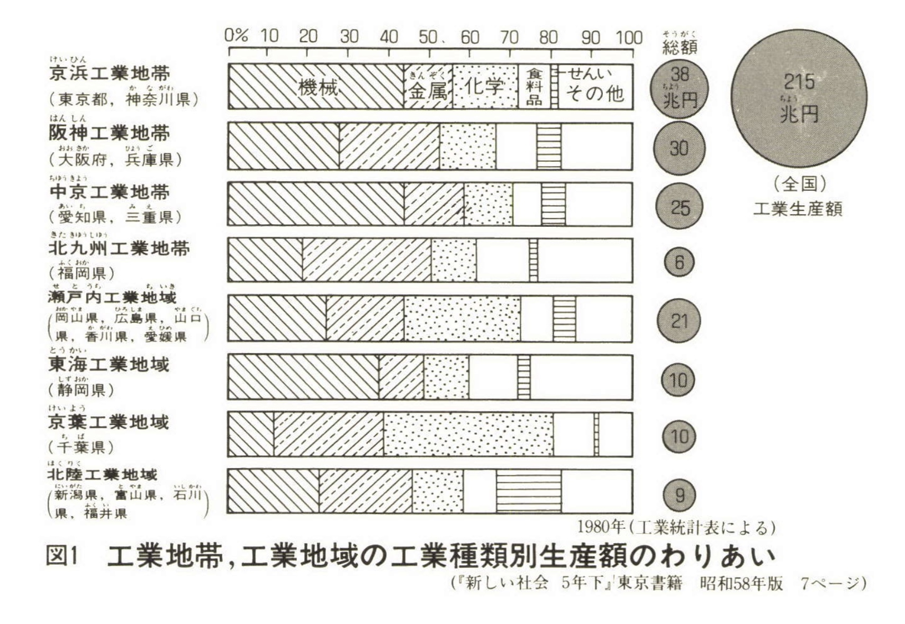
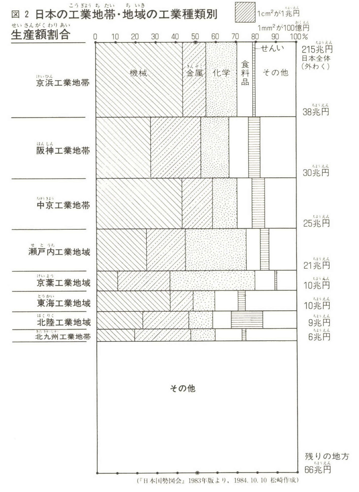
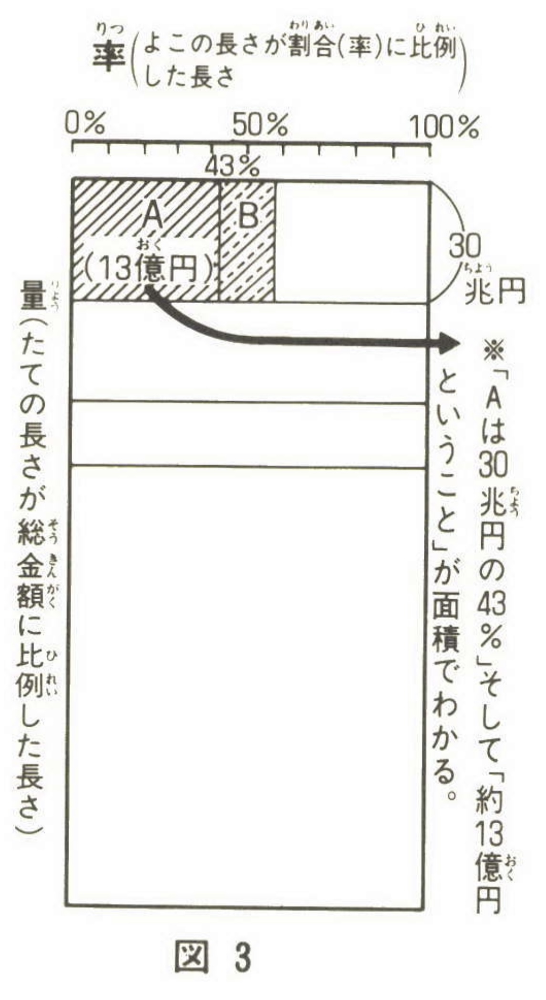

+++
author = "Yuichi Yazaki"
title = "The Origin of the Japanese Term \"Quantity-Proportion Graph\""
slug = "quantity-proportion-chart"
date = "2025-09-28"
description = ""
categories = [
    "chart"
]
tags = [
    "",
]
image = "images/cover-quantity–proportion.jpeg"
+++

A **quantity-proportion graph** uses rectangular area to represent both absolute quantity and proportion. One dimension represents the size of a category, while the other dimension divides that category by composition. Each small rectangle's area corresponds to quantity multiplied by proportion.

Internationally, similar methods are known as **mosaic plots** in statistics and **Marimekko charts** in business. The Japanese term "量率グラフ" emerged through education and popularization in Japan.

<!--more-->

## Examples

### Total Amount Shown by Bar and Circle Area

### The Same Data as a Quantity-Proportion Graph

## Timeline of the Term

- **Mid-1950s onward**: Kiyonobu Itakura later recalled using this kind of graph for about 30 years.
- **Late 1970s to early 1980s**: Itakura introduced the graph in a study group on self-sufficiency rates. Hirotsugu Shiono proposed the name "quantity-proportion graph."
- **Around 1982-1983**: Shigehiro Matsuzaki became interested in the method and introduced it in elementary-school lessons.
- **June 1984**: Matsuzaki published an article in *Tanoshii Jugyo*, where the term appeared clearly in print.
- **January 1985**: Matsuzaki's book *Shakai o Minaosu Megane* was published with the term in the subtitle.

## Roles of the Three Figures

- **Kiyonobu Itakura**: long-time practitioner who introduced the method in study groups.
- **Hirotsugu Shiono**: proposed the Japanese name.
- **Shigehiro Matsuzaki**: brought the method into classrooms and spread it through articles and books.

## Mechanism

- **Vertical dimension**: proportional to total amount
- **Horizontal dimension**: proportional composition within the category
- **Rectangle area**: amount represented by the intersection cell

This allows readers to see both volume and composition at once.

## Naming

- **Mosaic plot**: statistical name
- **Marimekko / Mekko chart**: business-dashboard name
- **Quantity-proportion graph**: Japanese educational name

The Japanese explanation often says "vertical = quantity, horizontal = proportion." More precisely, both dimensions are relative scales, and the area is what encodes the resulting quantity.

## Summary

The term "quantity-proportion graph" arose from Japanese educational practice in the 1980s. Although the chart can be understood internationally as a kind of mosaic or Marimekko chart, its Japanese history is distinctive because it spread through classroom use and educational writing.

## References

- [National Diet Library Search: Shigehiro Matsuzaki, Shakai o Minaosu Megane](https://ndlsearch.ndl.go.jp/books/R100000002-I000001715850)
- [CiNii Books: BN04447666](https://ci.nii.ac.jp/ncid/BN04447666)
- [Japanese Wikipedia: Quantity-proportion graph](https://ja.wikipedia.org/wiki/%E9%87%8F%E7%8E%87%E3%82%B0%E3%83%A9%E3%83%95)
