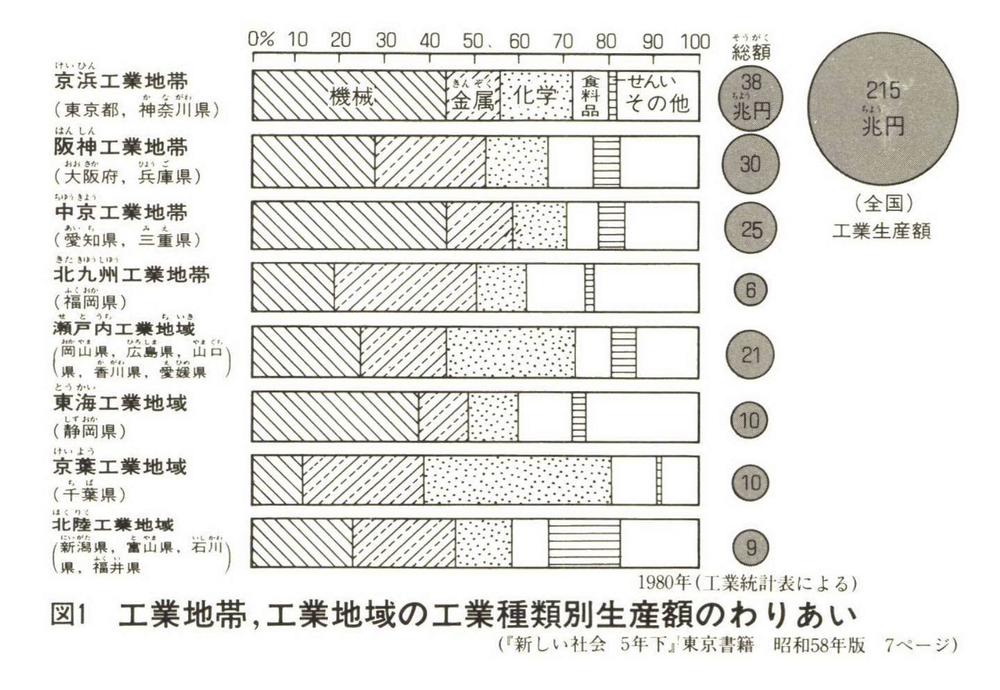
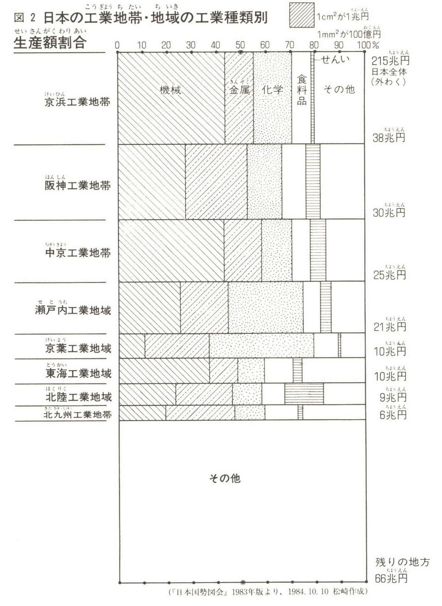
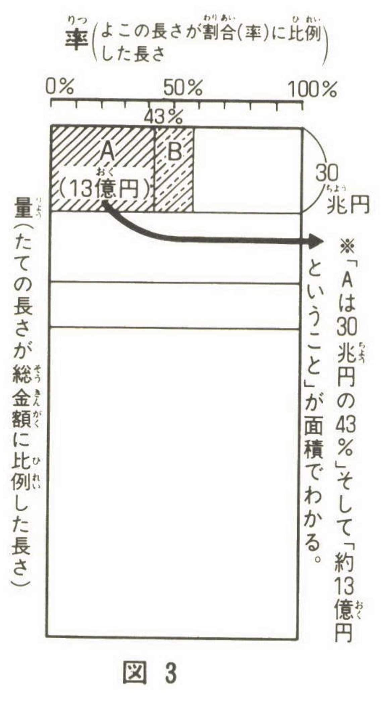

+++
author = "Yuichi Yazaki"
title = "量率グラフという呼び名の誕生史"
slug = "quantity–proportion-chart"
date = "2025-09-28"
description = ""
categories = [
    "chart"
]
tags = [
    "",
]
image = "images/cover-quantity–proportion.jpeg"
+++

量率グラフは、長方形の面積を用いて **量（絶対値）と率（割合）** を同時に表現する可視化手法です。横幅でカテゴリ全体の量を示し、その中を縦方向に割合で分割することで、各小矩形の面積が量×割合に相当します。

国際的には モザイク・プロット（Mosaic Plot）が統計ソフトに実装されており、ビジネス界隈ではマリメッコ・チャート（Marimekko Chart）の名称が浸透しています。これに対して「量率グラフ」という呼称は、日本独自に広まった言い方であり、教育や普及活動の中で生まれました。

<!--more-->

## 量率グラフの例

### 棒グラフと円の面積で表現した総額

### 全く同じデータを量率グラフで表現したもの

## 誕生の経緯（年表）

- **1950年代半ば頃〜** ...板倉聖宣が、後に「量率グラフ」と呼ばれる形式のグラフを「30年ほど前から愛用してきた」と1985年に回想 。出版物での確認はなく、本人の述懐に基づく時期推定。
- **1970年代末〜1980年代初頭** ...板倉が「自給率」の授業書を作る研究会でこの種のグラフを提示。そこで塩野広次が「量率グラフ」という名称を提案。量と率の両方を立てる＝「両立グラフ」としての意味を込めたものだった。
- **1982〜1983年頃** ...板倉の提示をきっかけに、松崎重広がこの手法に強く関心を持ち、自身の小学校授業に導入。児童とのやりとりを通じて「誰でも関心を持って描ける」グラフであることが示された。
- **1984年6月** ...松崎重広、「量率グラフの世界 社会科と算数で広がる」を月刊『たのしい授業』（仮説社）No.15に発表。同号には板倉自身による「量率グラフ」記事も掲載され、出版物として初めて明確に登場。
- **1985年1月** ...松崎重広『社会を見なおすメガネ―量率グラフで見る日本』（国土社）が刊行。板倉聖宣が監修を務め、書名に「量率グラフ」を冠した初の単行本となった。

## 三者の役割

- 1.板倉聖宣：実践者として長年愛用し、研究会で提示。
- 2.塩野広次：研究会の場で「量率グラフ」という名称を提案。
- 3.松崎重広：教育現場に導入し、論文・単行本を通じて普及。

この三者の協働があって、今日「量率グラフ」という日本語名称が登場したといえます。

## 量率グラフの仕組みと特徴

- 横幅（x方向）：上位カテゴリの合計量に比例
- 縦分割（y方向）：そのカテゴリ内の構成比（割合）
- 矩形の面積：量×割合＝交差セルの量（度数/金額等）

この仕組みにより、量と割合を同時に直感的に把握できます。

向くケース
- 市場構成（地域×品目、チャネル×商品など）で、ボリュームと構成比を同時に把握したいとき。

他のグラフとの違い
- **100%積み上げ棒グラフ** ：割合だけ（棒幅は一定）
- **量率グラフ** ：棒幅も変化し、量と割合を同時に表現
- **ツリーマップ** ：同じ面積表現だが、量率グラフはクロス表（分割表）の可視化に特化

## 呼び名の整理

- **モザイク・プロット（Mosaic plot）** ：統計学・統計ソフトでの正式名称
- **マリメッコ・チャート（Marimekko, Mekko）** ：ビジネスダッシュボード分野での俗称
- **量率グラフ** ：日本で生まれ、教育や書籍を通じて普及した呼称（ただし、JIS Z 8101やe-Stat統計用語集には掲載していない）

## まとめ

「量率グラフ」という日本語呼称は、

- 板倉聖宣の実践（1950年代〜）、
- 塩野広次の命名（1980年前後）、
- 松崎重広の教育現場導入（1980年代前半）、
- 1984年『たのしい授業』・1985年単行本での出版、

を経て使用されました。

国際的にはモザイク・プロット（Mosaic plot）の一種として理解されますが、日本では「量率グラフ」という名のもとに教育実践から普及した独自の経緯があります。

## 参考リンク

- [国立国会図書館サーチ（松崎重広『社会を見なおすメガネ』）](https://ndlsearch.ndl.go.jp/books/R100000002-I000001715850)
- [CiNii Books 書誌情報（BN04447666）](https://ci.nii.ac.jp/ncid/BN04447666)
- [Wikipedia 日本語版「量率グラフ」](https://ja.wikipedia.org/wiki/%E9%87%8F%E7%8E%87%E3%82%B0%E3%83%A9%E3%83%95)
