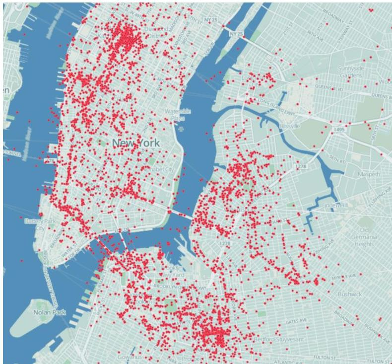
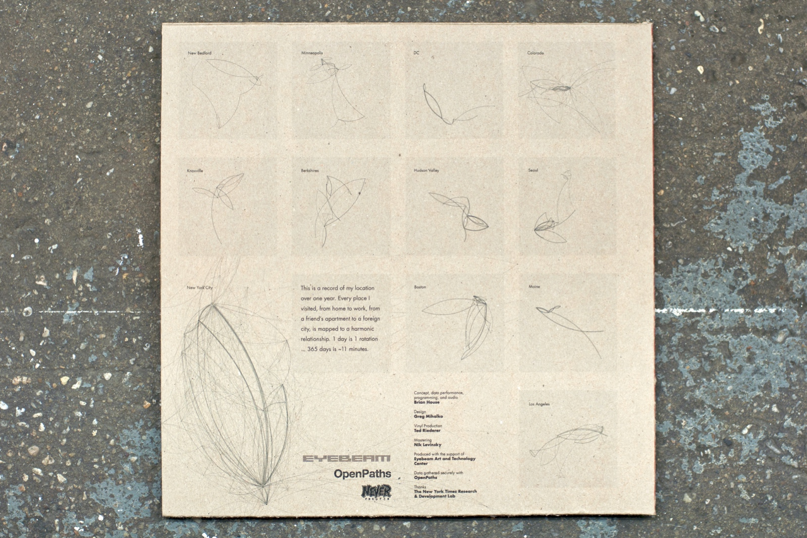
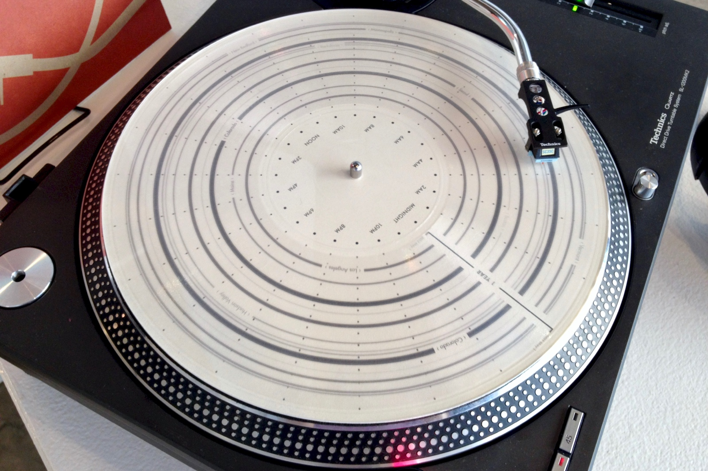
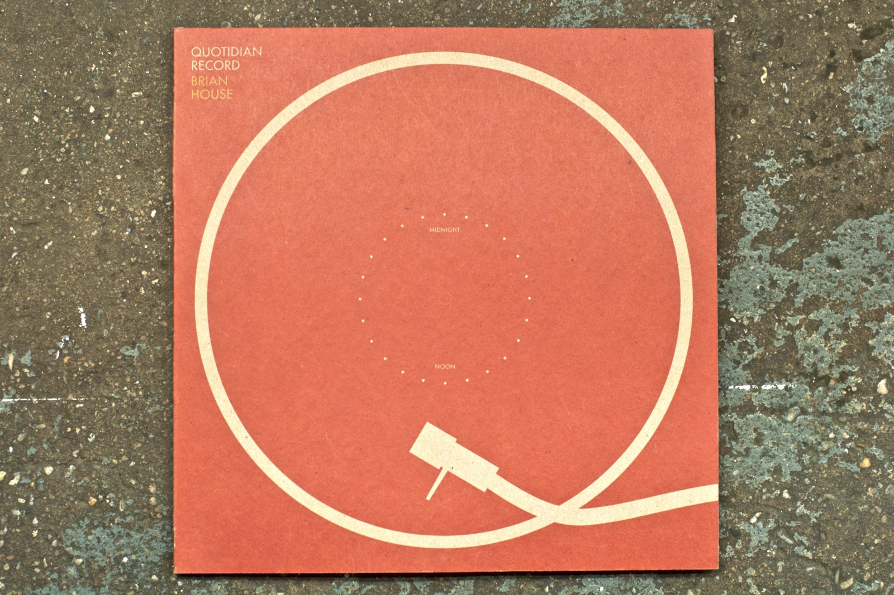
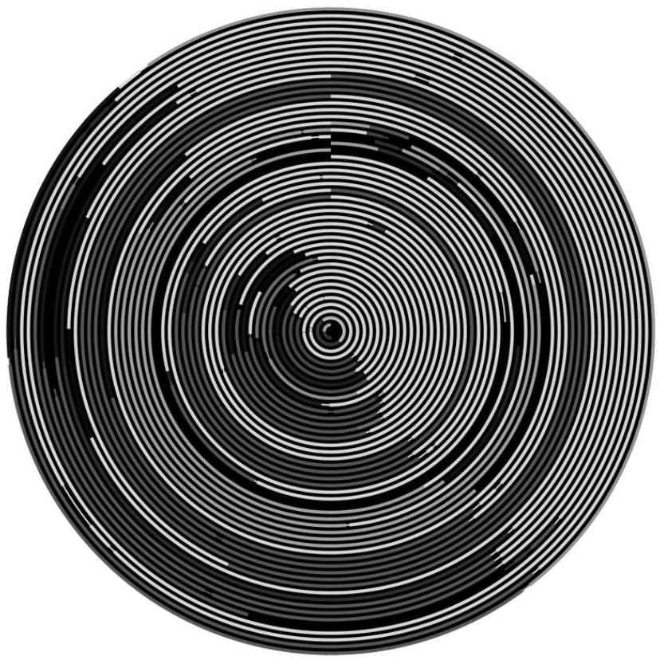
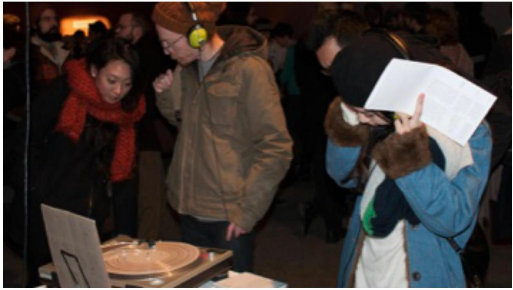

+++
author = "Yuichi Yazaki"
title = "Quotidian Record"
slug = "quotidian-record"
date = "2026-01-04"
categories = [
    "consume"
]
tags = [
    "データ物質化",
]
image = "images/quotidian_record_7@2x.jpg"
+++

**Quotidian Record** は、アーティスト／研究者である Brian House による作品で、**個人の位置情報データ（GPSログ）を、音楽・視覚表現・物理的オブジェクト（アナログレコード）へと一貫したルールに基づいて変換した作品**です。

日常的な移動という一見取るに足らない行為（quotidian）を、時間・空間・音の対応関係として再編し、**データと身体的経験の関係**を問い直す点に本作の特徴があります。

本作品は「データの可視化」にとどまらず **データを聴き、触れ、操作できる物体として再構成すること** を目的としています。

<!--more-->

## 経緯

本作は、Brian House が自身のスマートフォンで長期間にわたり取得した位置情報データをもとに制作されました。

当初は純粋なデータ記録として蓄積されていた GPS ログが、次第に「日々の反復構造」や「生活のリズム」を示していることに着目し、音楽的・視覚的な翻訳が試みられます。

その過程で、**1日という時間単位を1周の円として扱う同心円表現**が、アナログレコードの溝構造と同型であることが発見され、最終的にヴィニール盤という物理メディアへと結実しました。

## データ構造

本作で扱われるデータは、単純な緯度・経度の連続点ではありません。以下のような段階的な整理が行われています。

| 段階 | 内容 |
|---|---|
| 生データ | 緯度・経度・タイムスタンプを含む GPS ログ |
| 前処理 | 連続点を「移動（トリップ）」としてまとめる |
| 抽象化 | 各トリップの終点を「滞在地点」として抽出 |
| 統合 | 近接する終点をクラスタリングし、一意の「場所」として定義 |
| 配列 | 時系列に沿った「場所のシーケンス」へ変換 |

この処理により、データは「座標の集合」から「生活行動の連なり」へと意味づけられます。

## 目的

本作の目的は、位置情報データを正確に分析・可視化することではありません。  
むしろ、以下の点に主眼が置かれています。

- データを**抽象的な記号ではなく、経験として再構成すること**
- 日常の反復構造を、**音楽的・身体的に知覚可能な形へ翻訳すること**
- デジタルデータとアナログメディアの関係を再考すること

## ユースケース

この作品は実用的なナビゲーションや分析ツールではありませんが、以下の文脈で参照されることが多いです。

- データ可視化／ソニフィケーションの実践例
- パーソナルデータの芸術的利用
- データの物体化（Data Physicalization）の代表例
- HCI やメディアアートにおける研究・教育素材

## 特徴

Quotidian Record の特徴は **一貫した変換ルール** を持ちながら、結果として極めて詩的な体験を生み出している点にあります。

- 1日＝1回転という明確な時間対応
- 場所の訪問頻度を音楽的協和／不協和として反映
- 視覚・聴覚・触覚を横断するメディア設計
- 作家的恣意を極力排し、アルゴリズムに委ねた構成

## 作品の見方

### 視覚的な見方

レコード盤の表面には、同心円状のパターンが刻まれています。  
これは以下の対応関係に基づいています。

- 円周：1日の24時間
- 外側から内側：時間の経過（日付の進行）
- 色や区切り：異なる滞在地点

通勤や帰宅など、日々繰り返される行動は、似た形状として視覚的に現れます。

### 聴覚的な見方（聴き方）

音楽は、場所のシーケンスに基づいて自動生成されています。

- 都市ごとに音階（スケール）が割り当てられる
- よく訪れる場所ほど協和的な音程になる
- 珍しい場所は不協和音として現れる

これにより、**生活の安定と逸脱が音として知覚可能**になります。

### 物体としての見方

この作品は「再生する」だけでなく、「操作する」ことができます。

- スタイラスを置く位置＝特定の時間帯
- 回転という動作そのものが時間の再体験
- 針の移動により、時間と空間を横断する感覚が生まれる

## デザイン上の注意点

本作は「美しい可視化」を目指していません。
むしろ、以下の点が意図的に選ばれています。

- 視認性よりも構造的一貫性を優先
- 装飾的な色使いではなく、意味に基づく割当
- データの欠落や偏りも、そのまま音や形に反映

このため、一般的なインフォグラフィックスとは異なる読み取り姿勢が求められます。

## 応用例

Quotidian Record の考え方は、以下のような応用が考えられます。

- ライフログの音楽化・触覚化
- 時間ベースの行動データの物理化
- 教育における「データと身体性」の教材
- 展示空間におけるインタラクティブ作品

## 類似の手法

類似の文脈を持つ作品や手法としては、以下が挙げられます。

- 生体データのソニフィケーション
- 年輪図やサークルタイムラインによる時間表現
- 3Dプリントによるデータ物体化作品

ただし、本作ほど **時間・音・物体が厳密に対応づけられた例は多くありません**。

## まとめ

Quotidian Record は、位置情報データを単に「可視化」するのではなく **時間を回転として、生活を音として、データを物体として再定義した作品** です。

本作が示しているのは、データは必ずしも画面上のグラフである必要はなく **身体的に経験されるメディアへと変換しうる**という可能性です。

## 参考・出典

- [Quotidian Record – Brian House](https://brianhouse.net/works/quotidian_record/)
- [Quotidian Record: The Musical Interpretation of Mobile Phone Location Data (PDF)](https://brianhouse.net/files/brian_house_quotidian_record.pdf)
