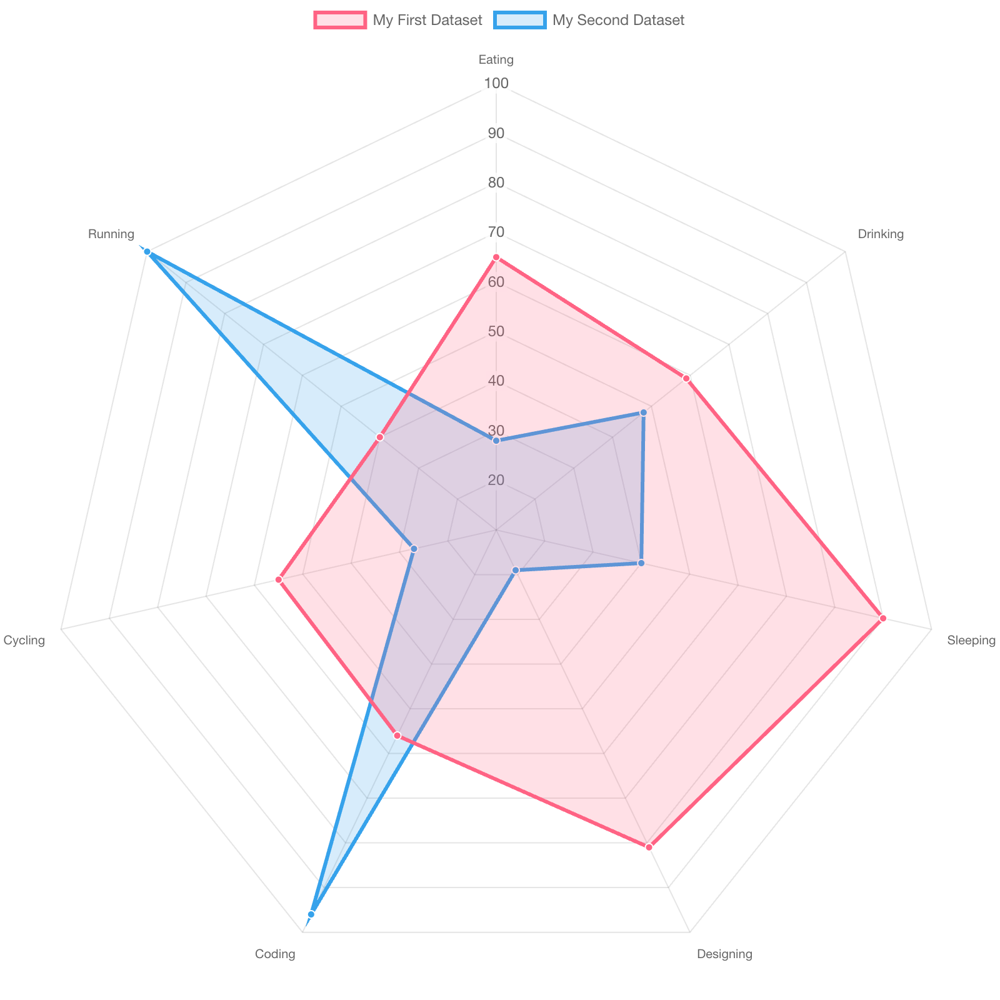

+++
author = "Yuichi Yazaki"
title = "Radar Chart"
slug = "radar-chart"
date = "2025-10-11"
categories = [
    "chart"
]
tags = [
    "",
]
image = "images/cover.png"
+++

A radar chart compares multiple variables by arranging axes radially and connecting values into a polygon. It is also called a spider chart or web chart. It is often used to compare attributes of products, people, organizations, or performance profiles.

<!--more-->

## Historical Background

Early forms appeared in nineteenth-century statistical graphics and were later used in military, industrial, and educational assessment. Software such as Excel, Tableau, matplotlib, and Plotly made radar charts easy to create.

## Design Notes

- Use a small number of variables.
- Keep axis scales consistent and meaningful.
- Avoid comparing too many polygons.
- Consider small multiples or bar charts for precise comparison.

## Summary

Radar charts are useful for profile-like comparisons, but they can be hard to read precisely. They work best when the overall shape is more important than exact values.
