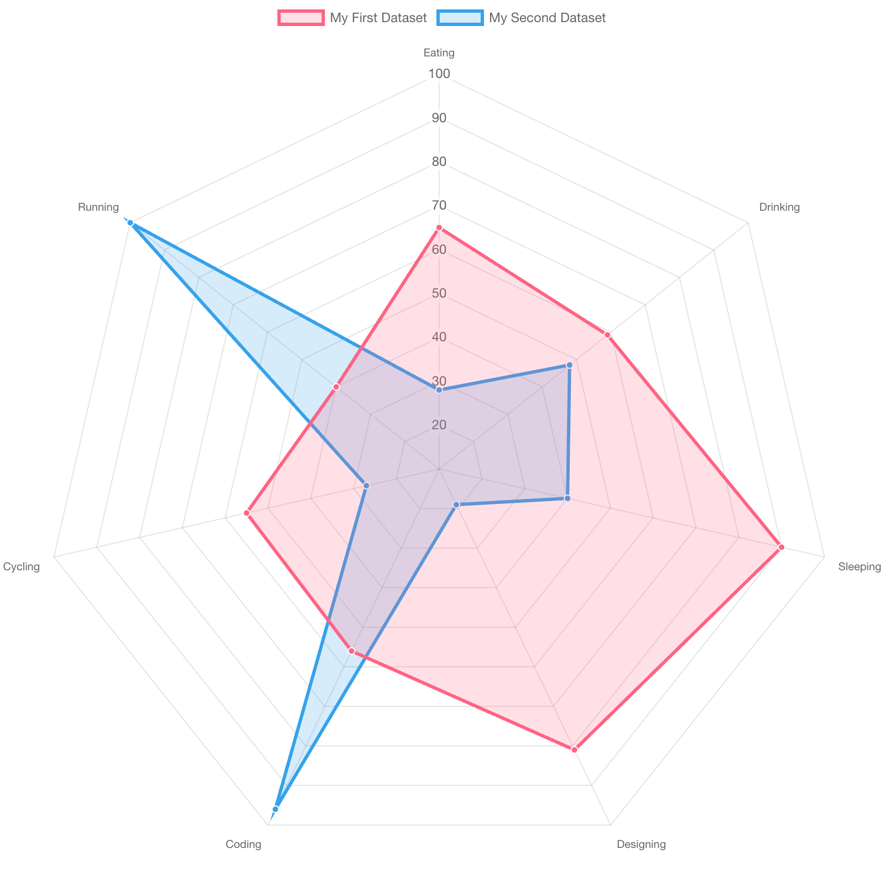

+++
author = "Yuichi Yazaki"
title = "レーダー・チャート（Radar Chart）"
slug = "radar-chart"
date = "2025-10-11"
categories = [
    "chart"
]
tags = [
    "",
]
image = "images/cover.png"
+++

レーダー・チャート（Radar Chart）は、多変量データを放射状に配置して比較するためのグラフです。別名としてスパイダー・チャート（Spider Chart）やウェブ・チャート（Web Chart）とも呼ばれます。各軸が異なる変数を表し、中心から外に向かって値が大きくなります。1つのデータ系列は多角形として描かれ、複数の系列を重ねることで、パターンや特徴の違いを視覚的に比較することができます。

<!--more-->

## チャートの見方

| 要素 | 説明 |
|------|------|
| 軸（Axes） | 各軸は異なる変数を表す。例：製品の性能指標（速度、精度、価格、耐久性など）。 |
| 中心点 | すべての軸が交わる中心点は、最小値（または0）を示す。 |
| スケール | 軸上の目盛りは値の範囲を示す。すべての軸でスケールが一致している必要がある。 |
| 多角形（Polygon） | 各データ系列を結んだ線。形状の違いから強みや弱みを一目で把握できる。 |
| 塗りつぶし（Fill Area） | 面を塗ることで、比較を視覚的に強調できる。重なり部分の透明度調整も重要。 |

例えば、5つの性能指標をもつ製品AとBを比較する場合、製品Aのレーダー形状がより外側に広がっていれば、総合的に性能が高いことを示します。一方、特定の軸だけ突出している場合は、その要素が強みであることを示唆します。

## 背景と利用例

レーダー・チャートは、もともと心理学やスポーツ科学などで人物やチームの特性を多次元的に評価するために使われてきました。現在では、マーケティングや製品比較、ビジネス戦略分析など幅広い分野で利用されています。

しかし、軸が多すぎると見づらくなり、またスケールの不一致や変数の単位が異なる場合は誤解を生む恐れがあります。そのため、使用する際は軸の順序やスケールを慎重に設計する必要があります。特に視覚的バランスを取るためには、軸の配置順が比較結果に与える影響にも注意を払うことが重要です。

## 関連ツール・応用例

| ツール・ライブラリ | 特徴 |
|------------------|------|
| Microsoft Excel / Google Sheets | 標準でレーダー・チャート機能を搭載。ビジネス向けに最も普及。 |
| D3.js / Plotly.js | Webでの動的インタラクションが可能。ホバーで値表示やアニメーション比較も実装可能。 |
| Vega-Lite | 宣言的記述で簡潔に定義可能。学術・教育用途に向く。 |
| RAWGraphs | 多次元データを簡単にレーダー形式で可視化できるOSSツール。 |

## まとめ

レーダー・チャートは、多変量データを直感的に比較するのに適した可視化手法です。中心からの距離で各項目の強弱を示し、全体の形状で傾向を読み取ることができます。ただし、軸の数や順序、スケール設計を誤ると誤解を招くため、慎重な設計が必要です。適切に設計されたレーダー・チャートは、ビジネス評価からスポーツ分析まで、幅広い分野で「全体像をひと目で伝える」強力な手段となります。

## 参考・出典
- [Radar chart — Wikipedia](https://en.wikipedia.org/wiki/Radar_chart?utm_source=chatgpt.com)
- [Radar Chart | Chart.js Documentation](https://www.chartjs.org/docs/latest/charts/radar.html?utm_source=chatgpt.com)
- [Radar Chart Guide — ApexCharts](https://apexcharts.com/docs/chart-types/radar/?utm_source=chatgpt.com)