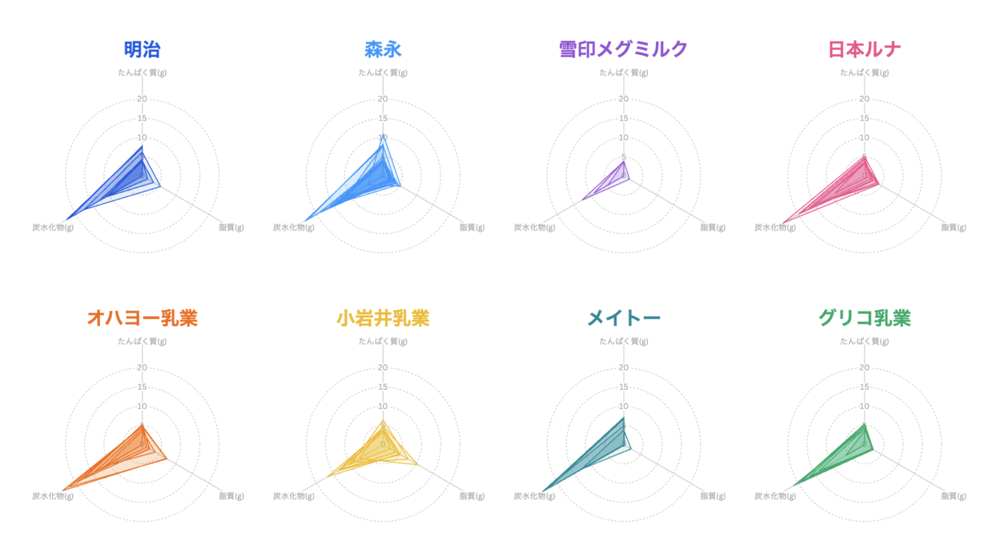
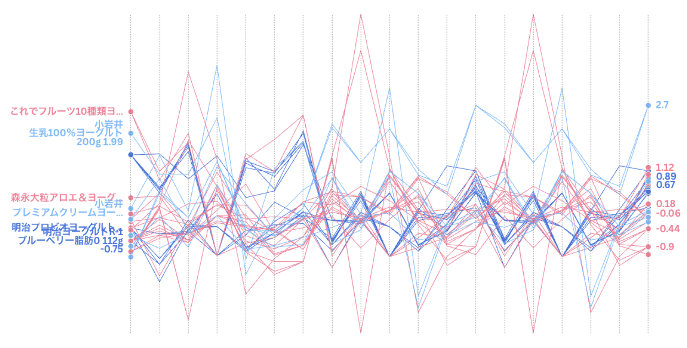

+++
author = "Yuichi Yazaki"
title = "Radar Charts and Parallel Coordinates: A Debate About Readability"
slug = "radar-parallel-coordinates"
date = "2025-09-28"
categories = [
    "chart"
]
tags = [
]
image = "images/thumbnail_combined.jpg"
+++

A **radar chart**, also called a spider chart, compares multiple variables by plotting values on axes radiating from a center point. Adjacent points are connected to form a polygon.

Radar charts are often used for student scores, product comparison, ability evaluation, and other profiles where viewers are expected to read balance or imbalance as a shape.

<!--more-->

## Weaknesses of Radar Charts

Radar charts are popular, but they are often criticized.

- **Radial comparison is hard**: people are better at comparing lengths on a shared horizontal or vertical baseline.
- **Shape and area bias**: the polygon can exaggerate differences that are numerically small.
- **Axis order is arbitrary**: changing the order of variables changes the shape.
- **Limited scalability**: many variables or many series quickly become unreadable.

Michael Correll's essay "Bad Ideas in Visualization" argues that radar charts invite viewers to read shape even though that shape depends heavily on arbitrary axis ordering.

## Parallel Coordinates as an Alternative

A **parallel coordinates plot** arranges variables as parallel vertical axes and connects each observation with a line. Compared with radar charts, all variables share a more consistent visual frame, which can make comparison easier.

The basic argument is that radar charts scatter axes around a circle, while parallel coordinates align them in a common direction.

## Research Context

Research such as **P-Lite: A study of parallel coordinate plot literacy** compares how people read radar charts, parallel coordinates, scatterplots, and related views. The conclusion is not that one chart is always better. Rather, parallel coordinates can be more accurate for high-dimensional data in some tasks, while they also require more familiarity.

## Popularity vs. Expertise

Despite criticism, radar charts remain far more widely recognized than parallel coordinates.

### 1. The Power of Shape

Radar charts turn multiple values into a memorable polygon. In presentations and education, that shape can be persuasive and intuitive.

### 2. Cultural Familiarity

Sports magazines, games, and school materials have made radar charts familiar as "ability charts."

### 3. Tool Availability

Excel and Google Sheets include radar charts. Parallel coordinates usually require R, Python, or specialized visualization tools.

### 4. Learning Cost

Parallel coordinates can look tangled to non-specialists. Radar charts are easier to recognize at first glance.

## Choosing Between Them

Radar charts can work when there are few variables and few items, and the goal is to show a rough balance profile. Parallel coordinates are better when there are more variables, more observations, and a need for more precise pattern exploration.

## Summary

The question is not which chart is universally correct. The choice depends on audience, task, and data size. Radar charts communicate shape and balance; parallel coordinates support more systematic comparison and exploration.

## References

- [Statistics Bureau of Japan: Radar chart](https://www.stat.go.jp/naruhodo/9_graph/jyokyu/redar.html)
- [Wikipedia: Radar chart](https://en.wikipedia.org/wiki/Radar_chart)
- [Data-to-Viz: Spider / Radar Chart](https://www.data-to-viz.com/caveat/spider.html)
- [Dueling Data: Radar Chart vs Parallel Coordinate Chart](https://duelingdata.blogspot.com/2013/07/radar-chart-vs-parallel-coordinate-chart.html)
- [Michael Correll: Bad Ideas in Visualization](https://mcorrell.medium.com/bad-ideas-in-visualization-77d378148d35)
- [P-Lite: A study of parallel coordinate plot literacy](https://www.sciencedirect.com/science/article/pii/S2468502X22000377)
