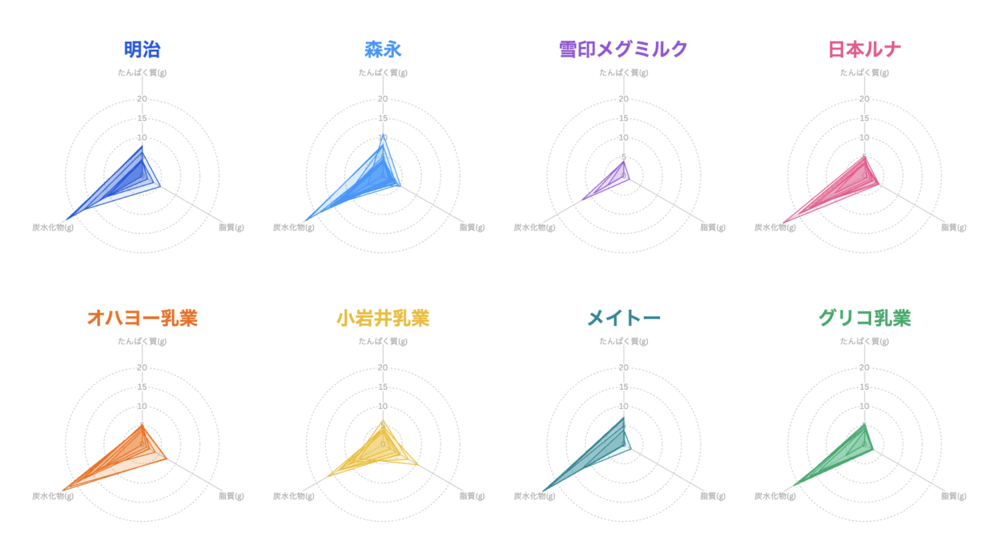
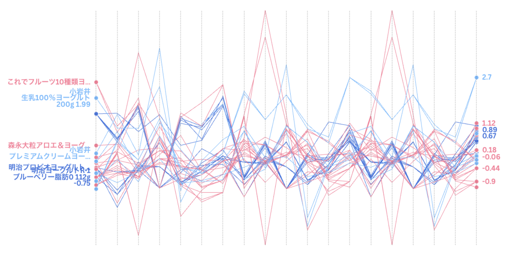

+++
author = "Yuichi Yazaki"
title = "レーダー・チャートと平行座標：読みやすさをめぐる議論"
slug = "radar-parallel-coordinates"
date = "2025-09-28"
categories = [
    "chart"
]
tags = [
]
image = "images/thumbnail_combined.jpg"
+++

レーダー・チャート（radar chart、スパイダーチャート、蜘蛛の巣グラフとも呼ばれる）は、複数の項目を同時に比較するための可視化手法です。
中心から放射状に伸びる複数の軸に値をプロットし、隣り合う点を線で結ぶことで多角形が描かれます。
- 用途：学生の成績、製品比較、能力評価など
- 特徴：項目間のバランスや偏りを「形」として直感的に把握できる

日本の統計局の解説でも、「項目数に応じた正多角形を想定し、中心から外に向かって値をプロットする」と説明されています。値が大きいほど外側に、値が小さいほど内側に配置され、複数の対象を重ねることで比較が容易になります。

<!--more-->

## レーダー・チャートの弱点

一方で、レーダー・チャートには批判も少なくありません。代表的な問題点は以下のとおりです。

- **半径方向の距離比較が難しい** ...人間は共通の基準線に対する垂直・水平の比較は得意ですが、放射方向の距離差を正確に読むのは苦手です。
- **面積や形のバイアス** ...多角形の「面積」や「形状」が視覚的に印象を強めるため、実際の数値差以上に誇張される場合があります。
- **軸順序の恣意性** ...軸を並べる順番によって形が大きく変わるため、グラフ作成者の意図が読み手の印象に強く影響します。
- **比較対象や項目数の制限** ...多くの対象や項目を扱うと線や面が重なり、判読困難になります。

Michael Correll のコラム「Bad Ideas in Visualization」では、レーダー・チャートは「形として読んでしまう誘惑が強く、しかもその形が軸順に依存するため誤解を招きやすい」と批判されています。

## 平行座標（Parallel Coordinates）という代替

そこでしばしば比較されるのが、**平行座標プロット（parallel coordinates plot, PCP）**です。これは複数の変数を平行な縦軸に並べ、各データを線でつなぐ手法です。

ブログ Dueling Data では次のように述べられています：

「レーダー・チャートは見た目は面白いが、各スポーク上の長さを比較するのは難しい。一方で平行座標では、すべての変数が共通の基準軸を持つため、比較が容易である。」

つまり、レーダー・チャートが放射方向に散らばる軸をもつのに対し、平行座標はすべての変数を縦に並べるため、「共通スケール上での比較」がやりやすいというわけです。

## 研究的な裏付け

学術研究でも、両者の可読性比較が行われています。
たとえば P-Lite: A study of parallel coordinate plot literacy では、レーダー・チャート・平行座標・散布図などを対象にユーザ実験が行われました。結果は一概に「どちらが常に優れている」とは言えませんが、平行座標の方が高次元データを扱いやすく、正確な読み取りが可能になる場面があると報告されています。

## レーダー・チャートの大衆性 vs 平行座標の専門性

ここまで見てきたように、レーダー・チャートには可読性や正確性の問題点が多く指摘されています。それでもなお、平行座標プロットよりもはるかに一般的に知られ、使われているのはなぜでしょうか。

### 1. 直感的な「形」の力

レーダー・チャートは、複数の値を多角形として一望できるため、凹凸や偏りを感覚的に把握できます。人間は数値よりも「形」で情報を捉える傾向が強く、プレゼンや教育の場では特に効果的に働きます。

### 2. メディアと文化での定着

スポーツ雑誌やゲーム（選手能力の五角形グラフ）、教育用統計教材などを通じて、一般層が自然に触れる機会が多くありました。そのため「能力比較＝レーダー・チャート」という認知が文化的に広がっています。

### 3. ツールでの利用の容易さ

ExcelやGoogleスプレッドシートといった一般的な表計算ソフトにレーダー・チャートが標準搭載されており、誰でも簡単に作成できます。一方、平行座標プロットはRやPython、専用可視化ツールを使わないと描けず、普及のハードルが高いのが現状です。

### 4. 学習コストの違い

平行座標は軸が並列に並び、データが線として交差します。慣れていない人には「ごちゃごちゃしている」と見えてしまい、理解にはある程度のデータリテラシーが求められます。レーダー・チャートは一方で「形」として直感的に伝わるため、非専門家にも抵抗が少なく、実務や教育で採用されやすいのです。

## まとめ：使い分けの視点

「レーダー・チャートより平行座標の方が読みやすい」とする意見は確かに存在し、専門家の批評や研究によって裏付けられています。
しかし同時に、平行座標にも「線が交錯して読みにくい」「軸の順序で印象が変わる」といった弱点があります。

したがって結論は単純ではなく、以下のように整理できます。

- レーダー・チャート：比較対象や項目が少なく、「バランス」を直感的に見せたいときに有効
- 平行座標：項目数やデータ数が多く、正確な比較やパターン探索をしたいときに有効

可視化は「どちらが正しいか」ではなく「誰に」「どんな目的で」見せるかによって選び分けることが重要です。

## 参考リンク

- [統計局「なるほど統計学園」：レーダーチャート](https://www.stat.go.jp/naruhodo/9_graph/jyokyu/redar.html)
- [Wikipedia: レーダーチャート](https://ja.wikipedia.org/wiki/%E3%83%AC%E3%83%BC%E3%83%80%E3%83%BC%E3%83%81%E3%83%A3%E3%83%BC%E3%83%88)
- [Wikipedia: Radar Chart (EN)](https://en.wikipedia.org/wiki/Radar_chart)
- [Data-to-Viz: Spider (Radar) Chart](https://www.data-to-viz.com/caveat/spider.html)
- [Dueling Data: Radar Chart vs Parallel Coordinate Chart](https://duelingdata.blogspot.com/2013/07/radar-chart-vs-parallel-coordinate-chart.html)
- [Michael Correll: Bad Ideas in Visualization](https://mcorrell.medium.com/bad-ideas-in-visualization-77d378148d35)
- [P-Lite: A study of parallel coordinate plot literacy (ScienceDirect)](https://www.sciencedirect.com/science/article/pii/S2468502X22000377)

