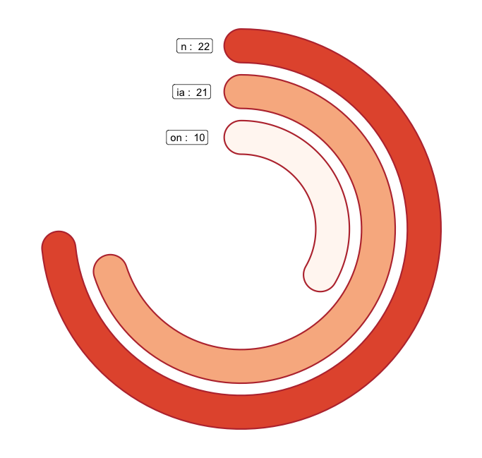
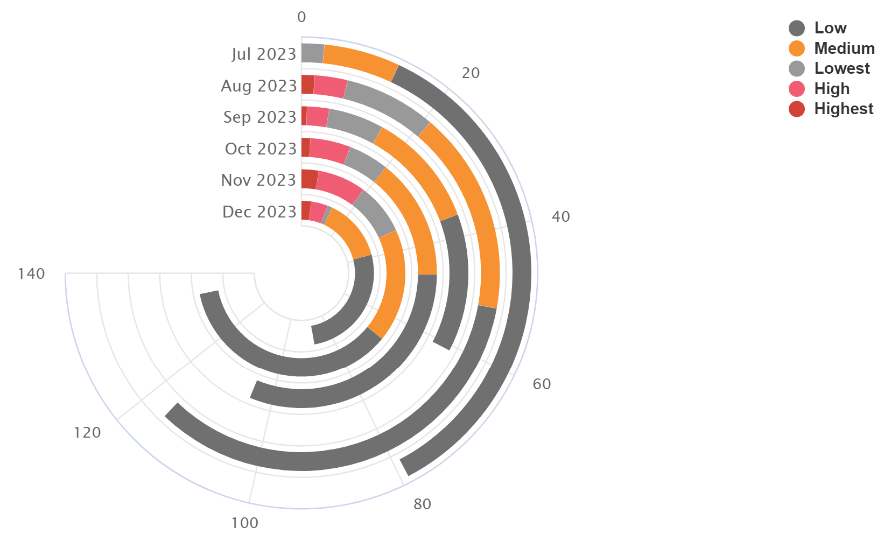

+++
author = "Yuichi Yazaki"
title = "ラディアル・バー・チャート"
slug = "radial-bar-chart"
date = "2025-10-11"
categories = [
    "chart"
]
tags = [
    "",
]
image = "images/cover.png"
+++

ラディアル・バー・チャート（Radial Bar Chart）は、一般的な棒グラフ（Bar Chart）を円形に配置したチャートです。データの値を棒の長さで表現する点は同じですが、棒が放射状に配置され、全体が円形を描くようになっているのが特徴です。時系列や周期的データ（月、季節、時間など）を直感的に表現する際に適しています。

<!--more-->

## チャートの見方

ラディアル・バー・チャートでは **円の中心から外側に向かう方向** に値が増加します。各棒は「カテゴリ」や「期間」を表しており、角度方向でグループ化されます。

例えば、左の緑色のチャートでは「4月〜11月」の月ごとの値を円環状に配置しています。内側が早い月、外側が後の月を示しています。棒の長さはデータの大きさを表し、長いほど値が大きいことを意味します。

右の青いチャートでは「1922〜1928年」の各年を円環で表しています。内側が古い年、外側が新しい年を示しています。月次や年次のデータをラディアル形式で可視化することで、季節的傾向や年ごとの周期的変化を視覚的に比較できます。

## 背景と利用例

ラディアル・バー・チャートは、主に以下のような場面で利用されます。

- **季節性のあるデータ**（例：月別平均気温、降水量、販売データなど）
- **時間的なサイクル**を強調したい場合（例：1日の時刻ごとの活動量）
- **美的な円形構成**を重視したデータビジュアライゼーションやインフォグラフィックス

ただし、棒の長さが円の外周方向に伸びるため、通常の棒グラフよりも **長さの比較が直感的でない** 場合があります。そのため、比較目的よりも **周期性やパターンの可視化** に向いています。

## まとめ

ラディアル・バー・チャートは、データを円形に展開することで周期的パターンを強調できる可視化手法です。月や年など、時間的サイクルを持つデータの傾向を美しく表現する際に有効です。一方で、棒の長さの比較精度は低下するため、デザイン的意図や全体傾向の把握を目的とした利用が推奨されます。

## 参考・出典
- [Radial Bar Charts - The Data Visualisation Catalogue](https://datavizcatalogue.com/methods/radial_bar_chart.html)
- [Radial/Circular Bar Chart – Data Viz Project](https://datavizproject.com/data-type/circular-bar-chart/)
- [Radial bar chart demo – Highcharts](https://www.highcharts.com/demo/polar-radial-bar/grid-light)
