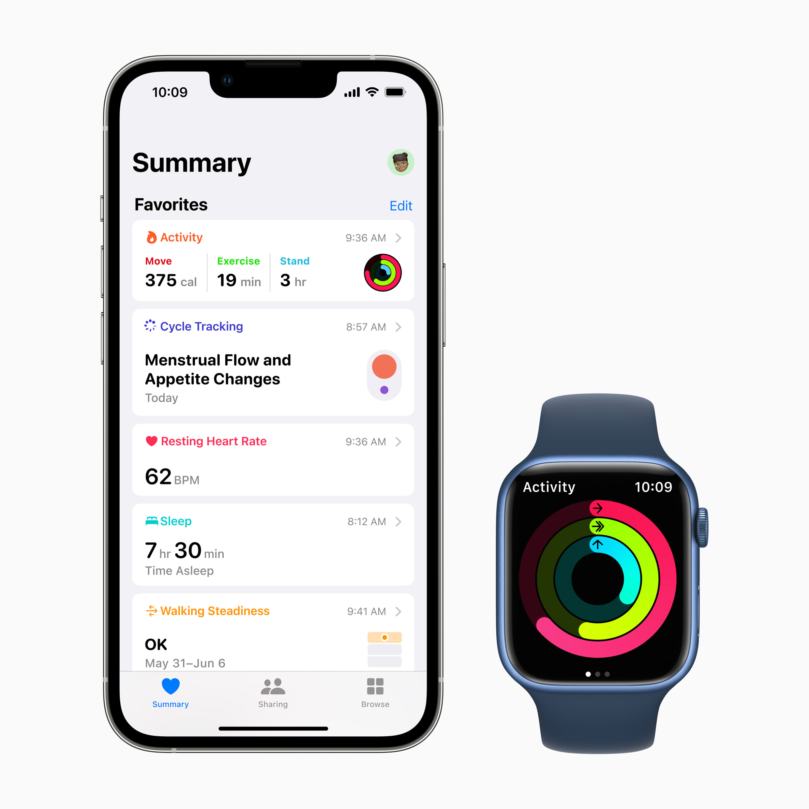
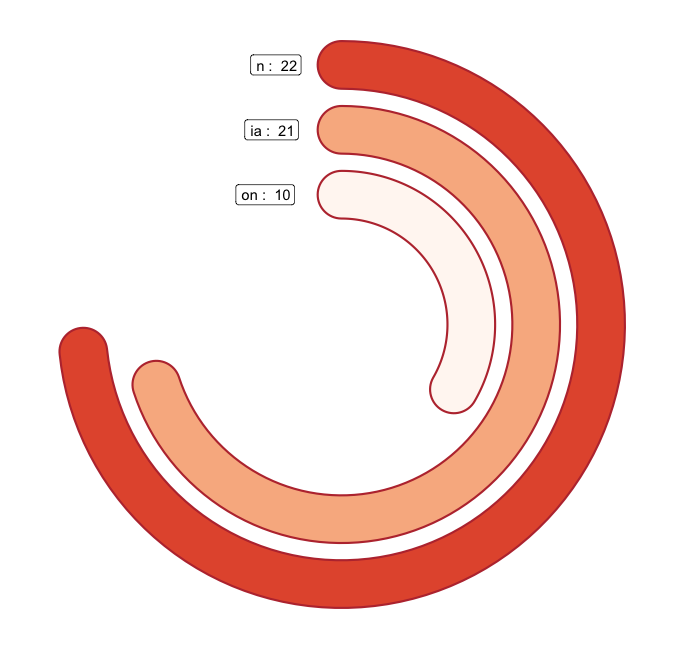
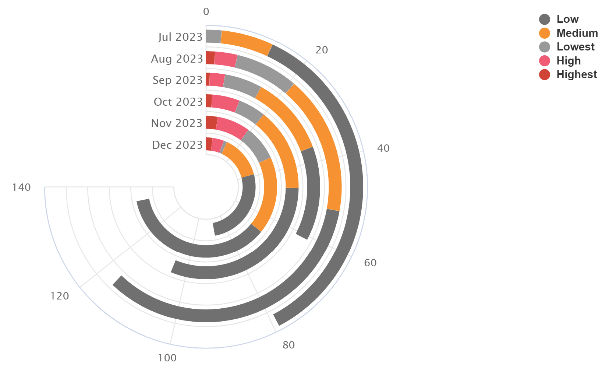

+++
author = "Yuichi Yazaki"
title = "ラディアル・バー・チャート（Radial Bar Chart）"
slug = "radial-bar-chart"
date = "2025-10-11"
categories = [
    "chart"
]
tags = [
    "",
]
image = "images/cover.png"
+++

ラディアル・バー・チャート（Radial Bar Chart）は、**一般的な棒グラフを円形（極座標）に配置し、データの値を放射状の棒の長さで表現するチャート**です。各棒が円の中心から外側に向かって伸び、全体が円形を描くのが特徴です。時系列や周期的データ（月、季節、時間など）を直感的に表現する際に適しています。

<!--more-->







## 別名

- Circular Bar Chart
- Star Chart

## 歴史的経緯

ラディアル・バー・チャートの起源は、極座標を用いたデータ表現の歴史と深く結びついています。19世紀にフローレンス・ナイチンゲールが考案した「鶏頭図（Coxcomb Chart）」は、扇形の面積で値を表現する円形チャートとして知られ、ラディアル・バー・チャートの先駆けと見なされています。20世紀後半のコンピュータグラフィックスの発展とともに、D3.jsやHighchartsなどの可視化ライブラリが普及し、インフォグラフィックスやダッシュボードにおいて円形の棒グラフが広く使われるようになりました。

## データ構造

ラディアル・バー・チャートで扱うデータは、以下の構造を持ちます。

| 変数 | 説明 | データ型 | 例 |
|------|------|----------|-----|
| カテゴリ | 各棒に対応する項目 | カテゴリカル（名義・順序） | 月名、曜日、地域名 |
| 値 | 棒の長さに対応する数値 | 数値（連続） | 売上高、気温、降水量 |
| グループ（任意） | 複数系列を比較する場合 | カテゴリカル | 年度、製品カテゴリ |

## 目的

ラディアル・バー・チャートの主な目的は以下のとおりです。

- **周期的なデータの可視化**：月別、季節別、時間帯別など、循環する性質を持つデータのパターンを円形配置で強調します。
- **カテゴリ間の比較**：放射状に並ぶ棒の長さを比較することで、各カテゴリの値の大小関係を把握します。
- **視覚的インパクトの提供**：通常の棒グラフに比べ、デザイン性が高く、インフォグラフィックスやプレゼンテーションで注目を集めやすいです。

## ユースケース

| 分野 | 具体例 |
|------|---------|
| 気象データ | 月別平均気温や降水量の年間推移 |
| ビジネス | 月別売上高の季節的傾向の可視化 |
| 健康・フィットネス | 1日の時間帯ごとの活動量の表示 |
| エネルギー | 時刻ごとの電力消費量の周期的パターン |
| インフォグラフィックス | 美的な円形構成を重視したデータ表現 |

## 特徴

- 円形配置により、周期的・循環的なパターンを直感的に表現できます。
- デザイン性が高く、インフォグラフィックスやダッシュボードで視覚的なインパクトを与えます。
- 通常の棒グラフと比較して、棒の長さの正確な比較がやや困難です。これは円弧の外側ほど同じ角度でも面積が広がるためです。
- カテゴリ数が多い場合でも、円形に配置することでコンパクトに収まります。
- 複数系列を同心円状に重ねることで、年次比較などにも対応できます。

## チャートの見方

- **円の中心から外側に向かう方向**に値が増加します。棒が長いほど値が大きいことを意味します。
- **各棒の角度位置**がカテゴリ（月、時間帯など）を表します。
- **色の違い**がグループや系列の区別を示します。例えば、異なる年度のデータを色分けして比較できます。
- 複数の同心円がある場合は、内側が古い年や最初の系列、外側が新しい年や後の系列を示していることが一般的です。
- 全体の形状から、どの時期やカテゴリに値が集中しているかを直感的に把握できます。

## デザイン上の注意点

- **正確な比較が必要な場合は注意**：外側の棒ほど円弧が長くなるため、同じ値でも外側の棒が大きく見えます。正確な比較が最優先の場合は、通常の棒グラフの使用を検討してください。
- **開始角度の設定**：データの性質に応じて、12時の位置（上部）を起点とするのが一般的です。
- **グリッド線の追加**：値の読み取りを補助するため、同心円状のグリッド線を表示することが推奨されます。
- **凡例の配置**：色分けしている場合は、凡例を明確に示してください。
- **カテゴリ数**：あまりに少ないカテゴリ（3〜4個以下）では円形にする効果が薄いため、通常の棒グラフを使う方が適切です。

## 応用例

- Florence Nightingaleの鶏頭図は、クリミア戦争における月別死因の構成を円形で表現し、衛生環境の改善の必要性を視覚的に訴えた有名な事例です。
- 気象データのダッシュボードでは、12ヶ月の降水量をラディアル・バー・チャートで表示し、乾季と雨季のパターンを一目で把握できるようにしています。
- スマートウォッチのアクティビティリングは、ラディアル・バー・チャートの考え方を応用し、日々の運動目標の達成度を円形で表現しています。

## 代替例

| 代替チャート | 適する場面 |
|-------------|-----------|
| 棒グラフ（Bar Chart） | 正確な値の比較を重視する場合 |
| レーダーチャート（Radar Chart） | 複数の軸で全体的なバランスを比較する場合 |
| 鶏頭図（Coxcomb Chart） | 扇形の面積で値を表現したい場合 |
| 折れ線グラフ（Line Chart） | 時系列の変化の推移を追う場合 |

## まとめ

ラディアル・バー・チャートは、データを円形に展開することで周期的パターンを強調できる可視化手法です。月や季節、時間帯など、循環する性質を持つデータの傾向を視覚的に美しく表現する際に効果的です。一方で、棒の長さの比較精度は通常の棒グラフに劣るため、正確な数値比較よりも全体傾向やパターンの把握、デザイン的なインパクトを目的とした利用が推奨されます。

## 参考・出典

```
- [Radial Bar Chart - The Data Visualisation Catalogue](https://datavizcatalogue.com/methods/radial_bar_chart.html)
- [Circular barplot - R Graph Gallery](https://r-graph-gallery.com/circular-barplot.html)
- [Basic circular barplot in d3.js - D3 Graph Gallery](https://d3-graph-gallery.com/graph/circular_barplot_basic.html)
- [Radial bar chart demo - Highcharts](https://www.highcharts.com/demo/polar-radial-bar)
```
