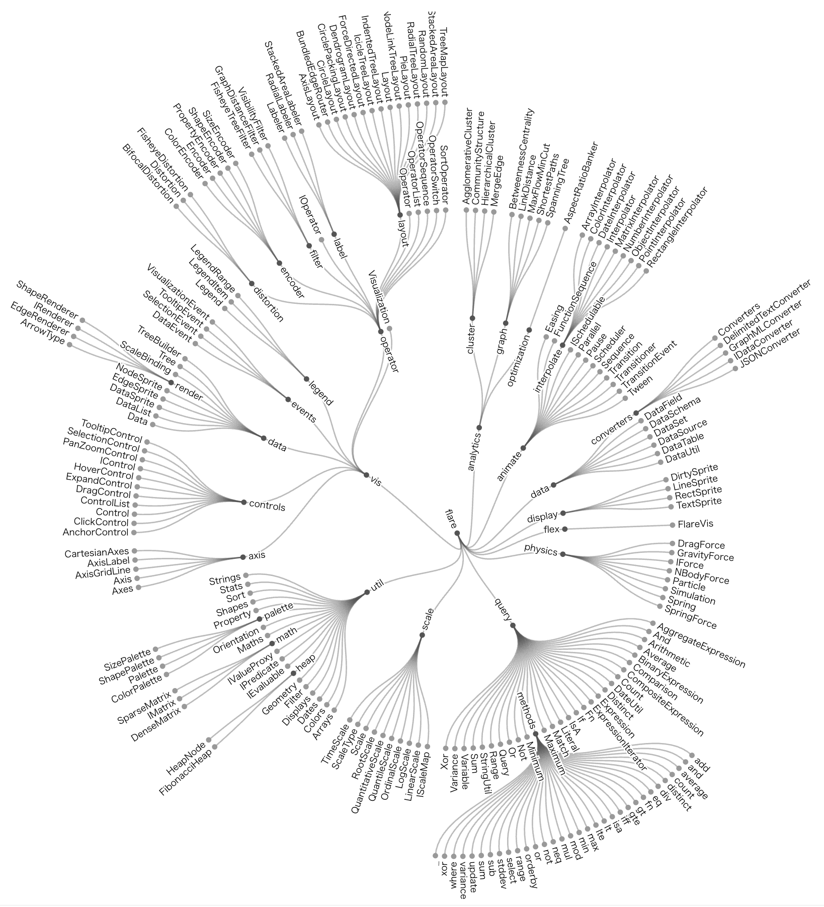

+++
author = "Yuichi Yazaki"
title = "Radial Tree"
slug = "radial-trees"
date = "2025-10-11"
categories = [
    "chart"
]
tags = [
    "",
]
image = "images/thumb_ph_vizjp.png"
+++

A radial tree lays out a hierarchy in a circular form. The root node is placed at the center, and child nodes radiate outward by level. This makes hierarchical depth and parent-child relationships visible in a compact layout.

<!--more-->

## Historical Background

Circular tree layouts appear in nineteenth-century classification and phylogenetic diagrams, but computational radial tree layouts developed in information visualization research in the late twentieth century.

## Use Cases

- Taxonomies
- Organization structures
- File systems
- Phylogenetic trees
- Information architecture maps

## Design Notes

- Use radial trees when compact overview matters.
- Keep labels legible around the circle.
- Avoid very deep hierarchies without interaction.
- Consider horizontal trees when labels are long.

## Summary

Radial trees are compact hierarchy diagrams. They provide a strong overview, but label readability and dense branches require care.
