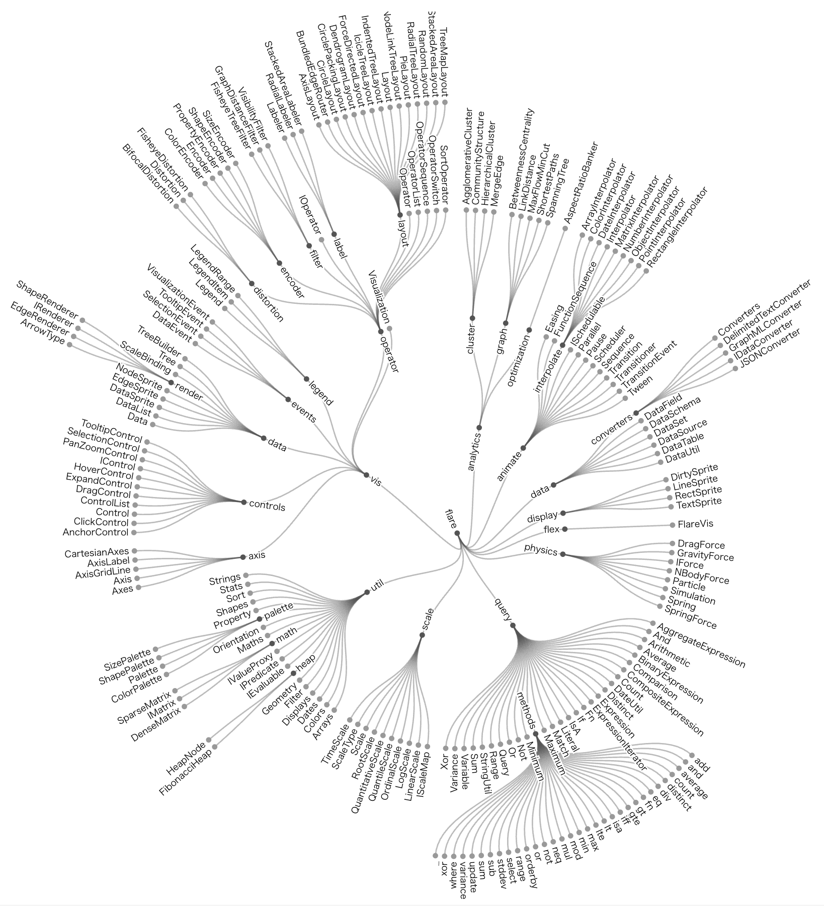

+++
author = "Yuichi Yazaki"
title = "放射樹 (Radial Tree)"
slug = "radial-trees"
date = "2025-10-11"
categories = [
    "chart"
]
tags = [
    "",
]
image = "images/thumb_ph_vizjp.png"
+++

放射樹（Radial Tree）は、階層構造を円形に展開して表現する可視化手法です。ルートノード（根）を中心に置き、各階層のノードを外側に放射状に配置することで、階層の深さや親子関係を直感的に把握できるようにします。ツリー構造をコンパクトにまとめながら、全体の関係性を均等に示せる点が特徴です。情報の階層、組織構造、分類体系、ファイル構造など、ツリー型のデータを視覚的に整理するのに用いられます。

<!--more-->

## 歴史的経緯

ツリー構造を円形レイアウトで表現する発想は、19世紀の系統樹や分類図に見られますが、コンピュータ上でのRadial Treeとしての実装は1980〜1990年代の情報可視化研究に端を発します。特に1991年のEadesによる「radial layout for general trees」や、1995年のKozo Sugiyamaらによる階層的グラフ描画アルゴリズムが基礎理論として知られています。

放射樹は古典的なツリー構造可視化の一形態であり、1980年代以降、計算機科学や情報可視化分野で発展しました。

特に **Tamara Munzner** や **Ben Shneiderman** らの研究を通じて、ツリー構造の多様なレイアウト手法（矩形、円形、放射状など）が体系化されました。

近年では、**D3.js** や **RAWGraphs** 、**Gephi** などの可視化ツールで簡単に放射樹レイアウトを生成でき、インタラクティブな情報可視化の定番手法の一つとなっています。

## データ構造

放射樹は基本的にノード（node）とエッジ（edge）による木構造データを入力とします。  
各ノードは「名前」「親ノード」「子ノード」などの属性をもち、JSONやCSV形式で階層的に表現できます。  
放射配置では、階層の深さに応じてノードの半径位置を決定し、角度方向に均等に分配することで全体を描きます。

| 要素 | 説明 |
|------|------|
| ノード（node） | 各要素（例：人物、フォルダ、分類など） |
| エッジ（edge） | 親子関係を結ぶ線 |
| 深さ（depth） | ルートからの距離、半径方向に反映 |
| 角度（angle） | ノード間の配置方向 |

## 目的

放射樹の目的は、階層データを**全体構造として把握**しやすくすることです。  
直線的なツリーでは末端が長くなりがちですが、放射構造では空間を効率的に利用して、同心円状に階層を展開します。これにより、上下や左右の偏りなく、中心から外への拡がりを示す視覚効果が得られます。

## ユースケース

- 生物分類や言語系統樹など、進化や派生を表す図  
- 組織図やサイトマップなど、階層的な構造分析  
- ファイルシステムやナレッジグラフの視覚化  
- ソーシャルネットワークの階層的分析  
- 概念体系（タクソノミー）の表示

| 用途 | 説明 |
|------|------|
| **分類体系の表示** | 動植物の分類やファイル構造など、明確な階層関係をもつデータの可視化。 |
| **組織図・家系図** | 上位と下位の関係をコンパクトに示す際に有効。 |
| **系統進化の表示** | 系統樹 (Phylogenetic Tree) の放射型レイアウトとしても利用される。 |
| **知識体系の可視化** | 概念やテーマの関連を階層的に整理するマインドマップ的用途にも応用可能。 |

## 特徴

- **空間効率が高い**：円周方向に展開するため、広範な階層を1画面で示しやすい  
- **方向の中立性**：上下左右の階層方向に偏りがない  
- **直感的な階層理解**：中心から外側へという自然な構造認識が可能  
- **装飾性が高い**：視覚的に美しく、インフォグラフィックにも適する

## チャートの見方

中心がルート（親）であり、外周に向かって階層が深まります。  
ノードをクリックすると、そのサブツリーを展開または折りたたむ操作が可能な場合もあります。  
線の長さや角度には意味がないことも多く、主に「階層」と「関係性」の理解を目的とします。

放射樹は「ツリー構造」を放射状に配置する点が特徴です。以下のような要素で構成されます。

| 要素 | 説明 |
|------|------|
| **中心ノード (Root)** | ツリーの起点。すべての関係がここから放射状に展開します。 |
| **枝 (Edge)** | 親子ノードをつなぐ線。放射方向に伸びるため、階層が増えると円環状に広がります。 |
| **ノード (Node)** | 各階層の要素。大きさや色で属性（人数、重み、カテゴリなど）を表すこともあります。 |
| **角度配置 (Angular Layout)** | ノードが中心から均等な角度で配置され、全体で円形を形成します。 |
| **階層距離 (Radial Distance)** | 階層の深さに応じて中心からの距離が変わります。外側ほど下位の階層になります。 |

この構造により、上下や左右の方向性に依存せず、情報を均等に視覚化できる利点があります。

## デザイン上の注意点

- **ラベル配置の工夫**：外周に並ぶノード名が重ならないように配置角度を調整する  
- **階層の深さ制御**：階層が多すぎると外側が密集するため、省略や折りたたみが有効  
- **色の使い分け**：階層レベルやカテゴリごとに色を区別すると理解しやすい  
- **インタラクション設計**：ズームやフィルタ機能を加えると情報過多を防げる  

## 応用例

- **D3.js radial tree layout** を用いたWebインタラクティブ系統図  
- **Cytoscape**によるバイオネットワーク表示  
- **Graphviz `twopi`レイアウト**による円形階層構造描画  
- 組織や家系図などのビジュアル年表

## 代替例

| 手法 | 特徴 |
|------|------|
| 樹状図（Tree Diagram） | 水平・垂直方向に階層を展開する一般的形式 |
| サンバーストチャート（Sunburst） | 放射樹を円弧領域で面積化したバリエーション |
| ハイパーボリックツリー | 放射樹の改良版。超曲面上に無限階層を視覚的に表現 |
| Icicle Chart | 階層を矩形ブロックとして線形に表示する |

## まとめ

放射樹は、ツリー構造の視覚化を円形レイアウトで美しく表現する手法です。階層のバランスや構造の対称性が直感的に伝わるため、組織図や分類体系のような複雑な階層関係の理解を助けます。データ量が増えるほど設計やインタラクションが重要となりますが、正しく設計すれば視覚的な明快さと芸術性を両立できる可視化です。

## 参考・出典

- [D3.js – Radial Tree Layout](https://observablehq.com/@d3/radial-tree)
- [Graphviz Layouts – Twopi (Radial)](https://graphviz.org/docs/layouts/twopi/)
- [Sugiyama, K., Tagawa, S., & Toda, M. (1981). Methods for visual understanding of hierarchical system structures. IEEE Transactions on Systems, Man, and Cybernetics.](https://doi.org/10.1109/TSMC.1981.4308636)
- [D3.js – Radial Tree Layout](https://observablehq.com/@d3/radial-tree)
