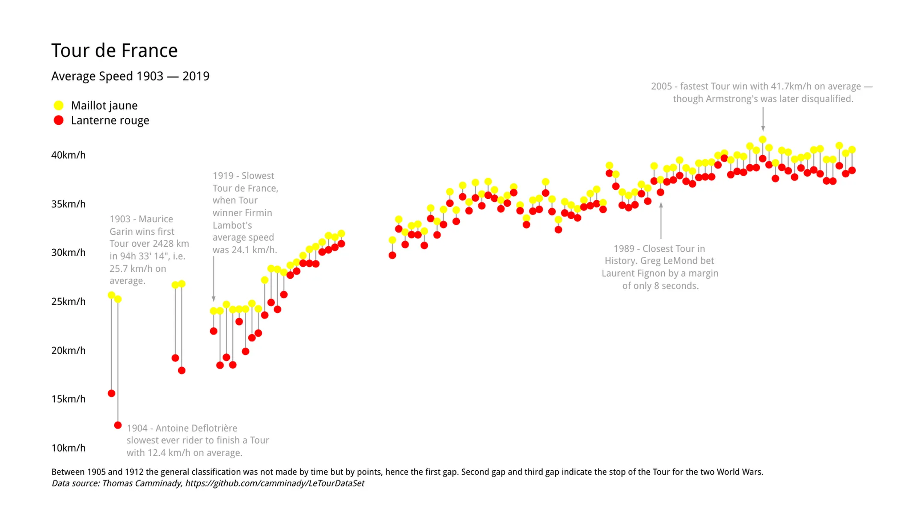

+++
author = "Yuichi Yazaki"
title = "Range Plot"
slug = "range-plot"
date = "2025-10-12"
categories = [
    "chart"
]
tags = [
    "",
]
image = "images/cover.png"
+++

A range plot connects two values for each item with a line, making the range between them visible. It is used when each category has a lower and upper value, a start and end, or two comparable values such as last year and this year. It is closely related to the dumbbell chart and gap chart.

<!--more-->

## Historical Background

Range plots developed from dot plots. William Cleveland formalized dot plots in the context of statistical graphics, and connecting two points with a line became a natural way to show gaps and intervals.

## Purpose

The purpose is to make differences between two values easy to compare across categories. The length of the line shows the size of the gap, while the positions of the endpoints show the actual values.

## Use Cases

- Minimum and maximum values
- Before-and-after comparison
- Gender gaps
- Year-over-year change
- Start and end dates or values

## Design Notes

- Label endpoints clearly.
- Sort categories by gap or endpoint when helpful.
- Use color to distinguish the two endpoint types.
- Avoid too many categories if labels become crowded.

## Summary

Range plots are effective when the story is about the interval between two values. They are more precise than grouped bars for showing gaps and often more compact.
