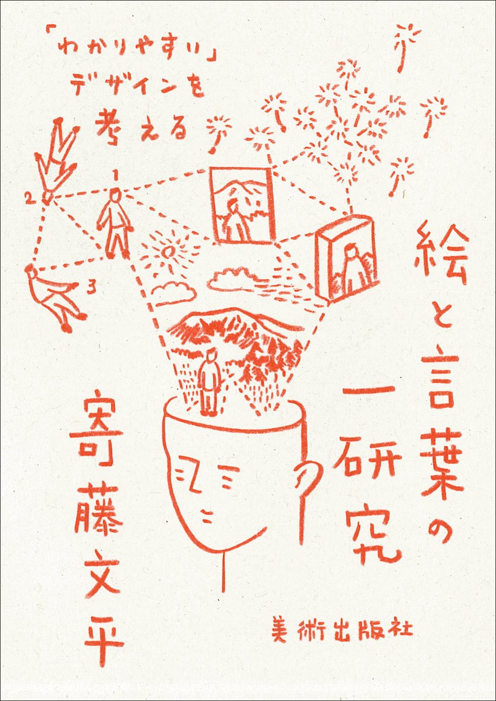
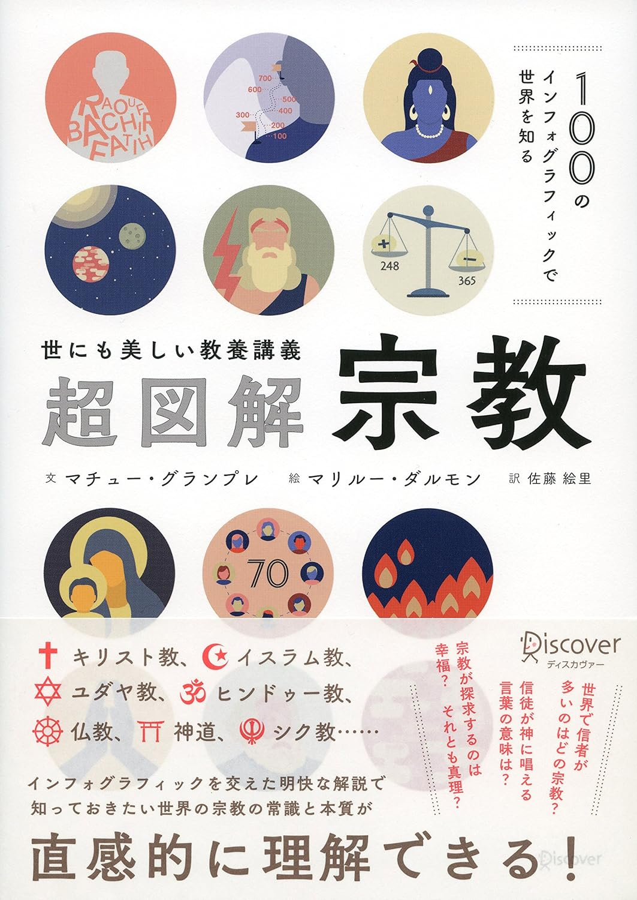
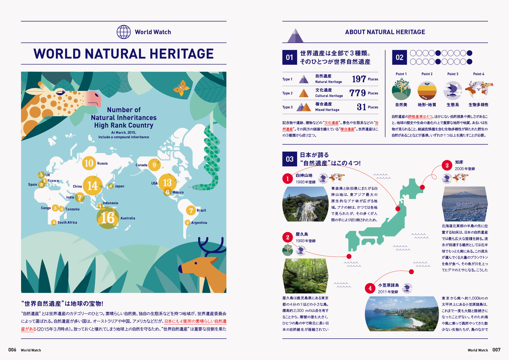
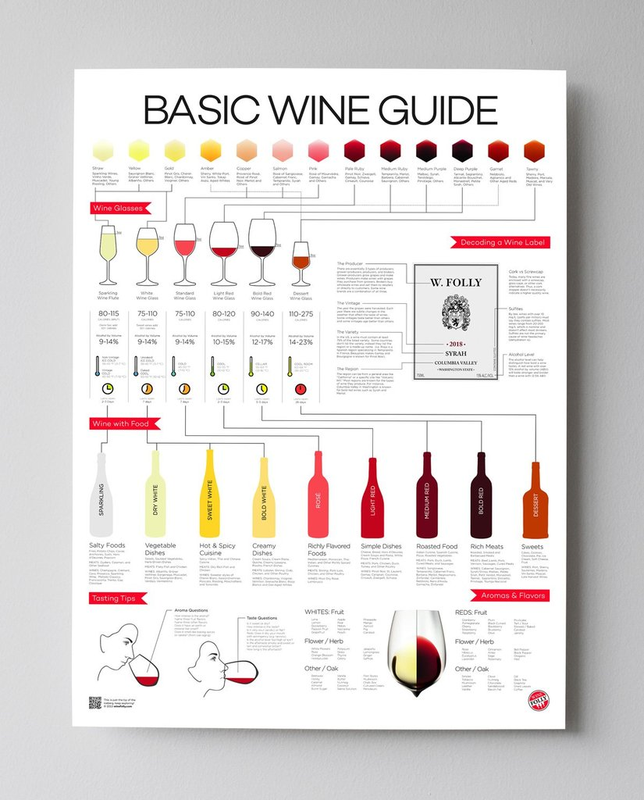
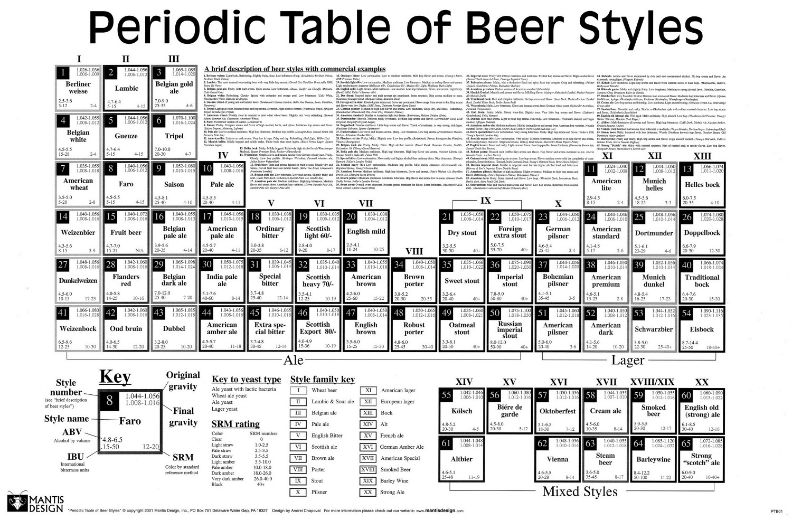

+++
author = "Yuichi Yazaki"
title = "美大生に聞く、今気になるデータ可視化／インフォグラフィック作品"
slug = "recent-interest-art-school-2020"
date = "2020-06-23"
categories = [
    "consume"
]
tags = [
    "",
]
image = "images/3minutesCalorieMate.png"
+++

筆者が非常勤で半期受け持っている、多摩美術大学 情報デザイン学科 メディアデザイン三年生に聞いた「よかったデータ可視化／インフォグラフィック作品」をリストしました。従来のインフォグラフィックから、最近流行りのBar Chart Raceまで。まだ観たことないものがあれば、ぜひ楽しんでください。

#### CalorieMate commercial from Japan - OyatsuCafe.com



#### MONSTER HUNTER 10th Anniversary Monsters Size Comparison



#### ドミノ・ピザ GPS DRIVER TRACKER

<figure>

<figcaption>

[https://www.dominos.jp/tracker/gps](https://www.dominos.jp/tracker/gps)

</figcaption>

</figure>

#### 絵と言葉の一研究 「わかりやすい」デザインを考える

<figure>

<figcaption>

[絵と言葉の一研究 「わかりやすい」デザインを考える](https://amzn.to/3doD7jt)

</figcaption>

</figure>

#### 100のインフォグラフィックで世界を知る 〈世にも美しい教養講義〉超図解・宗教

<figure>

<figcaption>

[100のインフォグラフィックで世界を知る 〈世にも美しい教養講義〉超図解・宗教](https://amzn.to/31ea7s6)

</figcaption>

</figure>

#### YouTubeチャンネル登録者数推移

https://twitter.com/kazuki8kki28/status/1217291500251279360

#### 【2009-2019】コミック別年間売上げランキング TOP10

https://www.youtube.com/watch?v=NQQT9U3xQio



#### エイゴラボ

<figure>

<figcaption>

[エイゴラボ](http://beach-inc.com/workinfo/eigo-lab/)

</figcaption>

</figure>

#### BASIC WINE GUIDE

<figure>

<figcaption>

[https://shop.winefolly.com/products/basic-wine-guide](https://shop.winefolly.com/products/basic-wine-guide)

</figcaption>

</figure>

#### Beer's Periodic Table

<figure>

<figcaption>

[https://visual.ly/community/Infographics/food/beers-periodic-table](https://visual.ly/community/Infographics/food/beers-periodic-table)

</figcaption>

</figure>

#### NO YOUTH NO JAPAN

[NO YOUTH NO JAPAN](https://www.instagram.com/p/CBnHouGBhF9/)

