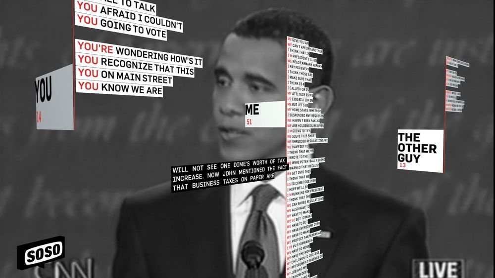
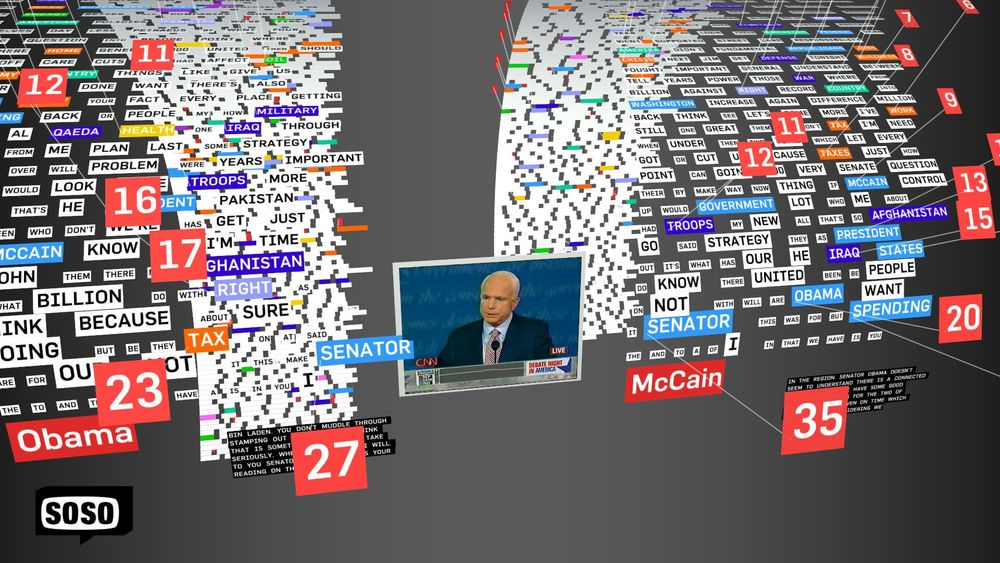

+++
author = "Yuichi Yazaki"
title = "ReConstitution 2008"
slug = "reconstitution-2008"
date = "2026-01-04"
categories = [
    "consume"
]
tags = [
    "",
]
image = "images/3290547303_f249dace17_o.jpg"
+++

ReConstitution 2008 は、データビジュアライゼーションとメディアアートを横断する制作スタジオ Sosolimited によって発表された、ライブ・オーディオビジュアル・パフォーマンス作品です。2008年のアメリカ大統領選挙におけるテレビ討論を素材として、討論の映像や音声をリアルタイムで解析・再構成し、抽象化された映像と音響として提示しました。

本作は、政治的主張の内容を伝えることを目的としたものではなく、討論というメディアイベントそのものを「素材」として扱い、言語、声、身体表現が持つ構造を別の感覚へ翻訳する試みとして位置づけられます。

<!--more-->

## 経緯

2008年の米国大統領選挙は、テレビ討論が強い注目を集め、候補者の言葉遣いや振る舞いがメディアを通じて大量に消費された選挙でした。ReConstitution 2008 は、そのような政治的・メディア的状況を背景に、討論を一方向的に「視聴」するのではなく、分解し、再構築する対象として捉え直すために制作されました。

本作は、討論番組の同時進行性を保ったまま実施されるライブ・パフォーマンスとして発表され、映像上映やインスタレーション展示の文脈でも紹介されています。

## データ構造

ReConstitution 2008 におけるデータは、厳密な数値データセットとして整理されるものではありません。主に以下の要素がリアルタイムに取り込まれ、変換のトリガーとして用いられます。

| 要素 | 内容 |
|---|---|
| 音声 | 候補者の発話、音量、リズム |
| 映像 | 討論番組の映像、候補者の表情や身振り |
| 時間情報 | 発話の間、繰り返し、同時性 |

これらは統計的な集計結果として可視化されるのではなく、映像や音響の変化を引き起こす素材として扱われます。

## 目的

本作の目的は、政治的討論を理解させたり、評価したりすることではありません。討論という出来事が、どのようなリズムで進行し、どのような身体的・感覚的要素を伴って成立しているのかを、視覚と聴覚を通して体験させることにあります。

ReConstitution 2008 は、討論を「意味の集合」ではなく、「構造と運動を持つメディア現象」として再提示する作品です。

## 特徴

ReConstitution 2008 の最大の特徴は、可視化結果を「読む」ことを求めない点にあります。映像は断片化され、繰り返され、抽象化されることで、討論の連続性は意図的に失われます。

これにより観客は、発言の内容よりも、話すという行為そのもの、身体の動き、音声の強弱といった非言語的要素に注意を向けることになります。

## 作品の見方

鑑賞の際には、画面に表示される情報を理解しようとするよりも、映像と音響の変化に身を委ねることが重要です。候補者の顔が強調される場面や、発話が断片的に反復される構成は、討論の緊張感やメディア的演出を浮かび上がらせます。

ここでは、可視化は説明装置ではなく、感覚を揺さぶるための変換装置として機能しています。

## Sosolimited の制作史における位置づけ

ReConstitution 2008 は、Sosolimited がライブ・データ表現に取り組む初期段階の実践として位置づけられます。本作では、解析結果を明示的なデータとして提示することよりも、討論を素材として解体・再構成する表現が重視されています。その後の作品では、同様のライブ性を保ちながら、言語特徴量や傾向を可視化する、より分析的な方向へと発展していきます。ReConstitution 2008 は、その転換以前の段階を示す重要な参照点と言えます。

## デザイン上の注意点

ReConstitution 2008 を参考にする際には、情報整理や分かりやすさをそのまま模倣しようとすると本質を見誤ります。本作のデザインは、あえて過剰で、不安定で、読みづらい構成を採用しています。

それは、政治討論が本来持つノイズや過密さを、そのまま体験させるための設計です。

## ユースケース

本作は以下のような文脈で参照されます。

- メディアアートにおけるライブ・リミックス作品
- 政治的出来事を素材化するアート表現
- リアルタイム映像処理・音響処理の実践例
- データ可視化以前の、生成的表現の事例

## 応用例

本作の考え方は、以下のような応用につながります。

- 会話や議論を素材としたライブ表現
- 音声データを用いた生成的アート
- 可視化以前の段階におけるデータ表現の研究
- パフォーマンスと情報処理の融合

## まとめ

ReConstitution 2008 は、政治討論を情報として説明するのではなく、メディア現象として再体験させるライブ・データ表現作品です。可視化を「理解のための図」と捉えるのではなく、「感覚を変換する装置」として扱う姿勢は、現在のデータビジュアライゼーションを考える上でも示唆に富んでいます。

## 参考・出典

- [Reconstitution 2008 – Sosolimited](https://www.sosolimited.com/work/reconstitution-2008)
- [ReConstitution 2008 (video excerpt)](https://vimeo.com/926778)
- [Sosolimited’s ReConstitution 2008](https://rouvelle.com/sosolimiteds-reconstitution-2008/)
- [ReConstitution – transmediale](https://transmediale.de/en/artwork/reconstitution)