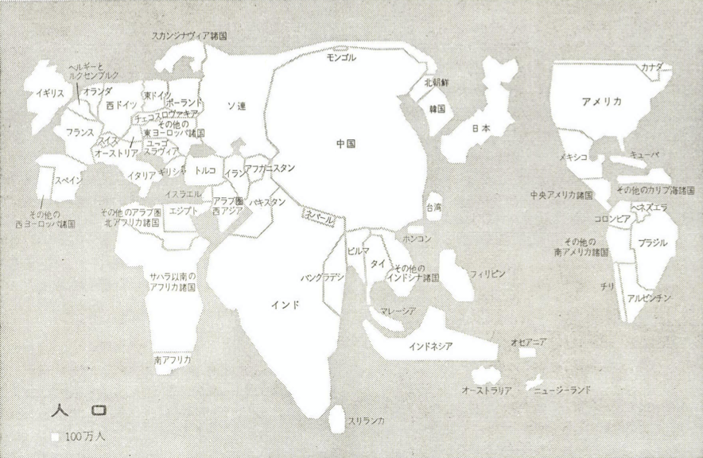
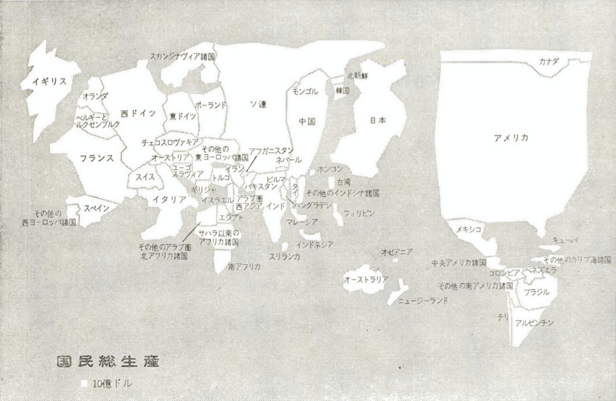
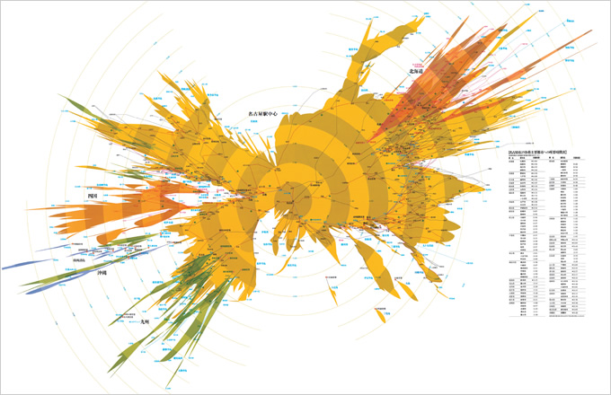

+++
author = "Yuichi Yazaki"
title = "ライシャワー元駐日大使が日本に向けた眼差しとしてのカルトグラム地図"
slug = "reischauer-cartogram"
date = "2020-08-14"
description = ""
categories = [
    "consume"
]
tags = [
    "map",
]
image = "images/ライシャワー_Japanese_GNP.png"
+++

ライシャワー元駐日大使「ザ・ジャパニーズ」という著書の中で、彼自身が作成したというカルトグラムで描いた日本地図が掲載されています。原書は1978年、翻訳書は翌1979年に出版されています。

<!--more-->

- [E・O・ライシャワー「ザ・ジャパニーズ」](https://amzn.to/4dMUASW)

カルトグラムというのは、データ値を国や行政区域の示す面積に反映させ、データ値を地図として眺めることを試みる手法です。

- E・O・ライシャワーによる「国の大小が人口に比例して描かれている地図」

- E・O・ライシャワーによる「国の大小がGNPに比例して描かれている地図」

ご本人はこのように説明しています。

> 「その地図の一つは国の大小が人口に比例して描かれており、いま一つはGNPに比例している。筆者がこの二つの地図をはじめて考えついたのは、一九六四年のことであった。第二次大戦の敗戦が尾を引き、実勢をはるかに下回る評価を蒙っていた日本人に対し、日本がかなりの大国であることを指摘するのが、そのもくろみであった。」

E・O・ライシャワー「ザ・ジャパニーズ」
アイデア誌（2007年9月号）の特集記事で、杉浦康平さんがインタビューに応じて、この地図からの影響を明かしています。

> 「統計は全てのものを数量化し、デジタル化する。だから、庶民一人ひとりの生活感情は切り捨てられて、単なる一個の人間、生きるための消費エネルギーの数量化へと還元されてしまう。計量化しないと、統計図や主題地図というものは描けないんです。だから誰もが疑うことなく計量化し地図化することで、国の活力の全体像が掴めると思っていた。
> ところが一方で、1965年に元駐日大使のE・O・ライシャワーによる国民総生産地図や人口地図のようなものが現れた。これはアメリカのGNPがいかに世界を制覇しうるほどに大きくなっているかの説明するための地図なのですが、同時に、主題をとりかえ見方を変えることで、見なれた地形がものの見事に変化し、動きうることを示す地図でした。動かない地表の地図ではなく、その上で人が生き、笑い、動き回って自分たちの文化を築いている、人びとのふるまいを映しだすような、動く地図の可能性があることを示してくれた。人間のアクティビティーを主題にした地図表現があるということ。じつに新鮮な、晴天の霹靂のような地図でした。」
> アイデア誌（324 2007年9月号）

ライシャワーさんによる地図の主旨と杉浦さんの受け取りのすれ違い、現在からみるとある種ほほえましいですが、こういった刺激が直後の杉浦康平さんの素晴らしい時間軸変型地図をはじめとした主題地図群を生み出していったことにドキドキしますね。杉浦さんの上記のコメントは現在も古びることなく、むしろ今こそ改めて噛み締めたいものです。

[杉浦康平さんの時間軸変形地図。『時間のヒダ、空間のシワ…［時間地図］の試み─杉浦康平ダイアグラム・コレクション』鹿島出版会](https://amzn.to/3ynJ3JH)