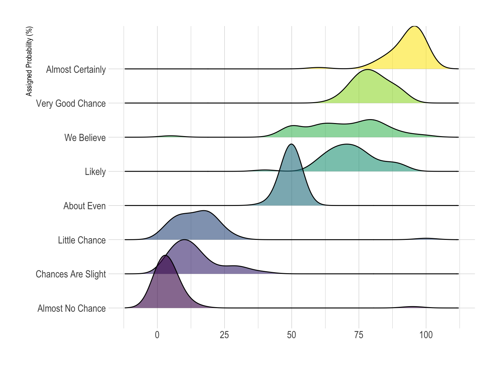

+++
author = "Yuichi Yazaki"
title = "Ridgeline Plot"
slug = "ridgeline-plot"
date = "2025-10-11"
categories = [
    "chart"
]
tags = [
    "",
]
image = "images/cover.png"
+++

A ridgeline plot stacks multiple distributions, usually smooth density curves, with slight vertical offsets. It is useful for comparing how distributions change across time or categories. The name comes from the appearance of mountain ridge lines.

<!--more-->

## Use Cases

- Temperature distributions over months
- Income or demographic distributions by group
- Music waveform-like patterns
- Comparing many related density curves

## How to Read It

Each ridge shows one distribution. Peaks indicate where values are concentrated. Comparing ridge positions and shapes reveals shifts, spread, and changes in modality.

## Design Notes

- Avoid excessive overlap that hides lower ridges.
- Use consistent scales.
- Label categories clearly.
- Consider violin plots or small multiples when exact comparison matters.

## Summary

Ridgeline plots are effective for comparing many distributions compactly. They emphasize shape and change more than exact values.
