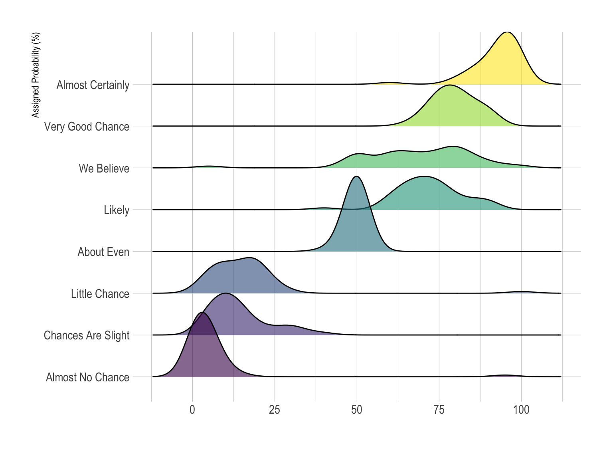

+++
author = "Yuichi Yazaki"
title = "リッジライン・プロット（Ridgeline Plot）"
slug = "ridgeline-plot"
date = "2025-10-11"
categories = [
    "chart"
]
tags = [
    "",
]
image = "images/cover.png"
+++

リッジライン・プロット（Ridgeline Plot）は、複数のグループ（カテゴリ）ごとの **連続変数の分布** を縦方向に重ねて描画するグラフです。  
各グループの分布を「稜線（ridge）」のように積み重ねることで、全体の比較や変化の傾向を直感的に理解できます。  

<!--more-->

別名として「Joyplot」とも呼ばれます。これは、イギリスのバンド Joy Division のアルバム『Unknown Pleasures』（1979年）のカバーアートに形が似ていることに由来します。このアルバムジャケットは、電波パルス信号を可視化した図形であり、その「波打つ山並み」がリッジライン・プロットの象徴的なイメージの原点となりました。

## チャートの見方

| 要素 | 意味 |
|------|------|
| 各曲線（稜線） | 特定カテゴリの分布（例：各年、各地域など）を表す。密度曲線やヒストグラムに基づく。 |
| 縦方向の並び | 分類（カテゴリ）の順序。通常は時系列やカテゴリー順に並べる。 |
| 横軸 | 対象となる数値変数（例：収入、温度、測定値など）。 |
| 稜線間の重なり | 分布同士の比較を視覚的に可能にする。重なりすぎると見づらくなるため、透明度やスケール調整が重要。 |
| 色や透明度 | 各カテゴリを区別したり、強調するために使用される。 |

### 背景と特徴

リッジライン・プロットは、データ分布を **省スペースで多層的に** 表現できる手法として、時系列や地域別の変化を比較する際に有効です。  
とくに以下の点で優れています：

- **分布の形状の比較**：複数のカテゴリを一枚の図で俯瞰できる。  
- **トレンドの可視化**：時間や順序に応じた変化を滑らかに見せることができる。  
- **視覚的魅力**：稜線が波のように連なるため、芸術的・印象的な表現としても活用される。  

一方で、重なり具合が大きすぎると識別が困難になるため、適切な「スケール」や「透明度（alpha）」の設定が重要です。

### 実践上のポイント

- **カテゴリ順の設定**：平均値や中央値順に並べると分布差が明瞭になる。  
- **バンド幅の調整**：平滑化（カーネル密度推定）パラメータを変えることで山の鋭さを調整可能。  
- **透明度設定**：オーバーラップが強い場合は `alpha` 値を小さくして視認性を確保する。  
- **補助線・注釈**：平均や四分位線を重ねると、定量的比較が容易になる。  

### まとめ

リッジライン・プロットは、統計的な分布比較を「層の重なり」で魅せるグラフです。  
Joyplotに由来するビジュアル的美しさと、分布比較の実用性を兼ね備えており、RやPythonなどの環境で手軽に作成できます。  
データ数が十分にある場合には、複数群の「変化の風景」を描く強力な手法となります。

## 参考・出典

- [Data to Viz — Ridgeline plot](https://www.data-to-viz.com/graph/ridgeline.html)  
- [Wikipedia — Ridgeline plot](https://en.wikipedia.org/wiki/Ridgeline_plot)  
- [R Graph Gallery — Basic ridgeline plot](https://r-graph-gallery.com/294-basic-ridgeline-plot.html)  
- [Altair — Ridgeline Plot Example](https://altair-viz.github.io/gallery/ridgeline_plot.html)  
- [Analytics Vidhya — Visualize data with a Joyplot](https://www.analyticsvidhya.com/blog/2021/06/ridgeline-plots-visualize-data-with-a-joy/)  

