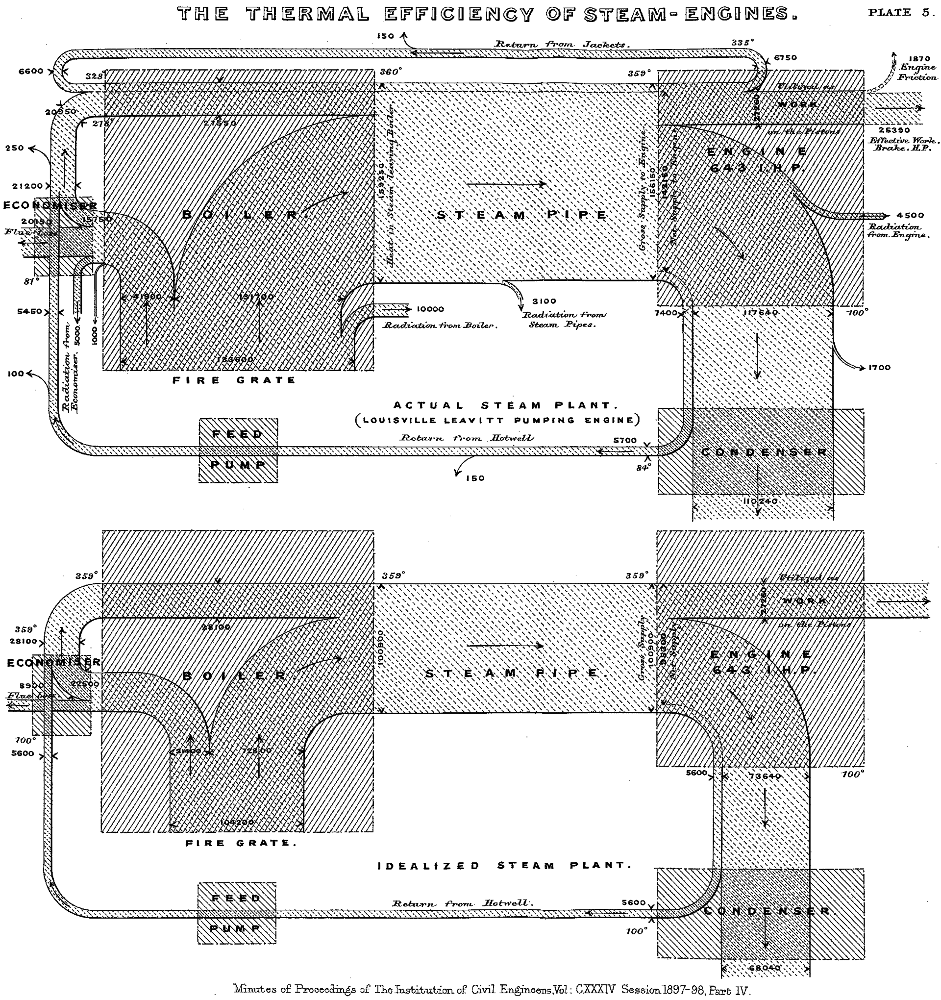

+++
author = "Yuichi Yazaki"
title = "サンキー・ダイアグラム（Sankey Diagram）"
slug = "sankey-diagram"
date = "2020-08-02"
description = ""
categories = [
    "chart"
]
tags = [
    "ネットワーク",
]
image = "images/image-13.png"

+++

サンキー・ダイアグラム（Sankey Diagram）は、エネルギーや物質、資金などの「流れ（flow）」を太さで表現する可視化手法です。矢印の幅が流量の大きさに比例しており、入力から出力への分配や変換を直感的に理解することができます。主に、エネルギーフローやコスト配分、サプライチェーンなどの分析に用いられます。

<!--more-->

## 歴史的経緯

この手法は、1898年にイギリスの技術者マシュー・ヘンリー・フィニー・サンキー（Matthew Henry Phineas Riall Sankey）が蒸気機関のエネルギー効率を示すために使用した図に由来します。その後、フランスの技師チャールズ・ミナール（Charles Minard）のナポレオン遠征図など、関連する流量表現図の影響を受けながら発展しました。20世紀後半には産業分析やエネルギー統計の分野で広く採用され、現在ではウェブ可視化ライブラリ（D3.jsなど）でも一般的なチャートタイプとして定着しています。

## データ構造

サンキー・ダイアグラムは、「ノード（node）」と「リンク（link）」の2要素から成ります。
- **ノード**：流れの出発点または到達点（例：発電所、家庭、工場など）
- **リンク**：ノード間をつなぐ流れであり、数量値（value）を持つ

| 要素 | 説明 | 例 |
|------|------|----|
| source | 出発ノード | "発電" |
| target | 到達ノード | "産業" |
| value  | 流量値 | 1200 GWh |

これらのデータをJSONやCSV形式で構造化し、ライブラリ側でネットワークとして描画します。

## 目的

サンキー・ダイアグラムの目的は、複雑なシステム内の流れを俯瞰的に可視化し、どの部分で損失や集中が起きているかを把握することにあります。特にエネルギー効率、コスト配分、資源循環などのテーマで有効です。

Eurostatではサンキー・ダイアグラムの意義をこう説明しています。

> 「サンキー・ダイアグラムは、エネルギーの収支を視覚的に表現するための非常に実用的なツールです。エネルギー収支は、経済のさまざまなセクター（供給、変換、消費など）におけるさまざまなエネルギー商品（燃料、熱、電力、すなわち市場性のある形でのエネルギーキャリア）の貢献度と相互関係をエネルギー単位でまとめたものです」
> [Energy flow diagrams – Eurostat](https://ec.europa.eu/eurostat/web/energy/energy-flow-diagrams)

エネルギー収支でいう、エネルギー商品と経済活動という、インプットとその結果としてのアウトプットを説明し、かつ入出力が一対一対応していない大量の物事が関連している様を示しつつ、その仕組み（システム）を概観するのに向いているといえます。

ネットワーク・ダイアグラムの一種といえ、対象とする物事（エネルギーや経済活動など）をノードとし、その間の流量をリンクとして線の幅やときには色も用いて示します。

明示的に時間軸を伴う流れを説明するチャートは別のチャート、Alluvial Diagramsを用います。サンキー・ダイアグラムは、インプットとその結果としてのアウトプットを説明しながらも、時間の情報は持ちません。有向グラフ的であり、矢印が一方向のみに向いていることのみを示します。

時間が経つにつれて、熱バランス、エネルギー、マテリアルの流れの可視化に用いられ、1990年代以降はライフサイクルアセスメント（LCA）における「代謝」の複雑さを示すためにサンキー・ダイアグラムを頻繁に使用していると、 Mario Schmidt はレポートしています。

## ユースケース

- 国別エネルギーフロー（IEA、経済産業省など）
- 企業のコスト構造分析
- サプライチェーンの物流経路
- ウェブトラフィックやユーザー行動の流れ分析
- 財政支出の可視化（国家予算フロー図など）

## 特徴

- 流量を面積（線の太さ）で表す定量可視化
- 方向性を持つ（主に左→右または上→下）
- 分岐や合流を自然に表現可能
- 色によってカテゴリや属性を補助的に示す

## チャートの見方

ノード間を結ぶ帯の太さが流量を示します。帯が太いほど大きな量が流れていることを意味します。また、色分けによりエネルギー源や部門、カテゴリを区別できます。左から右へ視線を動かすことで、入力から出力までの全体構造を理解できます。

## デザイン上の注意点

- 流量のスケールを適切に設定する（極端な差を抑制）
- ノード間の重なりや交差を減らす配置調整
- カラーマッピングは意味に基づき一貫性を保つ
- 流れの方向を視覚的に明確にする
- 凡例と単位（例：GWh、t、¥）を明記する

## 応用例

- **エネルギーフロー図**（日本エネルギー白書など）
- **資金の流れ**（寄付金の分配や予算の用途）
- **人材の移動**（社内配置や人事異動の可視化）
- **廃棄物フロー**（リサイクル率の見える化）
- **Web分析**（ユーザー遷移の可視化）

## 代替例

| 目的 | 代替チャート | 特徴 |
|------|---------------|------|
| 分岐・合流の強調 | フローチャート | 構造の理解に優れる |
| 全体構成比の強調 | ツリーマップ | 面積で割合を示す |
| 階層的関係の可視化 | サンバースト | 同心円構造で階層を表現 |

## まとめ

サンキー・ダイアグラムは、複雑な流れを「太さ」で定量的に示すことで、エネルギーや資金、物流などの動態を一目で把握できる優れた可視化手法です。歴史的には工学的分析のために生まれましたが、現在では経済、環境、UX設計など多様な分野で応用されています。

## 参考・出典

- [The Sankey Diagram in Energy and Material Flow Management – Schmidt – 2008 – Journal of Industrial Ecology – Wiley Online Library](https://onlinelibrary.wiley.com/doi/full/10.1111/j.1530-9290.2008.00004.x)
- [Sankey Diagrams – A Sankey diagram says more than 1000 pie charts](http://www.sankey-diagrams.com/)
- [The Sankey Diagram in Energy and Material Flow Management – Schmidt – 2008 – Journal of Industrial Ecology – Wiley Online Library](https://onlinelibrary.wiley.com/doi/full/10.1111/j.1530-9290.2008.00004.x)
- [Sankey Diagrams – A Sankey diagram says more than 1000 pie charts](http://www.sankey-diagrams.com/)

