+++
author = "Yuichi Yazaki"
title = "サンキー・ダイアグラム（Sankey Diagram）"
slug = "sankey-diagram"
date = "2020-08-02"
description = ""
categories = [
    "chart"
]
tags = [
    "",
]
image = "images/image-13.png"

+++

Mario Schmidt の調査によると、19世紀後半当時、新興工業国の技術者たちは、蒸気機関をさらに改良し、それぞれの用途に最適化するために、科学的手法を応用しようとしていました。蒸気機関の熱効率を分析するために、アイルランドのエンジニアRiall Sankeyによって、1898年に開発されました。

<!--more-->

Eurostatではサンキー・ダイアグラムの意義をこう説明しています。

> 「サンキー・ダイアグラムは、エネルギーの収支を視覚的に表現するための非常に実用的なツールです。エネルギー収支は、経済のさまざまなセクター（供給、変換、消費など）におけるさまざまなエネルギー商品（燃料、熱、電力、すなわち市場性のある形でのエネルギーキャリア）の貢献度と相互関係をエネルギー単位でまとめたものです」
> [Energy flow diagrams – Eurostat](https://ec.europa.eu/eurostat/web/energy/energy-flow-diagrams)

エネルギー収支でいう、エネルギー商品と経済活動という、インプットとその結果としてのアウトプットを説明し、かつ入出力が一対一対応していない大量の物事が関連している様を示しつつ、その仕組み（システム）を概観するのに向いているといえます。

ネットワーク・ダイアグラムの一種といえ、対象とする物事（エネルギーや経済活動など）をノードとし、その間の流量をリンクとして線の幅やときには色も用いて示します。

明示的に時間軸を伴う流れを説明するチャートは別のチャート、Alluvial Diagramsを用います。サンキー・ダイアグラムは、インプットとその結果としてのアウトプットを説明しながらも、時間の情報は持ちません。有向グラフ的であり、矢印が一方向のみに向いていることのみを示します。

時間が経つにつれて、熱バランス、エネルギー、マテリアルの流れの可視化に用いられ、1990年代以降はライフサイクルアセスメント（LCA）における「代謝」の複雑さを示すためにサンキー・ダイアグラムを頻繁に使用していると、 Mario Schmidt はレポートしています。

近年では「インプットとその結果としてのアウトプット」を説明するチャートの特性を活かし、集めた税金とその使いみちに使われる事例がたくさんあります。

## 過去、エネルギー関連をテーマに用いられてきた事例

### 20/30馬力のルノー車の走行速度60km/hの場合のエネルギー図

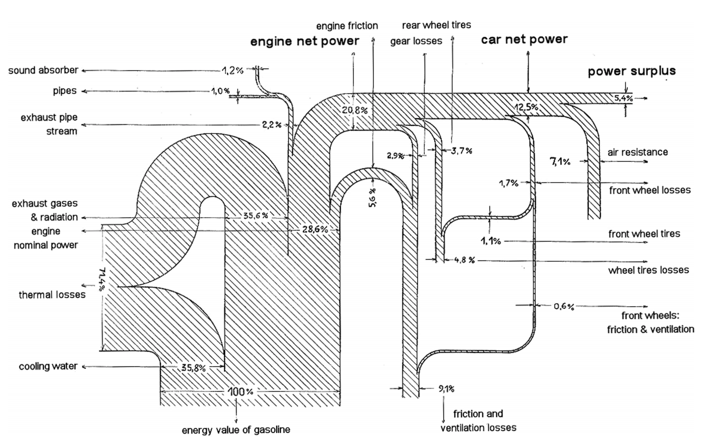

Source:
Riedler, A. 1911. Wissenschaftliche Automobil-Wertung.
Mario Schmidt. 2008. The Sankey Diagram in Energy and Material Flow Management.

### セメント製造における理論的な熱消費量（左）と実用的な熱消費量（右）

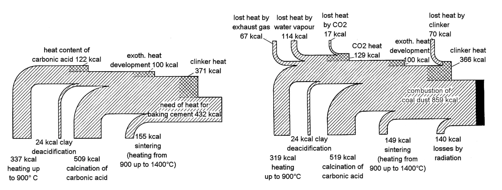

Source:
Schott, E. 1933. Waermewirtschaft in der Zementindustrie.
Mario Schmidt. 2008. The Sankey Diagram in Energy and Material Flow Management.

### ドイツの鉄鋼業のための鉄のフローチャート。鉱石中の鉄分100％に関連する数値

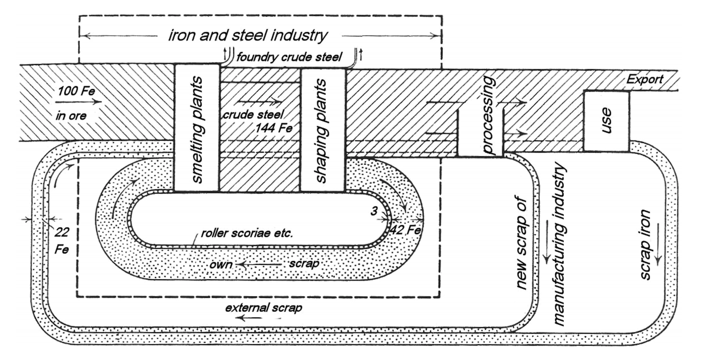

Source:
Reichardt, P. 1937. Rohstofflage, Roheisen- und StahlSortenfrage.
Mario Schmidt. 2008. The Sankey Diagram in Energy and Material Flow Management.

### エネルギーとマテリアルのフローによる管理

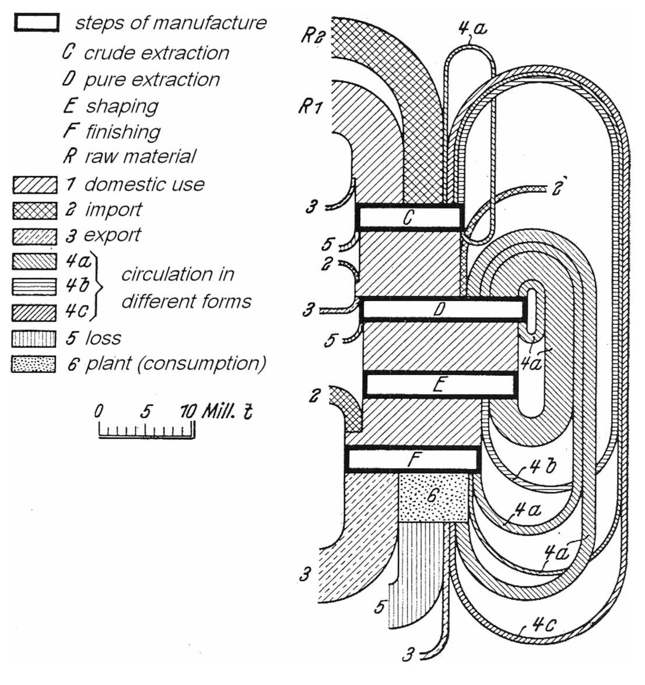

Source:
Schmidt, H. 1936. Grundsaetzliche Fragen zur Rohstoffbewirtschaftung.
Mario Schmidt. 2008. The Sankey Diagram in Energy and Material Flow Management.

### 鉄鋼工場における材料の年間価値の流れを模式的に示す

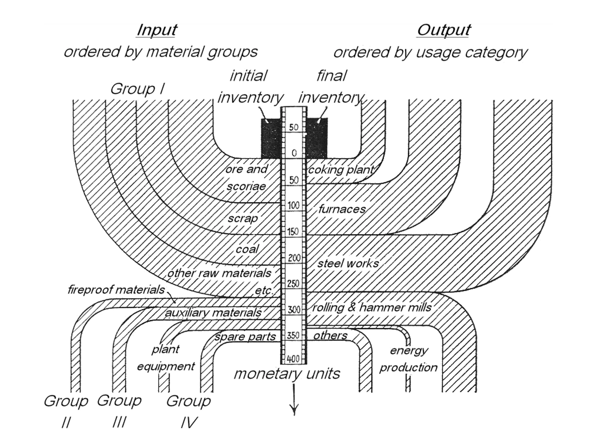

Source:
Schmidt, H. 1936. Grundsaetzliche Fragen zur Rohstoffbewirtschaftung.
Mario Schmidt. 2008. The Sankey Diagram in Energy and Material Flow Management.

## 近年、エネルギー関連をテーマに用いられてきた事例

### 米国天然ガス

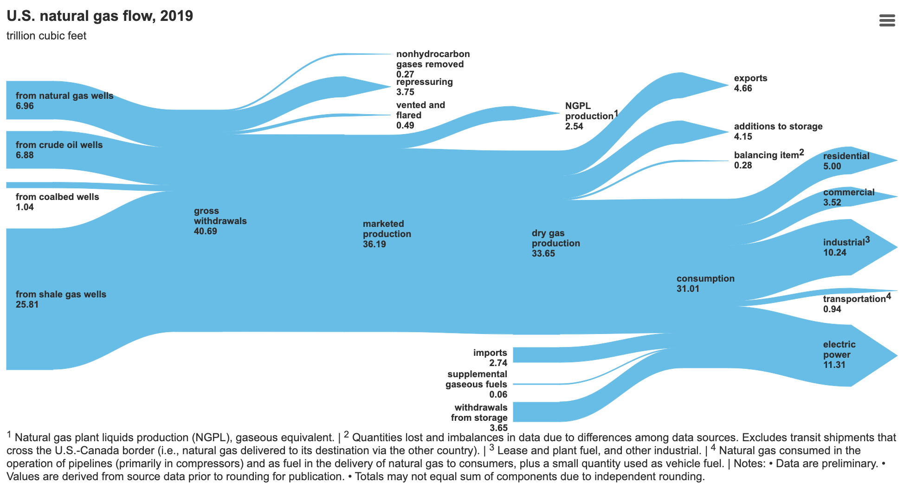

2019年の米国の天然ガスの供給（生産、輸入、貯蔵からの引き出し）と処理（消費、輸出、貯蔵への追加）の大きさを示しています。

[U.S. Energy Information Administration (EIA) – Issuestrends](https://www.eia.gov/totalenergy/issuestrends/)

### 国際エネルギー機関（International Energy Agency）

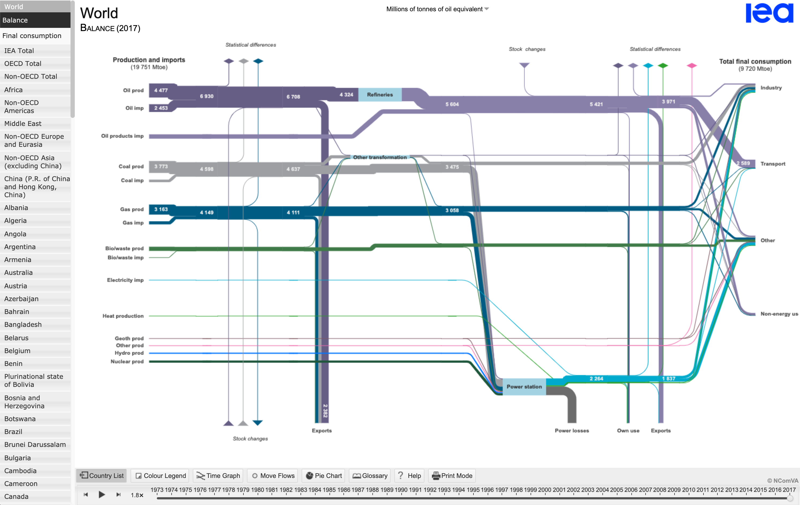

[IEA Sankey Diagram](https://www.iea.org/sankey/#?c=World&s=Balance)

### Eurostat

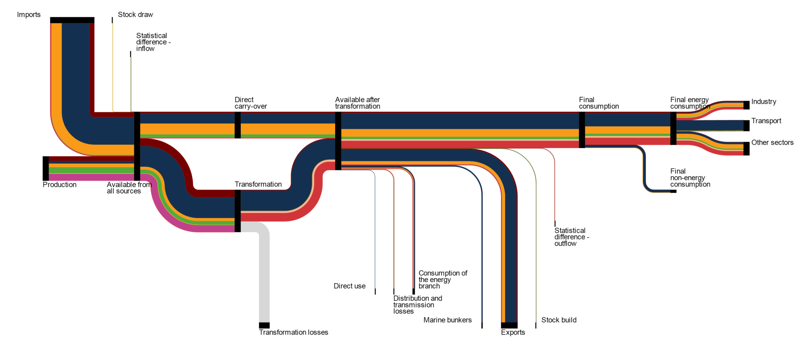

[Energy Flow Diagrams](https://ec.europa.eu/eurostat/web/energy/energy-flow-diagrams)

### LMDI Decomposition of Energy-Related CO2 Emissions Based on Energy and CO2 Allocation Sankey Diagrams: The Method and an Application to China

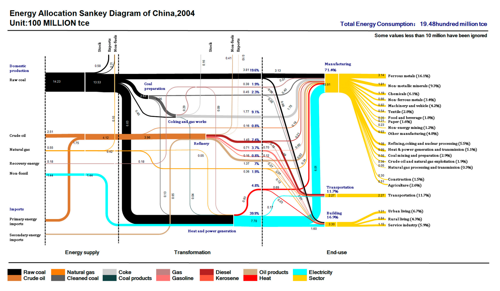

[(PDF) LMDI Decomposition of Energy-Related CO2 Emissions Based on Energy and CO2 Allocation Sankey Diagrams: The Method and an Application to China | Sustainability](https://www.researchgate.net/publication/322780248_LMDI_Decomposition_of_Energy-Related_CO2_Emissions_Based_on_Energy_and_CO2_Allocation_Sankey_Diagrams_The_Method_and_an_Application_to_China)

### LLNL – Energy Flow Charts

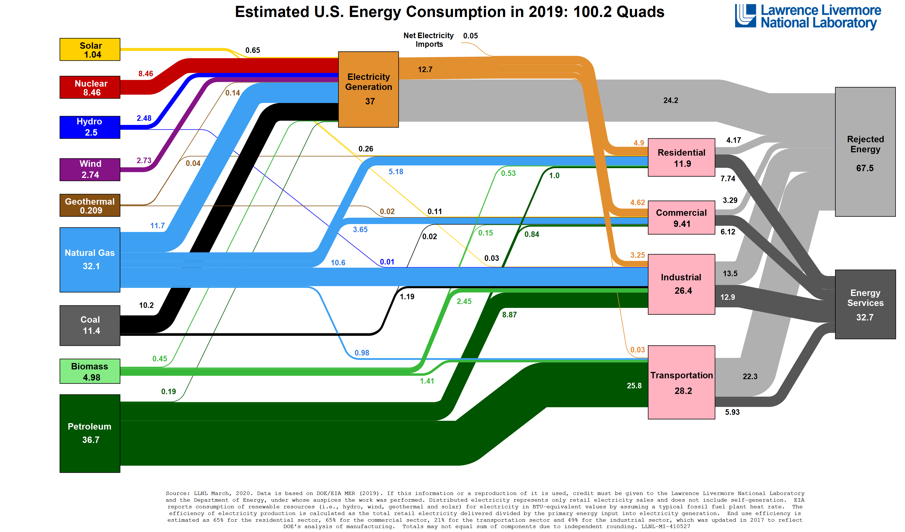

アメリカにおけるエネルギーのリソースとその使用先を示しています。ローレンス・リバモア国立研究所（LLNL）が1970年代に開発したもので、彼らは独自にEnergy Flow Chartsと呼んでいます。

[LLNL – Energy Flow Charts](https://flowcharts.llnl.gov/commodities/energy)



動画によるEnergy Flow Chartsの解説

### The flow of water in the hydrologic cycle

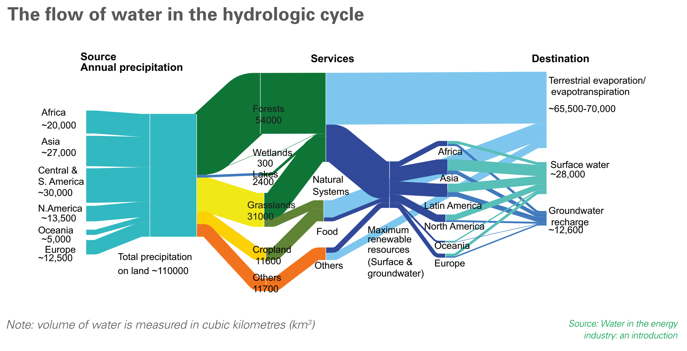

[The flow of water in the hydrologic cycle](https://www.ourenergypolicy.org/wp-content/uploads/2014/01/BP_ESC_Riosmallpdf.com_.pdf)

### 生産プロセスにおけるエネルギー効率化のための実践ガイド

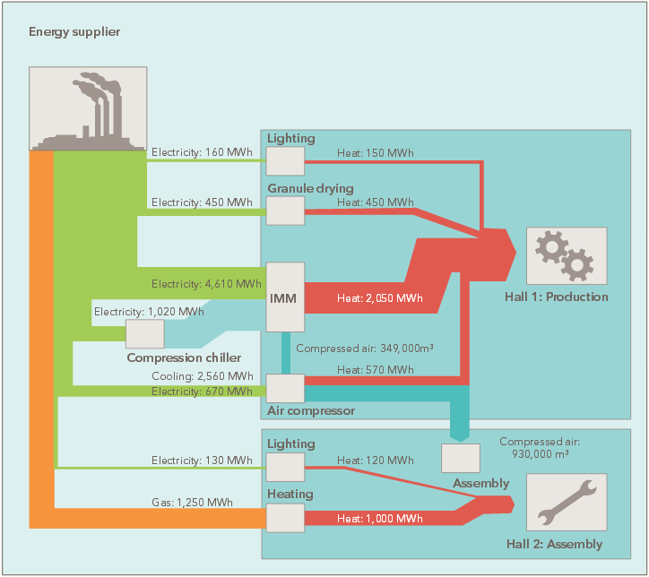

‘A Practical Guide to Energy Efficiency in Production Processes’

## エネルギー以外の分野でも

### 2008年のスペインの主な収益と支出

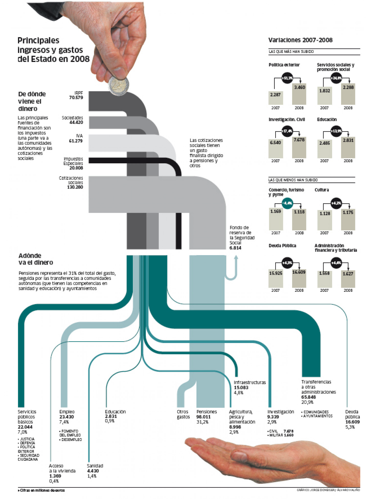

[Infographics Experts on Sankey Diagrams (Part 2) – Sankey Diagrams](http://www.sankey-diagrams.com/infographics-experts-on-sankey-diagrams-part-2/)

### G07 – Environmental Migration
2013年から2015年までの自然災害による人の移動を示しています。各大陸で影響を受けた最初の4カ国を考慮に入れています。大陸・国・災害・被害規模を示しています。

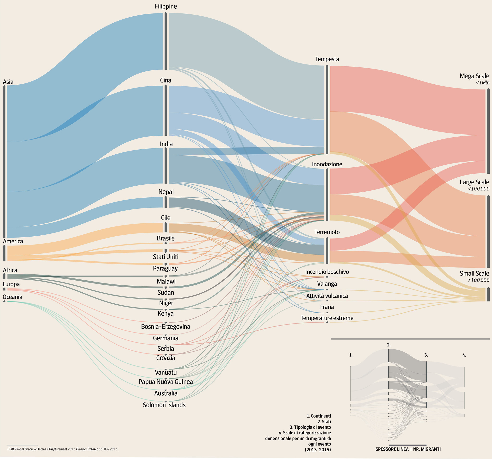

[G07 – Environmental Migration](https://www.flickr.com/photos/densitydesign/30802188224/)

### 気候変動ファイナンスフローの複雑性

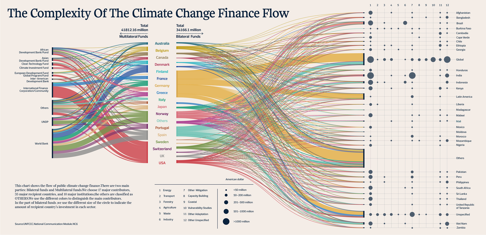

[The Complexity of the Climate Change Finance Flow](https://www.flickr.com/photos/densitydesign/31613433722/)

### 外国人戦闘員のシリアとイラクへの旅路

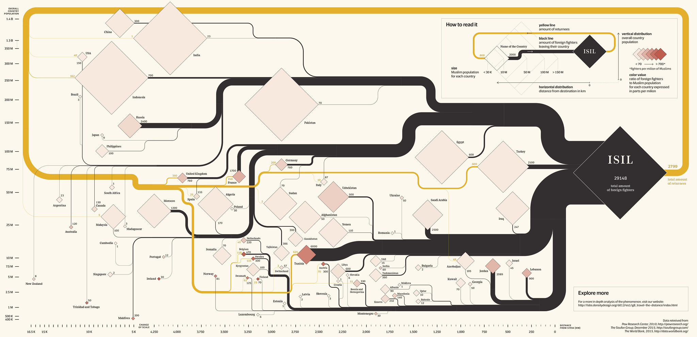

[G08 – Travel the Distance](https://www.flickr.com/photos/densitydesign/31527995451/in/dateposted/)

### 禁書

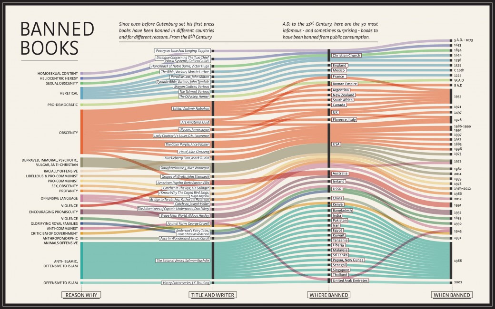

[Banned books – Visualoop](http://visualoop.com/infographics/banned-books)

## 異形・変型タイプ

### EU28カ国における移民の最終的な庇護先の決定結果

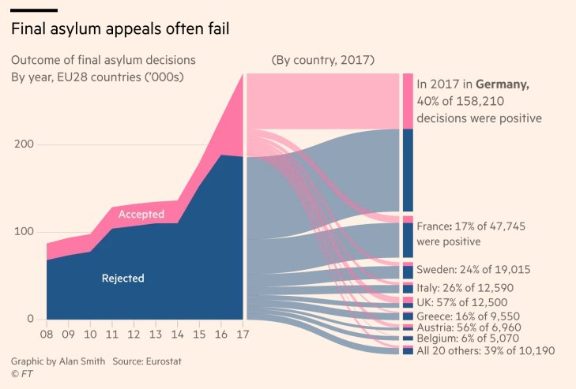

- [Outcome of final asylum decisions by year, eu28 countries](https://www.ft.com/content/58f2f7f8-c7c1-11e8-ba8f-ee390057b8c9)
- [#frankensankey Migration: the riddle of Europe’s shadow populations](https://twitter.com/theboysmithy/status/1049011087142768640)

### トランプさんのツイートの怒りの矛先

サンキー・ダイアグラムかといわれると微妙ですが…。

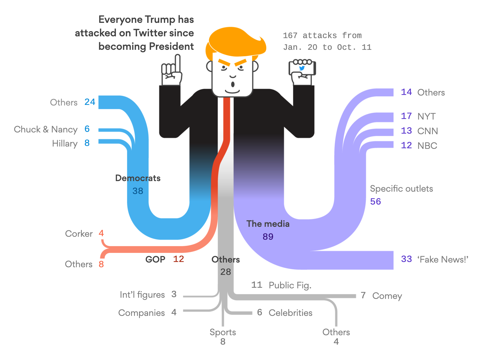

[Who Trump attacks the most on Twitter – Axios](https://www.axios.com/2017/12/15/who-trump-attacks-the-most-on-twitter-1513305449)

## 参考文献

- [The Sankey Diagram in Energy and Material Flow Management – Schmidt – 2008 – Journal of Industrial Ecology – Wiley Online Library](https://onlinelibrary.wiley.com/doi/full/10.1111/j.1530-9290.2008.00004.x)
- [Sankey Diagrams – A Sankey diagram says more than 1000 pie charts](http://www.sankey-diagrams.com/)

