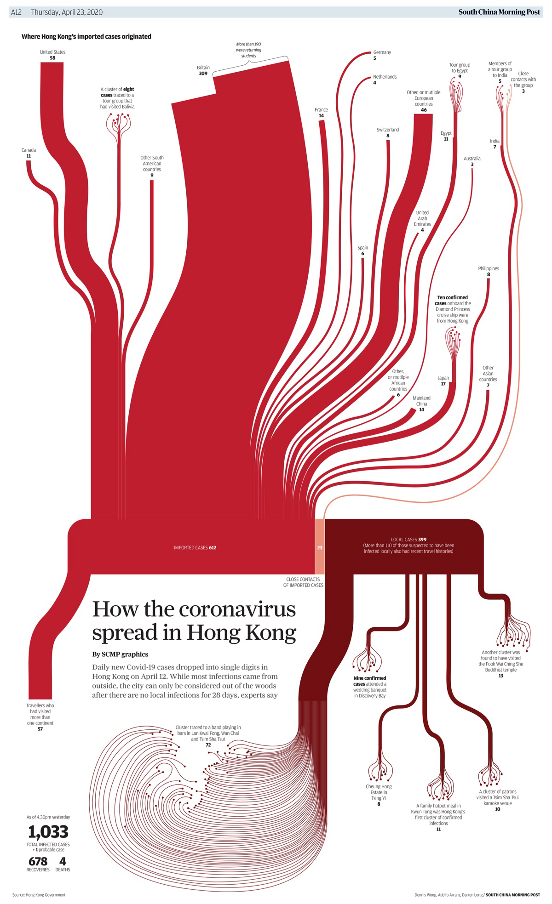

+++
author = "Yuichi Yazaki"
title = "香港の感染拡大を可視化したインフォグラフィック"
slug = "scmp-2020-covid-hk"
date = "2025-09-27"
categories = [
    "consume"
]
tags = [
    "Covid-19",
]
image = "images/scmp_2020_covid-hk-00.png"
+++

2020年4月、パンデミック初期に制作された 「How the coronavirus spread in Hong Kong」（Dennis Wong & Adolfo Arranz）は、香港における新型コロナ感染拡大を「輸入症例」から「市中感染」までの流れで描き出したインフォグラフィックです。
単なる統計表ではなく、感染の経路や広がりを 都市生活の文脈 に落とし込んで示すことで、読者が自分の暮らしと直結させて理解できる構造になっています。

<!--more-->

South China Morning Post の「How the coronavirus spread in Hong Kong」(2020)

## SCMPについて

South China Morning Post（SCMP）は香港を拠点とする有力英字新聞で、アジアを中心に国際的な報道を行っています。とりわけインフォグラフィックス・チームは世界的に高い評価を得ており、ジャーナリズム、イラストレーション、データビジュアライゼーションを融合させた表現で数々の国際賞を受賞しています。

## 構成の特徴

作品の中心には 3つの分類 が配置されています。

- IMPORTED CASES（輸入症例）
- CLOSE CONTACTS OF IMPORTED CASES（輸入症例の濃厚接触者）
- LOCAL CASES（市中感染）

この3区分は、感染拡大の段階を示すだけでなく、香港の防疫政策（1.水際対策、2.濃厚接触者隔離、3.市中対策）と正確に対応しています。

### 1. IMPORTED CASES（輸入症例）
- 意味：香港の外からウイルスを持ち込んだケース。
- 具体例：
    - 海外から香港に帰国・入国した人が、すでに感染していた場合。
    - 旅行者やビジネス渡航者がウイルスを持ち込んだ場合。
- 役割：感染の「出発点」として示され、パンデミック初期には特に重要視された分類です。

### 2. CLOSE CONTACTS OF IMPORTED CASES（輸入症例との濃厚接触者）
- 意味：上記の輸入症例と直接接触し、そこから感染したケース。
- 具体例：
    - 感染者と同居する家族。
    - 飛行機や公共交通機関で近くに座っていた人。
    - 一緒に食事や会合に参加した人。
- 役割：輸入症例が香港の市中に感染を広げる「橋渡し」として重要。輸入例と市中感染の中間的な位置づけです。

### 3. LOCAL CASES（地域内感染症例）
- 意味：海外渡航歴もなく、輸入症例との接触も確認できない香港内部での感染。
- 具体例：
    - 飲食店でのクラスター。
    - ジムや病院など、公共空間での感染。
- 役割：いわゆる「市中感染」を示し、パンデミック拡大の深刻度を最も直接的に反映するカテゴリーです。

### この3区分の意義

- 感染の「発端（imported）」から「二次感染（close contacts）」を経て「市中感染（local）」へと広がる流れを視覚的に整理。
- 読者にとって「香港は今どの段階にあるのか？」を直感的に理解させる。
- 政策判断においても「水際対策」「濃厚接触者追跡」「市中拡大防止」という3つのレベルを意識させる構造になっています。

## 視覚表現とメッセージ性

- **色彩** ：赤やオレンジで描かれた感染経路は、危機感と緊急性を強調。
- **アイコン化** ：人や建物、飛行機をシンプルなアイコンで示し、説明文を読まずとも概略が理解できる。
- **レイアウト** ：中央から放射状に広がる構造は「感染が都市全体へ蜘蛛の巣のように広がる」印象を与える。

これらはすべて、感染の「不可視性」を一目で理解させ、さらに「制御しなければ拡大してしまう」という社会的メッセージを強く伝えるための工夫です。

## 限界と課題

もちろん、このような紙面インフォグラフィックには限界もあります。

- 情報量が多いため、初見ではやや複雑に感じる。
- 感染経路を線で結んでいるが、実際には推定を含むため「確定的」と誤認されるリスクがある。
- 感染の時間的推移は、アニメーションやインタラクティブ表現の方が直感的に伝わる。

しかし、それらを差し引いても 新聞という静的メディアの制約の中で、複雑な事象を一望できる形に整理した点 は大きな功績といえるでしょう。

## まとめ

「How the coronavirus spread in Hong Kong」は、香港市民にとって新型コロナ感染拡大を「自分ごと」として理解するための強力な可視化でした。

- 感染拡大の段階を整理した構成
- 生活の場面に即したクラスターの細分化
- 都市に広がる脅威を直感的に伝えるビジュアル

これらの要素は、インフォグラフィックが単なる図解を超え、社会に行動を促す力を持つことを示しています。

## 参考・出典

- [South China Morning Post – Infographic Archive: How the coronavirus spread in Hong Kong](https://multimedia.scmp.com/culture/article/SCMP-printed-graphics-memory/lonelyGraphics/202004A256.html)
- [Nightingale DVS – On the Success of the South China Morning Post Infographics Team](https://nightingaledvs.com/on-the-success-of-the-south-china-morning-post-infographics-team/)