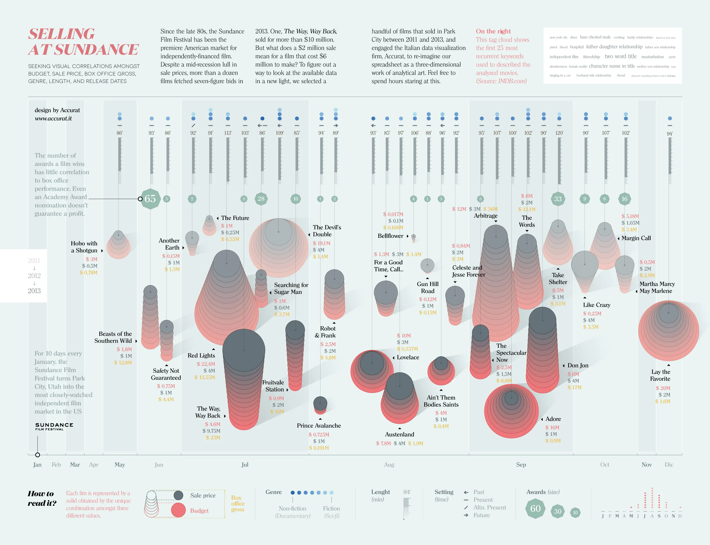
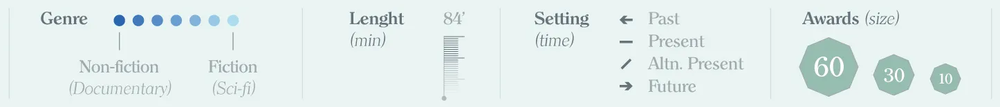
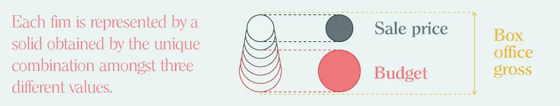

+++
author = "Yuichi Yazaki"
title = "Selling at Sundance: An Infographic on the Economics of Film"
slug = "selling-at-sundance"
date = "2025-10-04"
description = ""
categories = [
    "consume"
]
tags = [
    "オリジナルのビジュアル変換",
]
image = "images/cover.png"
+++

**Selling at Sundance** is an infographic by the Italian data visualization studio **Accurat**. It visualizes independent films bought and sold at the Sundance Film Festival from 2011 to 2013, combining budget, sale price, box-office gross, running time, genre, awards, and keywords in one layered design.

The project turns what was originally spreadsheet-like market data into a three-dimensional visual object.

<!--more-->

## How to Read It

The graphic is divided into two main layers. The upper half describes the nature and context of each film, while the lower half shows its economic structure.

### Upper Half: Film Type and Context

- **Blue-to-gray gradient**: genre position, from nonfiction to fiction.
- **Arrow shape**: time setting, such as past, present, fictional present, or future.
- **Small vertical bar**: running time.
- **Green polygon**: number and scale of awards.
- **Tag cloud**: the 25 most common IMDb keywords, giving an overview of themes and subject matter.

Together, these elements show what kinds of films received attention and how their themes clustered.

### Lower Half: Film Economics

The lower area describes financial outcomes through stacked shapes.

- **Red**: production budget
- **Gray**: sale price
- **Yellow number**: box-office gross

By layering cost, sale price, and revenue, the graphic makes it possible to see where a film created value: in festival acquisition, theatrical performance, or not at all.

## Context

Sundance has long been one of the most important markets for American independent film. Small-budget films may sell for millions of dollars, but awards and critical attention do not always guarantee commercial success.

The visualization makes that uncertainty visible. It shows how acclaim, genre, sale price, and box office can diverge.

## Summary

"Selling at Sundance" is a layered infographic about the business of independent cinema. By combining narrative attributes and financial data, it turns the film market into a readable visual story.

## References

- [Selling at Sundance — Behance](https://www.behance.net/gallery/14264353/Selling-at-Sundance)
