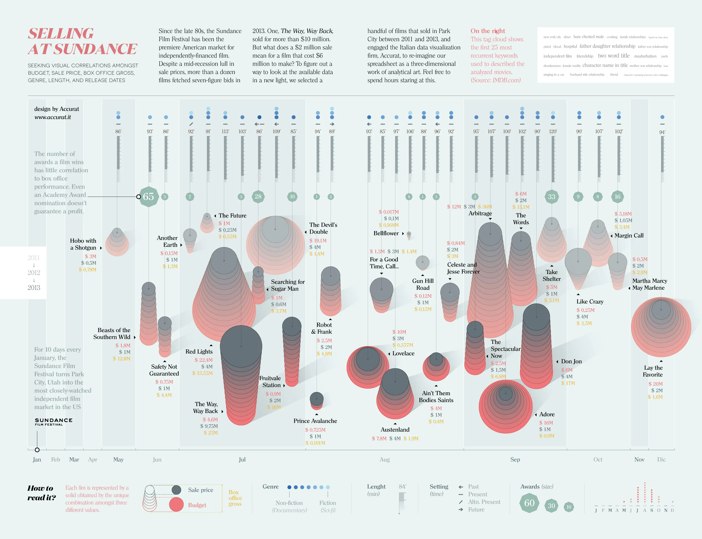
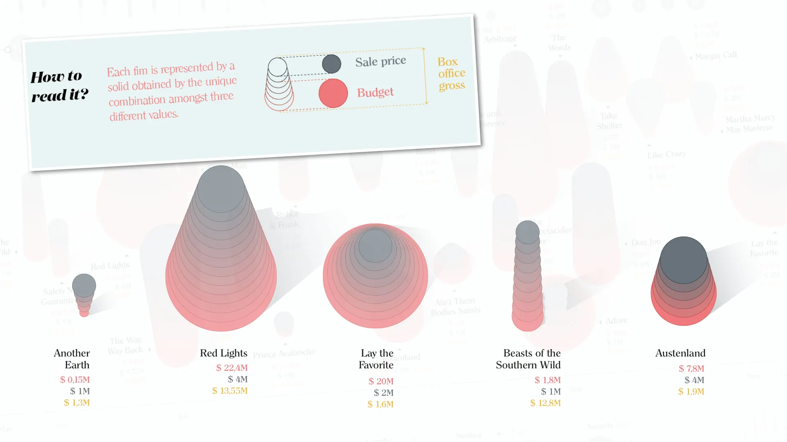

+++
author = "Yuichi Yazaki"
title = "映画の経済を描くインフォグラフィック — Selling at Sundance"
slug = "selling-at-sundance"
date = "2025-10-03"
description = ""
categories = [
    "consume"
]
tags = [
    ""
]
image = "images/cover.png"
+++

このインフォグラフィックは、イタリアのデータビジュアライゼーション・スタジオ **Accurat** が制作した「Selling at Sundance」です。2011年から2013年にかけてサンダンス映画祭で売買されたインディペンデント映画を題材に **予算・販売価格・興行収入・上映時間・ジャンル・受賞数** などを多次元的に可視化しています。もともとはスプレッドシートで管理されていたデータを「三次元的なアート」として再構成したものです。  

<!--more-->

## 図解の見方

この図は **上半分と下半分に分かれた二層構成**になっています。  
それぞれが「映画の性質」と「経済的成果」という異なる側面を表します。  

### 上半分：映画の性質と文脈

上側の領域では、各作品の**ジャンル的特徴や物語的傾向**が示されています。

- **青から灰色へのグラデーション** ：ジャンルの位置づけを表し、左のドキュメンタリー（Non-fiction）から右のフィクション（Fiction）へと連続的に変化します。  
- **矢印の形状** ：作品の **時代設定** を示します。過去（左向き矢印）、現代（上向き）、架空の現代（斜め上）、未来（右向き）といった具合に視覚化されています。  
- **小さな縦棒（Length）** ：映画の **上映時間** 。長い棒ほど長尺作品を意味します。  
- **緑色の多角形（Awards）** ：映画が受賞した **賞の数と規模** を表現。形が大きいほど受賞歴が多いことを意味します。  
- さらに右上には **タグクラウド** があり、IMDBのキーワードから抽出された上位25語が示され、全体の作品傾向（テーマや題材）を俯瞰できます。  

これらの要素によって「どんなタイプの映画がどんな評価を得ているか」を俯瞰的に捉えられる構造になっています。  

### 下半分：映画の経済データ

下側の領域は、映画ごとの **経済的構造** を示します。各映画は、積み重なった三層の図形で構成されています。

- **赤色部分** ：制作予算（Budget）  
- **灰色部分** ：販売価格（Sale price）  
- **黄色の数字** ：興行収入（Box office gross）  

これらを上下に重ねることで **制作コストと販売価格、そして実際の収益** の関係が一目で比較できます。  
販売価格が制作費を上回る場合や、興行的に成功した作品ほど、図形のバランスが異なり、「映画がどの段階で利益を得たか」が視覚的に浮かび上がります。  

## 補足的な背景知識

サンダンス映画祭は1980年代以降、アメリカ最大のインディペンデント映画のマーケットとして知られています。大作映画とは異なり、少額の予算で制作される一方で、作品によっては数百万ドルから数千万ドルの取引額になることもあります。  

この図では **映画祭での受賞数が必ずしも商業的成功につながらない** ことが強調されています。例えば、アカデミー賞にノミネートされたとしても、必ずしも利益が保証されるわけではないことが示されています。  

また、右上には **タグクラウド** があり、IMDBのキーワードから抽出した映画を説明する上位25語が表示され、作品傾向を把握できる仕組みになっています。  

## まとめ

「Selling at Sundance」は、映画祭におけるインディペンデント映画の経済的な位置づけを、多層的に表現したインフォグラフィックです。複雑な関係（予算、販売価格、興行収入、上映時間、ジャンル、受賞数）を一つの造形的な図形に凝縮することで **「数字の物語」を直感的に理解させる可視化デザインの好例** となっています。  

## 参考・出典

- [Selling at Sundance :: Behance](https://www.behance.net/gallery/14264353/Selling-at-Sundance)