+++
author = "Yuichi Yazaki"
title = "ShapefileからTopoJSONを生成する"
slug = "shapefile-to-topojson"
date = "2014-05-18"
categories = [
    "technology"
]
tags = [
    "qgis","地図"
]
image = "images/fi_Shape2Topo.png"
+++

## Shapefile→GeoJSON→TopoJSON

Shapefile(地理情報システムにおけるオープン標準ファイル形式)をウェブで使用可能なGeoJSONやTopoJSONへ変換するための手順をご紹介します。今回は都道府県ごとに分かれた日本地図を描画することをゴールにします。まずはShapefileからGeoJSONを生成し、その後GeoJSONからTopoJSONを生成することとします。

## Shapefileを編集する

### 国土地理院「地球地図」からShapefileをダウンロードする

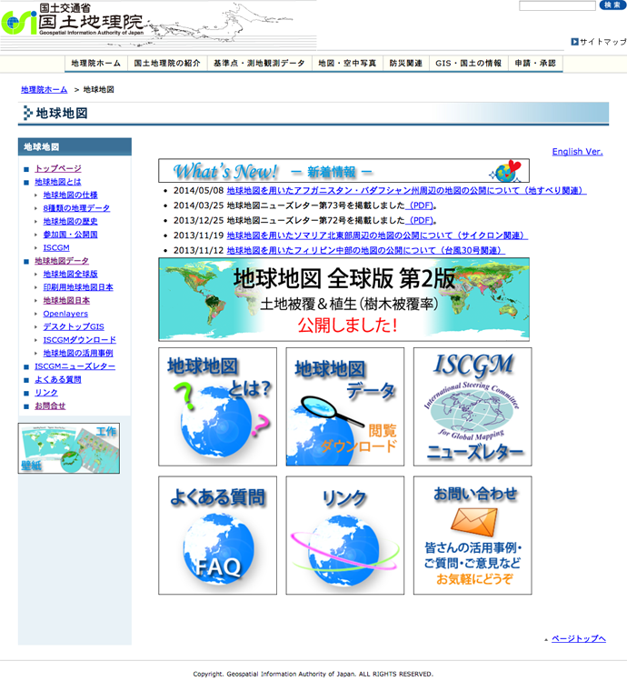

今回の目的から都道府県ごとの粒度のものがいいのですが、ないので市区町村ごとの粒度のものをダウンロードし、手元で修正することにします。[「地球地図日本のデータ」](http://www.gsi.go.jp/kankyochiri/gm_jpn.html)から第2版ベクタ（2011年公開）行政界 Shapeファイルをダウンロードします。

### QGISでShapefileを読み込む

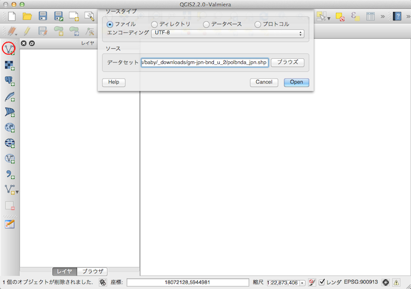

ここからQGISというアプリケーションを使います。展開したフォルダ内にはShapefileが３つありますが、そのうちpolbnda\_jpn.shpというファイルをQGISで読み込みます。QGISで「ベクターレイヤーの追加」を選択するとダイアログが表示されますので、ソース→データセットの箇所でShapefileを指定する、という方法で取り込みます。

### CRSを確認する

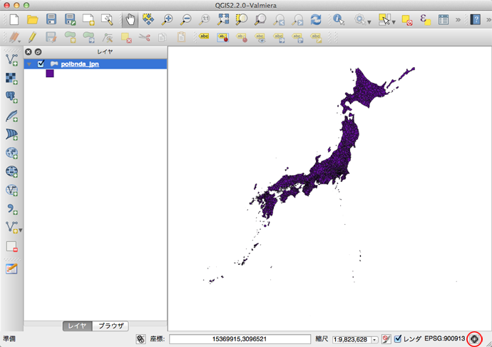

するとこんな感じで表示されます。見慣れた日本地図の形ではないな？と思ったら（そうでなくても）右下を見てください。ここに現在の描画用のCRS(Coordinate Reference System=空間参照系)の設定が(EPSG:...)と表示されています。赤丸箇所のボタンをクリックすると設定画面のCRSタブが開きます。

### CRSを変更する

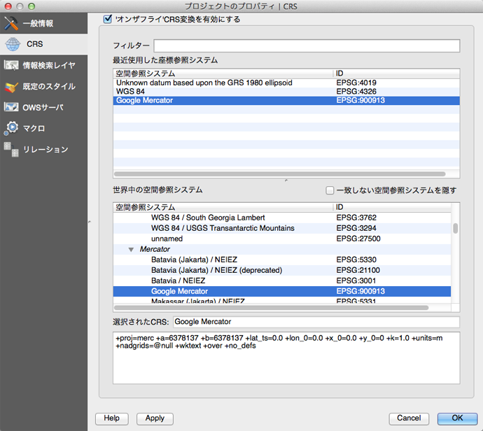

最上段の「'オンザフライ'CRS変換を有効にする」にチェックを入れると、座標参照システムを変更できるようになりますので、EPSG:900913（Google Mercator）を選択し、この画面を閉じます。

### 属性テーブルを開く

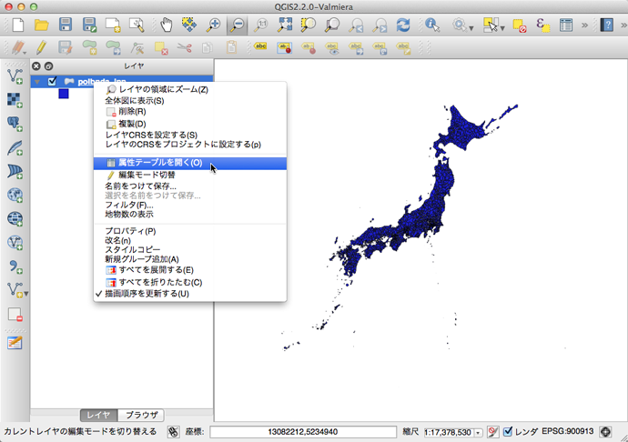

日本地図の乗っているベクターレイヤーを右クリックし、「属性テーブルを開く」を選択します。

### 不要のカラムを削除する

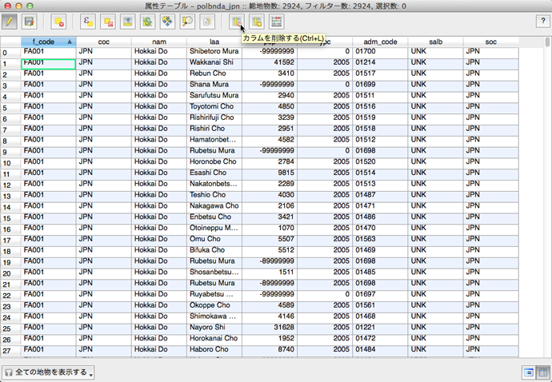

不要のカラムを削除します。左上の鉛筆アイコンの「編集モードを切替」ボタンをクリックして編集モードに入り、「カラムを削除する」ボタンを押すと、ダイアログが表示され、そこで削除するカラムを選択します。今回はnamカラム以外をすべて削除します。

### namカラムの表記揺れを解消する

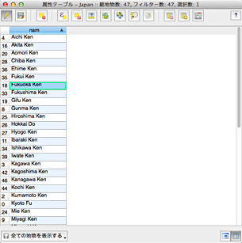

愛知県と福岡県と長野県が表記揺れしているので、表記を統一します(例：Aichi KenとAICHIなど)。

### 都道府県ごとにまとめる

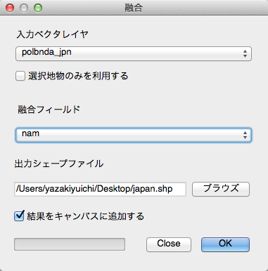

現在のデータは市区町村ごとにわかれていますので、namカラムの都道府県表記を使って、都道府県ごとにまとめます。「ベクター」→「空間演算ツール」→「融合」を選択すると図のようなダイアログが表示されるので、融合フィールドに「nam」を選択します。「出力シェープファイル」はお好きなものを、「結果をキャンパスに追加する」をチェックすると融合した結果を現在開いているファイルへベクターレイヤーとして追加されます。

### 日本語表記とIDを追加する

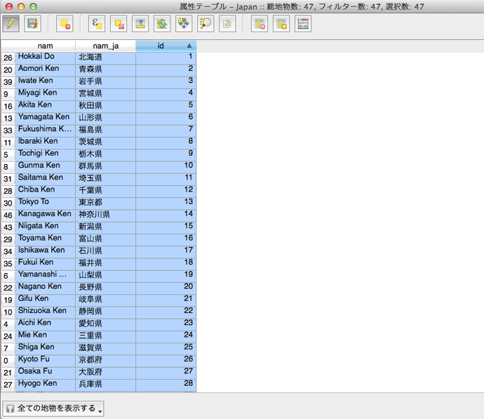

使い勝手を考えて、カラムを追加します。左上の鉛筆アイコンの「編集モードを切替」ボタンをクリックして編集モードに入り、「新規カラムを作る」ボタンを押すと、ダイアログが表示され、そこで新規カラムの名称と幅を指定します。追加には外部ファイルを読み込む方法と、QGIS上で手入力する方法とあります。

### Shapefileとして保存する

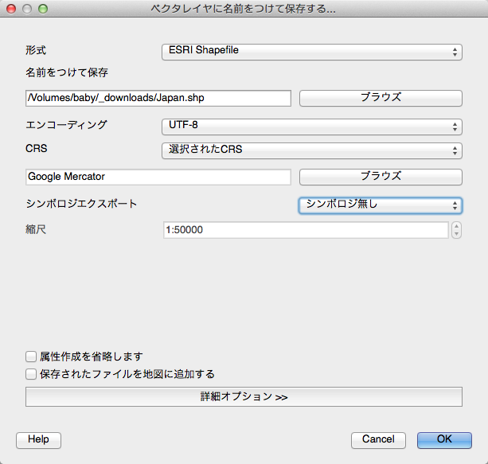

ベクターレイヤーを右クリックし「名前をつけて保存」を選択すると図のようなダイアログが表示されるので任意の設定をして保存します。これでShapefileの編集をおわります。

## ShapefileをGeoJSONに変換する

### ShapefileをGeoJSONに変換する

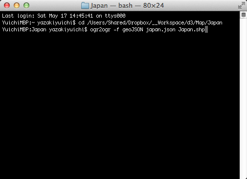

[GDAL](http://www.gdal.org/)というツールを使って、ShapeファイルをGeoJSONに変換します。一つ前のステップで、ファイルを保存する際にGeoJSON形式を選べばGeoJSONに変換することが可能です。別な方法としてGDALを使う方法もあります。GDALはMacであればHomebrewでインストール可能です。ogr2ogr -f geoJSON (出力ファイル名) (入力ファイル名)というコマンドを実行すると変換されます。

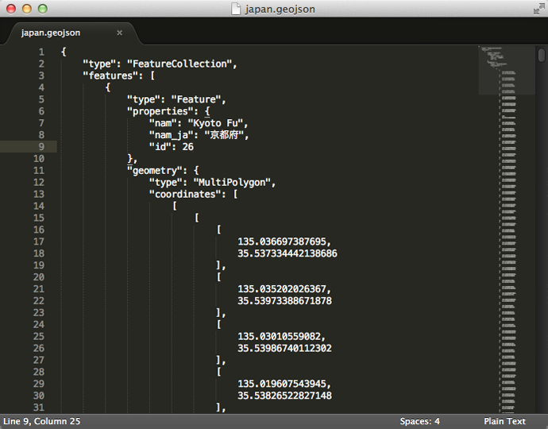

生成されたファイルの中身はこんな感じです。  

## GeoJSONをTopoJSONに変換する

topojsonというツールを使って、GeoJSONをTopoJSONに変換します。topojson -o (出力ファイル名) (入力ファイル名) -pというコマンドを実行すると変換されます。-pをつけないとGeoJSONのときにあったプロパティがすべて含まれなくなってしまいます。

- [手元のPCでGeoJsonをTopoJsonに変換したい場合](https://visualizing.jp/d3-topojson/#commandline)

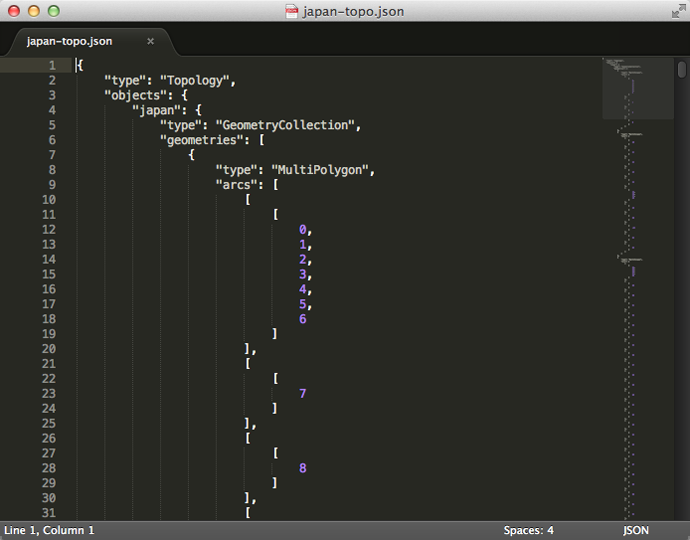

生成されたファイルの中身はこんな感じです。  

## TopoJSONを読み込んで地形を描画する

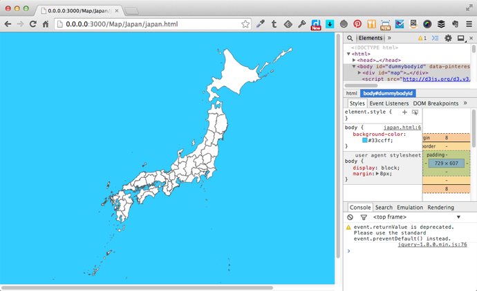

こんな感じで、描画することができました。今回加工したファイルはGitHubに掲載しています。

- [Data of Japan | Land](https://github.com/dataofjapan/land)
