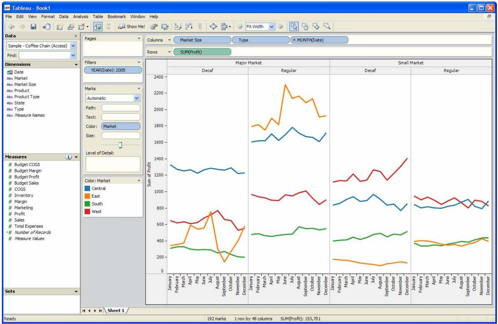

+++
author = "Yuichi Yazaki"
title = "What Is Show Me?"
slug = "show-me"
date = "2026-01-20"
categories = [
    "consume"
]
tags = [
    "",
]
image = "images/4-Tableau-Showme_img-0.jpeg"
+++

Show Me is a Tableau feature and research contribution that helps users choose appropriate visualizations. It addresses a common problem in visual analysis: users often know which fields they want to inspect, but not which chart type is suitable.

Show Me is not just a recommendation engine. It is implemented as a set of UI commands and defaults connected to VizQL, Tableau's visualization language.

<!--more-->

## Background

Traditional visualization tools often present users with a list of chart types and expect them to choose. This creates friction because chart choice depends on data type, number of fields, aggregation, and analytical intent.

Show Me changes the workflow. After the user selects fields, Tableau can recommend compatible views and generate them with appropriate defaults.

## How It Works

Show Me considers the selected fields and their roles, such as dimensions and measures. It then enables or disables chart options according to whether the selected data can support that view. When a chart is chosen, Tableau constructs a VizQL specification and creates the view.

## Why It Matters

The feature helps bridge the gap between data structure and visual encoding. It gives beginners a practical starting point while still letting advanced users refine the result.

## Design Lessons

- Chart recommendation should be grounded in data types and visual grammar.
- A useful default is part of the interface, not an afterthought.
- Recommendation should support exploration without hiding the underlying structure.
- Good tools help users move from fields to views quickly.

## Summary

Show Me demonstrates how visualization systems can guide chart selection through rules, defaults, and a formal visual language. It is important because it turns visualization choice into an interactive, data-aware workflow rather than a separate design decision.
