+++
author = "Yuichi Yazaki"
title = "Show Meとは何か"
slug = "show-me"
date = "2026-01-20"
categories = [
    "consume"
]
tags = [
    "",
]
image = "images/4-Tableau-Showme_img-0.jpeg"
+++

Show Meは、Tableauに実装された自動可視化支援機能を研究した論文です。この研究は、可視化分析のなかでユーザーが直面しがちな **「どのグラフを選べばよいかわからない」問題**に着目し、適切なビューを自動生成・推薦する仕組みを提案しています。Show Meは単なる推薦エンジンではなく **VizQLという可視化言語と連動したUIコマンド群とデフォルト設定の集合** として実装されている点が特徴です。

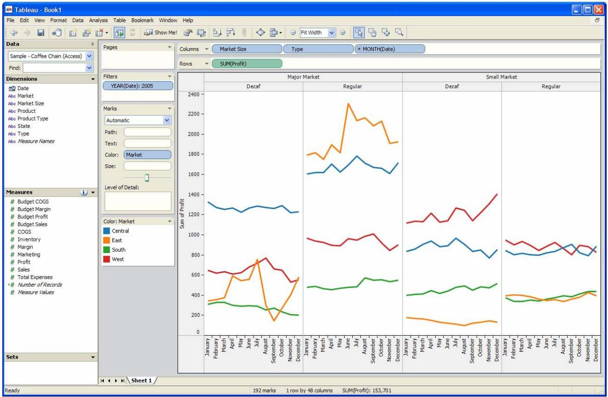

<!--more-->

## 背景と課題意識

従来の可視化ツールは、チャート一覧からユーザー自身が表現を選択するスタイルが一般的でした。しかし、ユーザーはしばしば以下のような困難に直面します：

- グラフィックデザインや可視化の原則に不慣れである
- 70以上のチャートタイプから選ぶのは負担が大きい
- 分析の流れを中断してしまう  

Show Meは、こうした**ユーザー体験の阻害要因を技術的に解決すること**を狙いとしています。

## Show Meの設計

Show Meは、以下の主要なコマンドとデフォルト設定から構成されています。

### 自動マーク選択（Automatic Marks）

データフィールドの型や棚（Rows/Columns）の構造に基づいて、適切な**マーク型（線・棒・点など）を自動的に選択**します。これにより、ユーザーがマークタイプを手動で選ぶ負担が減り、分析の流れが止まりません。

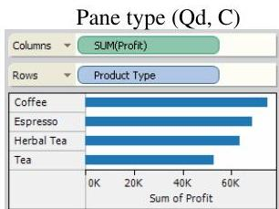
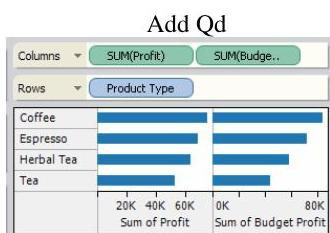
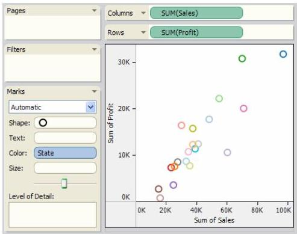
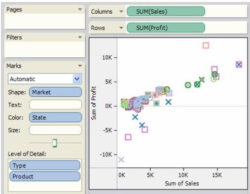

### 1フィールド追加コマンド（Add to Sheet）

フィールドをビューに1つ追加する際、**現在のビュー構造を壊さずに最適な位置・エンコーディングを推定**します。これは、中断なく分析を進めるための設計です。

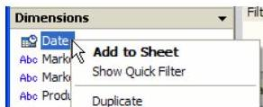
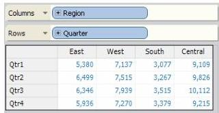
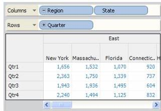
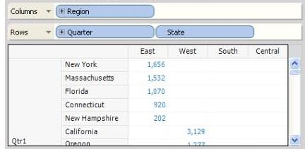
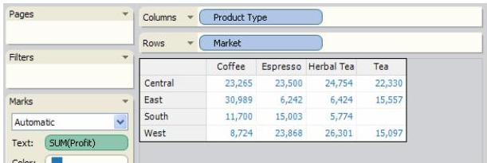
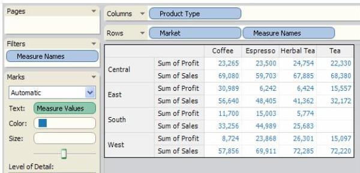
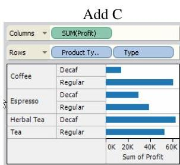

### Show Me / Show Me Alternatives

- 選択した複数フィールドに対して、**適切なビューをゼロから構築**
- 利用可能なビューだけが有効化され、**選択肢が限定される**
- デフォルトでは最も一般的・有用とされるビューが選ばれる  

これにより、「チャート一覧から名前を見て選ぶ」という従来UXではなく、**条件に合うビューが自動的に提案される体験**が実現しています。

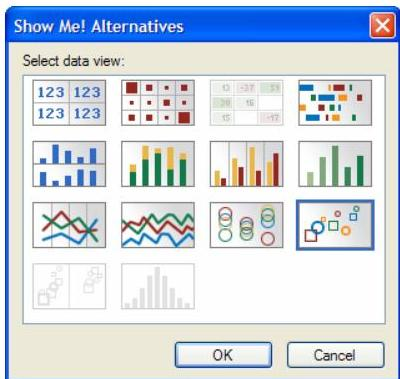

## 研究上のポイント

### 1）VizQLとの連携

Show Meは、Tableauの基礎となる **VizQL（Visualization Query Language）** と深く結びついています。VizQLは可視化とデータベースクエリを統合的に扱う言語であり、この言語を用いることで、マーク選択・ビュー構築・small multiples（多数のビューの自動生成）を効率的に行います。

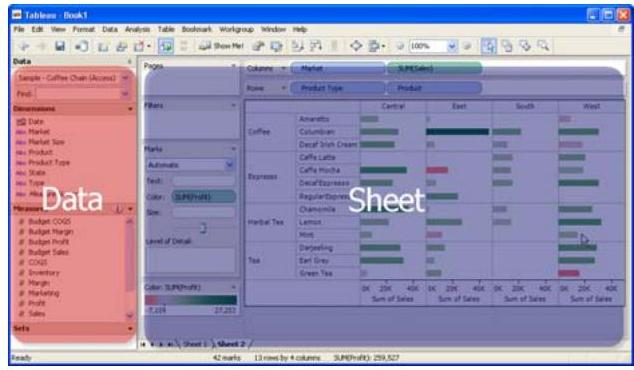

### 2）ユーザー体験（UX）の重視

Show Meの最大の貢献は、**単なる推薦アルゴリズムではなく、「分析の流れを阻害しない」ユーザー体験の設計**にあります。自動化は、ユーザーが明示的に命令を出さなくても、分析を継続できるようにすることを重視しています。

### 3）実データからの利用ログ

論文では、Tableauの商用ユーザーから得られたログデータも示され、Show Me機能が**実際に使用されていること**が確認されています。これにより、研究段階の仮説ではなく「実務で使われる仕組み」であることが示されています。

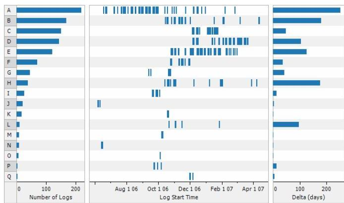
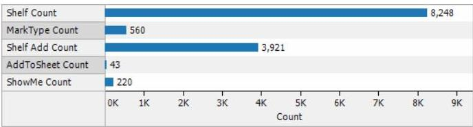
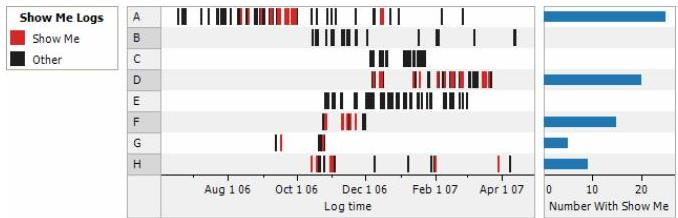
## Show Meの意義

Show Meは、可視化研究における以下のギャップを埋めました：

- **理想的なグラフィックデザイン原則**と
- **実際のユーザーが迷わず分析を進める体験**  

を統合したことです。理論的にはVizQLやGrammar of Graphicsが背景にありつつも、**一般ユーザーが最適なビューを自然に選択できる仕組み**を現実のソフトウェアで実装・検証した点が最大の意義です。

## まとめ

Show Meは、Tableauにおける自動可視化生成のためのユーザー体験設計を体系化した研究です。  
自動マーク選択、フィールド追加支援、最適ビューの提案という仕組みを通じて、ユーザーが可視化デザインの知識を持たなくてもスムーズに分析を進められるようになっています。  
また、実際の利用ログも示されており、「UXとして成立している」ことまで検証された稀有な研究です。

## 参考・出典

- [Show Me: Automatic Presentation for Visual Analysis (IEEE TVCG 2007, DOI 10.1109/TVCG.2007.70594)](https://dl.acm.org/doi/10.1109/TVCG.2007.70594)