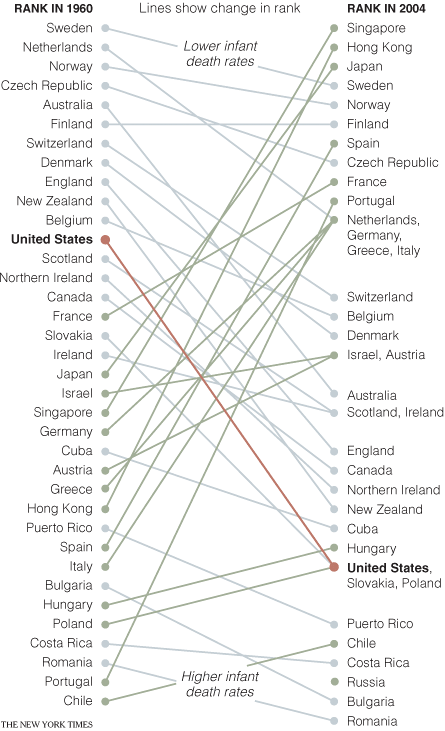
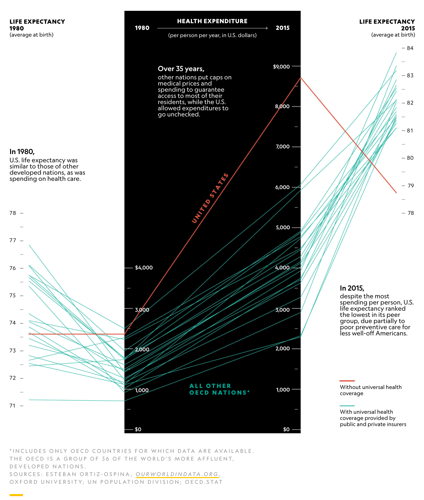
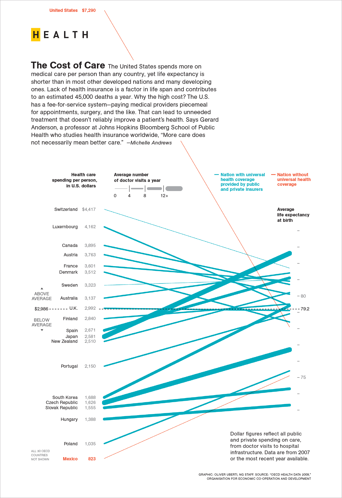
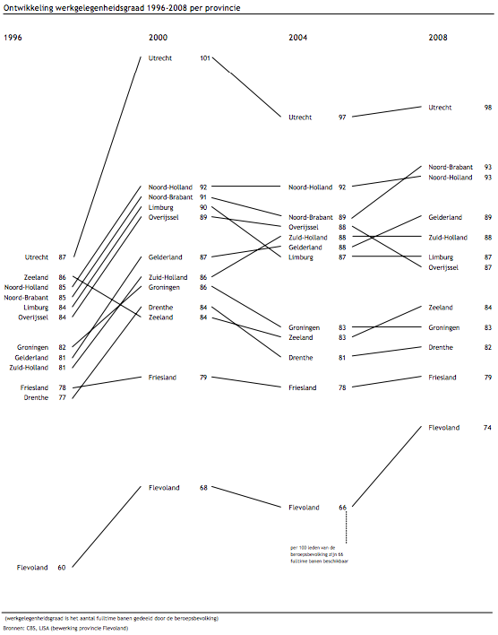
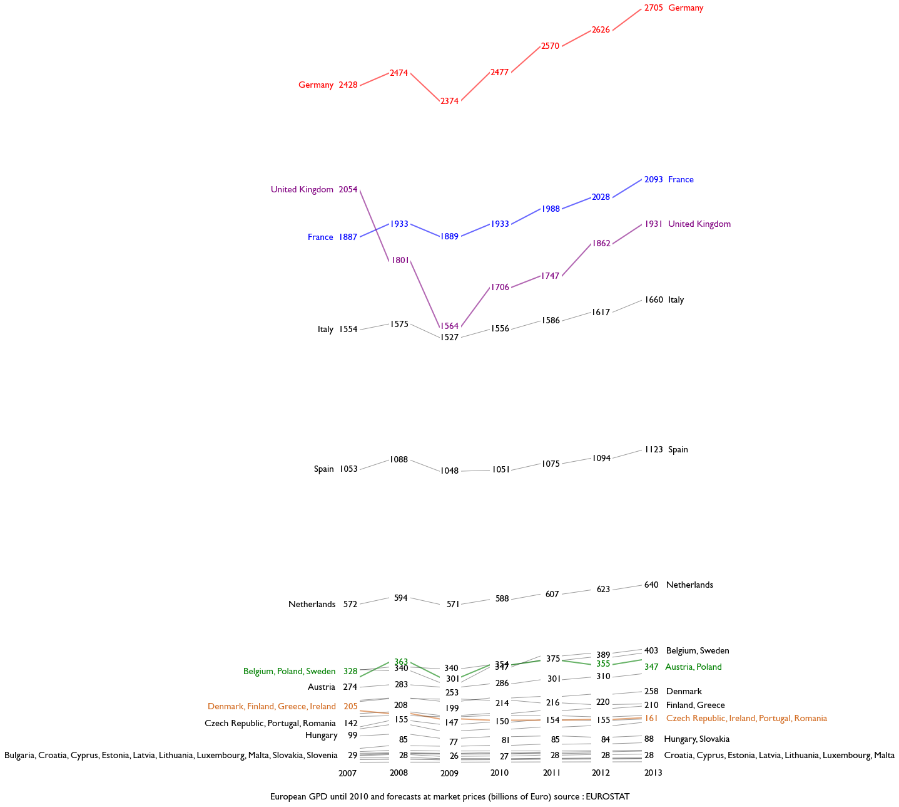

+++
author = "Yuichi Yazaki"
title = "スロープグラフ（Slopegraph）"
date = "2020-08-03"
description = ""
categories = [
    "chart"
]
tags = [
    "",
]
image = "infant_mortality.gif"
+++

スロープグラフとは、異なるカテゴリーデータについて、定量値が2つの時点でどのように変化したかを示す、簡略化された折れ線グラフです。その結果、折れ線ではなく直線のみで構成されるため、通常の折れ線グラフよりも読みやすく、多くの系列が乱雑にならずに済みます。二軸はそれぞれ共通の値範囲を持ちます。

<!--more-->

三軸以上で構成される場合もありますが、折れ線グラフではなくあえてスロープグラフを使う意味を考え、わかりやすさを失わずに抑制的であることが求められます。

色の属性は、別な異なるカテゴリーデータを用いるか、線としてプロットされた項目間の傾向を表すために使用されることもあります。

## 作例

### Edward Tufteの書籍に掲載の作例

[Slopegraphs for comparing gradients: Slopegraph theory and practice](https://www.edwardtufte.com/bboard/q-and-a-fetch-msg?msg_id=0003nk)

### ニューヨーク・タイムズ紙 1960年から2004年までの乳児死亡率の比較

[The New York Times > Health > Image > Infant Mortality Rates World Wide](https://archive.nytimes.com/www.nytimes.com/imagepages/2009/04/06/health/infant_stats.html)

### ヘルスケアにお金を費やしても、人生が最も長くなるとは限らない

[Spending more on health care may not lengthen life the most](https://www.nationalgeographic.com/magazine/2019/01/spending-money-health-care-may-not-extend-life/)

### アメリカの医療費

[The Cost of Care National Geographic](http://www.oliveruberti.com/infographics)

### オランダの様々な州の経済データと雇用の伸びを示すグラフ

[A Slopegraph Update](https://charliepark.org/a-slopegraph-update/)

### 2007〜2013年におけるEU加盟国のGDP時系列変化

[E. Tufte Slope Graphs contest](https://nbviewer.jupyter.org/gist/pascal-schetelat/8382651)

