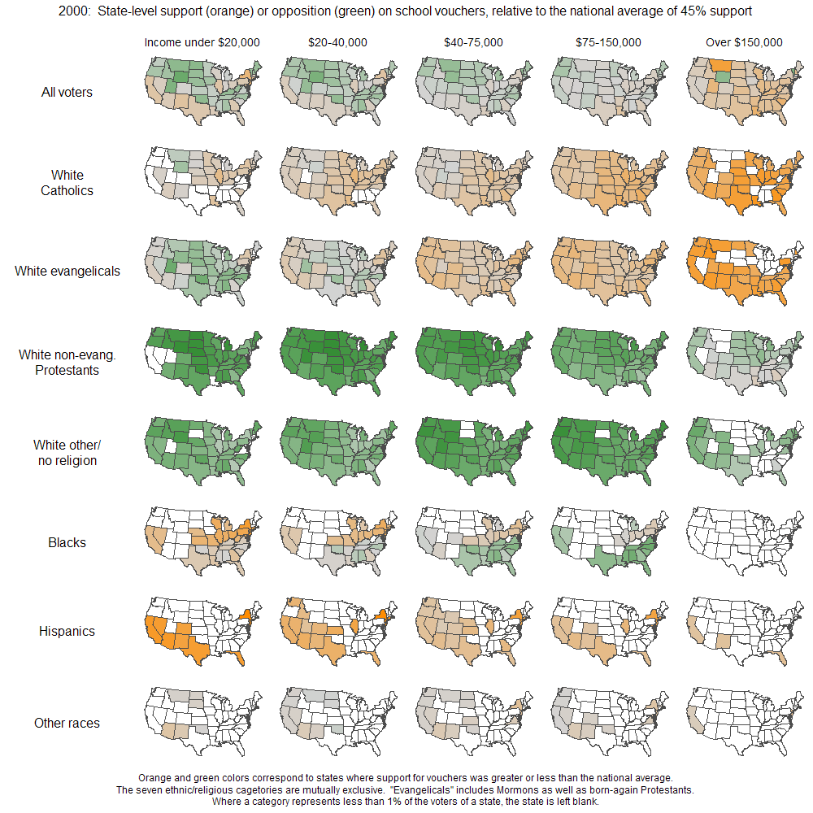

+++
author = "Yuichi Yazaki"
title = "Small Multiplesとは何か？"
date = "2020-07-04"
description = ""
categories = [
    "chart"
]
tags = [
    "",
]
image = "03892018723903.5634a9e2d28bf.jpg"
+++

チャートのスタイルではなく、ビューのあり方の一つです。

Small Multipleとは、変化、違いなどを比較したい変数を一つ選び、それ以外のデータ変数やチャート表現はすべて揃えた上で、比較した変数のみが異なるチャートを並置する表示形式を指します。特定のチャートの名称ではなく、このような表示形態を指します。このような表示形態の結果、多次元の変数をもつチャートの比較が容易になります。

<!--more-->

複数のビューへとファセット分割（ファセットを利用して疎に分けること）したものを並置して表示する例の一つに、Tamara Munznerは位置づけています。

## 誰が作ったか？

作品形態としては1870年の作品など19世紀から存在していましたが、エドワード・タフテが著作の中で用語を定義し、一般に広く知られるようになりました。彼自身はこんな風にメリットを説明しています。

> 『定量的な推論の中心にあるのは「何と比較するか？」という一つの質問です。多変量でデータが豊富なSmall Multipleデザインは、変化の比較、オブジェクト間の違い、代替案の範囲の比較を視覚的に適用することで直接答えます。データ提示の幅広い問題には、Small Multipleが最適な解決策です。』
> Edward Tufte, “Envisioning Information”, 1990. 訳は筆者。

## 質の比較

### アメリカの州ごとの職業別人口の割合

おそらく最古の例としては以下の「1870年のアメリカの統計アトラス」(1870 Statistical Atlas of the United States)に掲載されている図版があります。1870年の国勢調査による、アメリカの州ごとの職業別人口の割合を示しています。並び順としては左から右へ、上から下へ、順に並んでいます。

[Francis A. Walker, ”Persons with gainful occupations and attending school”, 1874.](https://www.census.gov/library/publications/1874/dec/1870d.html)

### デビュー作から名作まで

イギリスのModern Libraryによってランク付けされた英語の小説ベスト100の著者について可視化して作品です。一周が100年として円周に沿って時系列が設定されており、デビュー作と名作が生まれたタイミングを示しています。三角は生まれた年と亡くなった年と、作品が出版した年を結んで三角形を構成しています。そしてデビュー作と名作が生まれたタイミングを一つのチャートの中で出来るようになっています。一つひとつのチャートが一人の作家を示しており、作家ごとの人生における作品出版のタイミングを比較する意図で作成されています。

[From first published to masterpieces](http://allery/18723903/From-first-published-to-masterpieces)

### GitHubでアクティブなプログラミング言語は？

プログラミング言語別に、時系列でアクティブなリポジトリを比較しています。ここでの比較対象はプログラミング言語です。表示データを絶対数と相対数（割合）で切り替えるUIも用意されています。

[GiHut](https://githut.info/)

## 時系列の比較

### アメリカと日本、出生率の時系列比較

こちらはエリアチャートを用いて、ある年の出生率を描いたものです。横軸が年齢、縦軸が女性の人数あたりの出生数です。時系列の変化に注目したので、どの年を対象とするかをづらして、並置しています。

[一年ごとにみている場合](http://www.randalolson.com/2015/08/23/small-multiples-vs-animated-gifs-for-showing-changes-in-fertility-rates-over-time/)

[五年おきにみている場合](http://www.randalolson.com/2015/08/23/small-multiples-vs-animated-gifs-for-showing-changes-in-fertility-rates-over-time/)

## 量の比較／縦横両軸

### バウチャーに対する公的なサポートの見積もり

横軸に収入、縦軸に人種をとり、公的バウチャー制度がどのくらいサポートされているかをコロプレスマップのSmall Multiplesで示しています。この場合、並び順は横軸と縦軸に対応するものとなっています。

[estimate of public support for vouchers, broken down by religion/ethnicity, income, and state.](https://statmodeling.stat.columbia.edu/2009/07/15/hard_sell_for_b/)

## 質ごとの時系列の比較／地理空間

### 赤vs青。共和党対民主党 大統領選の投票行動 1964-2012

ここでは、並び順は北米の州の位置関係をできるだけ尊重したタイル状のグリッドとして描かれています。

[Small Multiple Tile Grid Map – Policy Viz](https://policyviz.com/2016/05/19/small-multiple-tile-grid-map/)

### スコットランドの政治が地理的にどのように変化したか

タイトル通りの内容ですが、ひとつひとつがSankey Diagramというチャートになっています。さきほどの例と同様に、地理的な位置関係を尊重したタイル状のグリッドとして描かれています。

[Holyrood elections see rise of ‘Team Ruth’ and demise of Labour vision | Politics | The Guardian](https://www.theguardian.com/politics/2016/may/06/holyrood-elections-see-rise-of-team-ruth-and-demise-of-labour-vision)

結果的に、擬似連続カルトグラム（Pseudocontinuous cartograms/Dorling cartograms）と表現的に近くみえる。

## インタラクティブ

Jim Vallandinghamがインタラクティブ版Small Multipleについて考察しています。4つに分類しています。

[How to Make Interactive Linked Small Multiples](https://flowingdata.com/2014/10/15/linked-small-multiples/)

### 1. 更新可能
UIへのユーザーのアクションにより、利用データ自体が一斉に更新されること。

[How Americans Spend Their Day](http://projects.flowingdata.com/timeuse/)

### 2. ソート可能
Small Multipleの並び順自体を何らかの変数によって行い、さらに変更可能なこと。

[Kepler’s Tally of Planets – Interactive Feature – NYTimes.com](http://www.nytimes.com/interactive/science/space/keplers-tally-of-planets.html)

### 3. ハイライト可能

チャートの一部をハイライトすると、Small Multipleのほかのチャートの同一箇所も同様にハイライトされること。

- [The American Middle Class Is No Longer the World’s Richest – The New York Times](http://www.nytimes.com/2014/04/23/upshot/the-american-middle-class-is-no-longer-the-worlds-richest.html?abt=0002&abg=1)
- [EU unemployment tracker | FT Data](http://ig-legacy.ft.com/content/26a7f942-70ad-38cd-ba64-1491b4aa1755)

### 4. スクラブ可能

マウスポインタなどで示した箇所のデータ値が、そのチャートだけでなく、すべてのSmall Multiple内チャートで表示されること。

- [How the Tax Burden Has Changed – Interactive Graphic – NYTimes.com](http://www.nytimes.com/interactive/2012/11/30/us/tax-burden.html)
- [Ambulances for Dialysis Patients on Rise](https://projects.propublica.org/graphics/ambulances)
- [How Likely Is It That Birth Control Could Let You Down? – The New York Times](http://www.nytimes.com/interactive/2014/09/14/sunday-review/unplanned-pregnancies.html)

