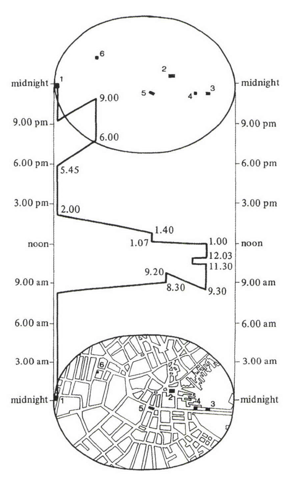

+++
author = "Yuichi Yazaki"
title = "A Day in the Life of a Colonial Boston Merchant: Visualizing Time and Space"
slug = "space–time-path-diagram"
date = "2025-10-11"
categories = [
    "consume"
]
tags = [
    "",
]
image = "images/thumb_ph_vizjp.png"
+++

This diagram appeared in geographer Allan Pred's 1984 paper "Structuration, Biography Formation, and Knowledge: Observations on Port Growth during the Late Mercantile Period." It shows how a late eighteenth-century Boston merchant spent a day across both time and space.

It is an important example of visualizing the relationship between human action and urban space in the context of structuration theory.

<!--more-->

## How to Read It

The diagram treats a person's daily movement as a path through time and space. Time is not separated from geography; instead, movement, duration, and location are combined into one visual structure.

## Why It Matters

The work demonstrates that daily life can be understood as a spatial-temporal pattern. It connects biography, social structure, and urban geography.

## Summary

The space-time path diagram is a powerful way to show lived movement. It makes visible how people occupy cities not only as points on a map, but as sequences of actions through time.
