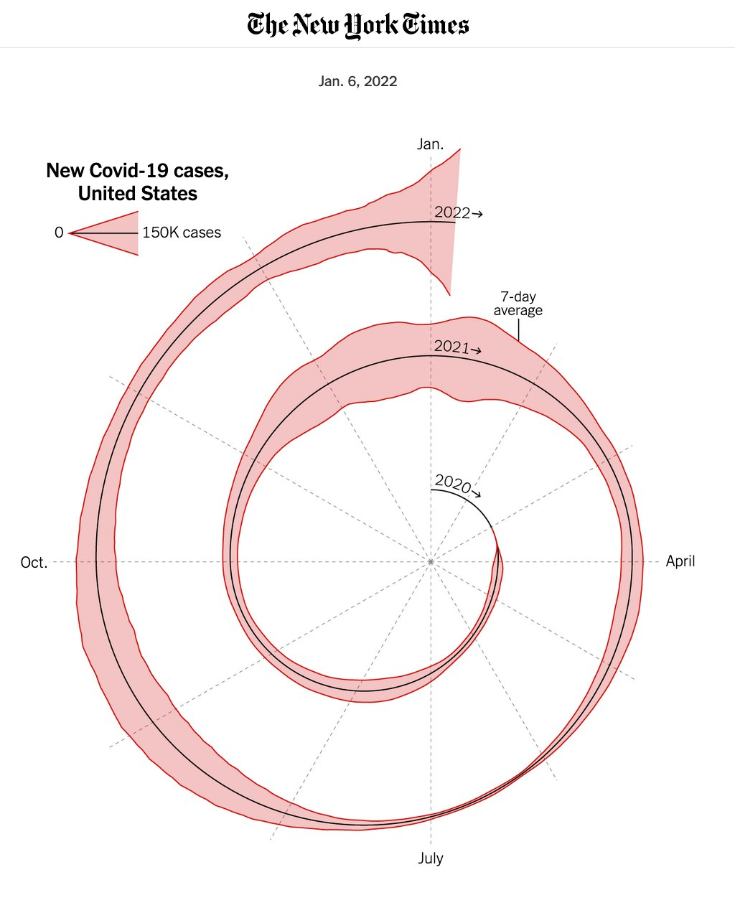
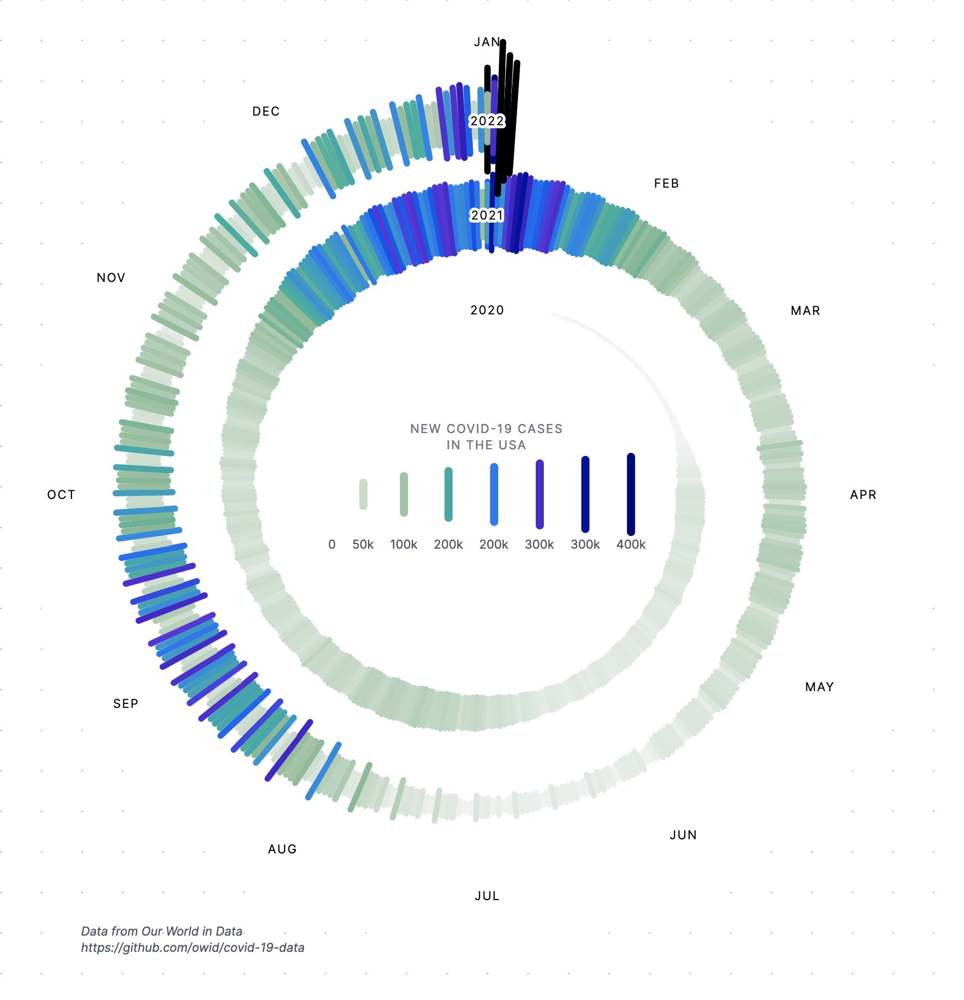
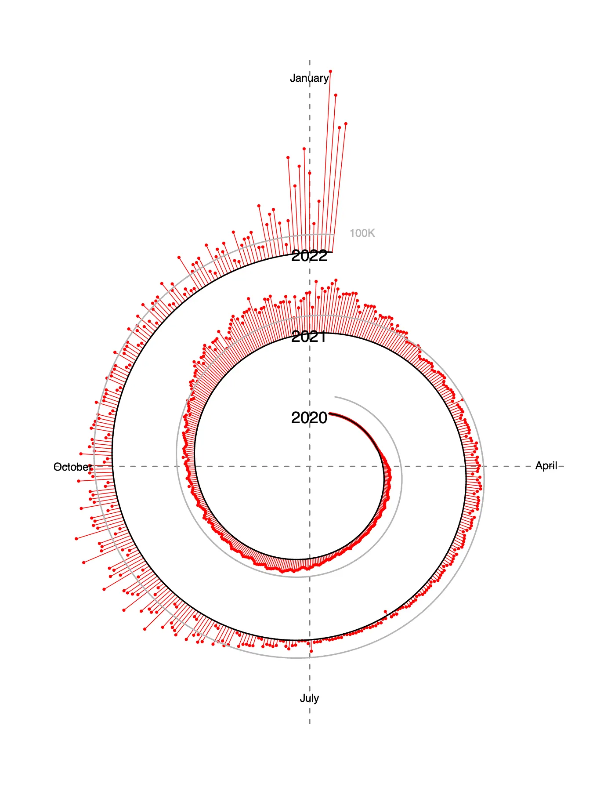

+++
author = "Yuichi Yazaki"
title = "NYT「Covid-19スパイラル可視化」をめぐる議論と代替案"
slug = "spiral-chart-nyt"
date = "2025-09-28"
categories = [
    "consume"
]
tags = [
    "",
]
image = "images/spiral-chart-nyt-cover.jpg"
+++

2022年1月、The New York Times が公開した「新型コロナウイルスの新規感染者数（米国）」を示す螺旋（スパイラル）型チャートは、データビジュアライゼーションの世界で大きな注目を集めました。
CDC や各州の保健当局の公式データをもとに、7日間平均を赤い帯と線で示しながら、2020年から2022年にかけての感染拡大を「渦を巻くように」描き出しています。

<!--more-->

The New York Times が 2022年1月に公開したスパイラル型のチャートは、米国における新型コロナ新規感染者数を可視化したものです。2020年から2022年初頭までの推移を螺旋状に重ね、赤い帯で新規感染者数、黒い線で7日間平均を示しています。年をまたぐ波の広がりを一目で捉えられるよう設計された、強いインパクトを持つ可視化です。

この作品は斬新な表現ゆえに強いインパクトを与えた一方で、データの読み取りや解釈をめぐって賛否両論を呼びました。

## 表現をめぐる主な議論

### 読み取りや比較の難しさ

スパイラルは視覚的には印象的ですが、日ごとの値を正確に読み取ることは難しく、年をまたいだ比較もしづらいとの指摘がありました。
特に螺旋の半径が増大するにつれて、面積や線幅の錯覚が発生しやすく、数値の大きさを誇張して感じやすいという批判も出ています。

### 螺旋のずれとバランス

eagereyes.org などの分析では、中心の位置や曲線が完全な数学的螺旋から外れていることが指摘されました。そのため「揺らいで見える」「整合性が取れていない」という印象を与えるとされています。

### 目的と位置づけ

一方で擁護の声も少なくありません。これは NYT のオピニオン記事に添えられたビジュアルであり、厳密な分析よりも「目を引き、議論を促す」ことが主目的であったと理解すべきだという立場です。
記事本文には折れ線グラフなど標準的な可視化も併記されており、螺旋図単独で理解させる意図はなかったとされています。

### 螺旋の意義

螺旋は「季節性・周期性」を示唆する表現として一定の意義があります。感染の波が毎年冬に大きくなる傾向を視覚的に示すには適した形式だという評価も存在します。
ただし、COVID-19 の流行は必ずしも規則的な周期を持つわけではないため、誤解を招く恐れもあるという慎重論もあります。

## 第三者による代替案

この図を受けて、複数のデータビジュアライゼーション専門家やデザイナーが「代替表現」を試みました。

### Amelia Wattenbergerさんによる代替表現

色使いやラベル配置を見直し、季節ごとの推移がより見やすいリミックスを公開。スパイラルの魅力を残しつつ可読性を高めました。

- [XユーザーのAmelia Wattenberger 🪷さん: honestly? I love the serpent chart! 🐍...](https://x.com/Wattenberger/status/1479276091751768065)
- [XユーザーのAmanda Makulec MPHさん: I was musing on why I love @Wattenberger's chart so much more than the original spiral graph (which I didn't have the disdain for that I saw from others)...](https://x.com/abmakulec/status/1479496579040034822)

### Sourya Shresthaさんによる代替表現

螺旋の外側に放射状バーを配置する形式にアレンジ。線幅の錯覚を抑え、比較がしやすくなるよう工夫しました。

- [XユーザーのSourya Shresthaさん: 「My own covid spiral (riff on nyt's)](https://x.com/soustha/status/1479588387556249609)

### そのほか

また、螺旋図から外れる代替として、伝統的な折れ線グラフ、積み上げ面グラフ、ヒートマップ（時×年で色分け表示）などが比較対象とされました。

## まとめ

NYT のスパイラル図は、情報を「正確に伝える」最適解ではないかもしれません。しかし、その斬新な表現は読者の関心を引き、データ可視化そのものをめぐる議論を喚起した点で大きな意味を持ちました。
データビジュアライゼーションの実践では **「わかりやすさ」と「印象の強さ」** のバランスをどうとるかが常に問われます。NYT の試みは、そのバランスを考えるうえで格好の事例といえるでしょう。

## おまけ

NYT のスパイラル図はその形状ゆえに、思わぬ派生作品も生まれました。
たとえばこちらは、アーティスト Prince が用いた記号「Love Symbol」を想起させるようにスパイラルを変形させたものです。

もちろんこれは公式の図表ではなく遊び心のあるアレンジですが、こうした「二次創作」が登場するのも、この可視化が強いインパクトを持っていた証拠といえるでしょう。

## 参考リンク

- [The New York Times – Coronavirus in the U.S.: Latest Map and Case Count](https://www.nytimes.com/interactive/2021/us/covid-cases.html)
- [practicalreporting.com – Why the NYT Spiral Graph is a Failure and a Success](https://www.practicalreporting.com/blog/2022/1/11/why-the-nyt-spiral-graph-is-a-failure-and-a-success)
- [eagereyes.org – The NY Times COVID Spiral is Off-Center](https://eagereyes.org/blog/2022/the-ny-times-covid-spiral-is-off-center)
- [Questions in Dataviz – Why is the NYT Spiral Graph Getting So Much Attention?](https://questionsindataviz.com/2022/01/10/why-is-the-nyt-spiral-graph-getting-so-much-attention/)
- [Better Posters Blog – The New York Times COVID-19 Serpent](https://betterposters.blogspot.com/2022/01/the-new-york-times-covid-19-serpent.html)
- [Medium – The NYT Viz that Divided Data Twitter (Sourya Shrestha)](https://medium.com/select-from-data/the-new-york-times-viz-that-divided-datatwitter-8a406241bb21)