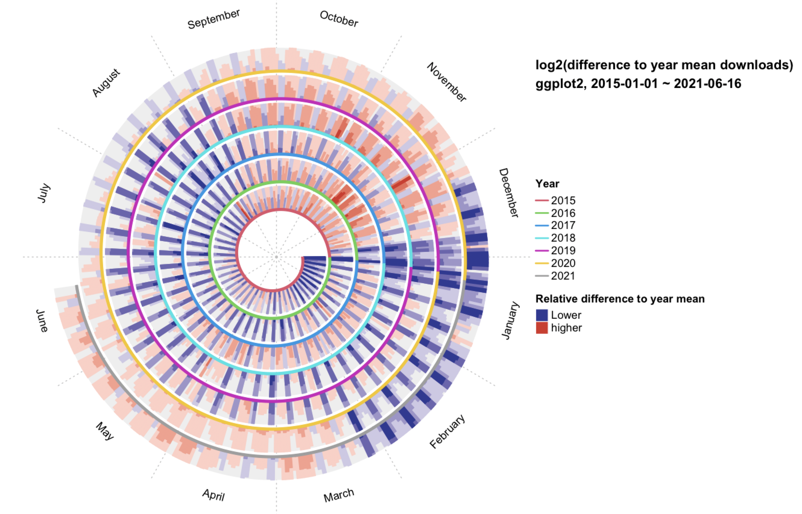

+++
author = "Yuichi Yazaki"
title = "Spiral Chart"
slug = "spiral-chart"
date = "2025-10-11"
categories = [
    "chart"
]
tags = [
    "",
]
image = "images/thumb_ph_vizjp.png"
+++

A spiral chart represents time or cyclical change along a spiral path. Unlike a circular chart that completes in one loop, a spiral can wind continuously through multiple cycles, making seasonal and periodic patterns easier to compare across years or periods.

<!--more-->

## Historical Background

Spiral forms in information graphics date back to nineteenth-century statistical diagrams. They are conceptually related to polar charts and cyclical time representations.

## Use Cases

- Seasonal time series
- Daily, weekly, or yearly cycles
- Long time series with repeated periods
- Periodic environmental or social data

## Design Notes

- Make the time direction clear.
- Avoid using spiral form when linear time comparison is simpler.
- Label cycles or reference periods.
- Use color carefully to avoid confusing position and value.

## Summary

Spiral charts are useful when periodicity is central to the story. They make repeated cycles visible, but they can be harder to read precisely than linear time-series charts.
