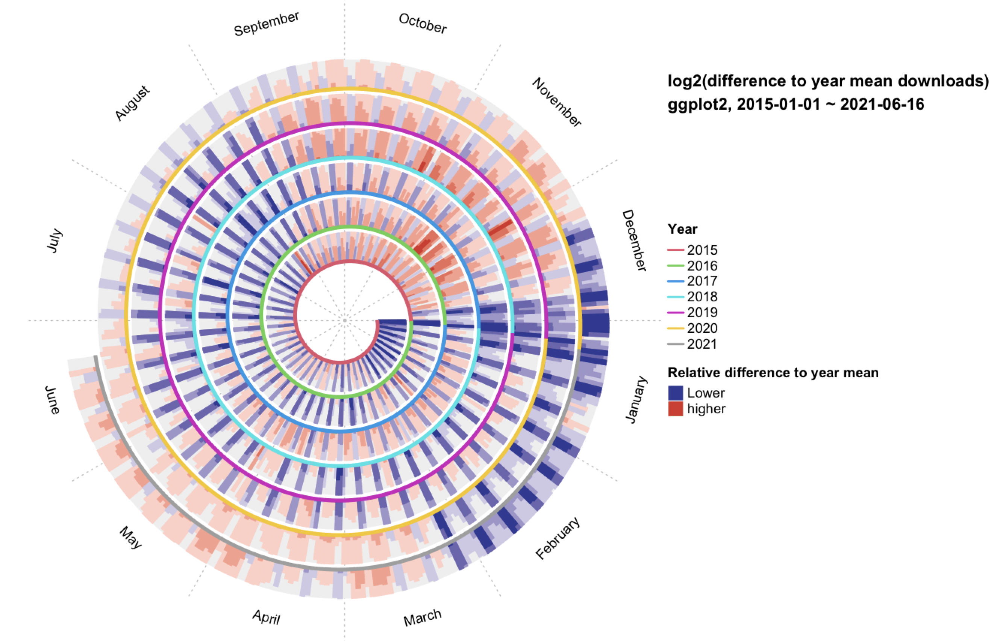
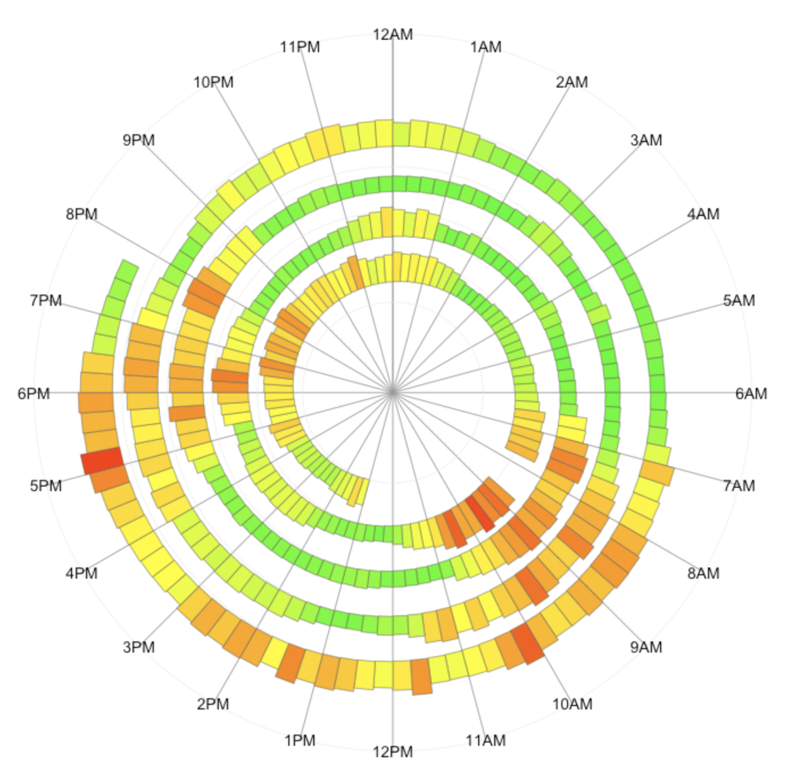
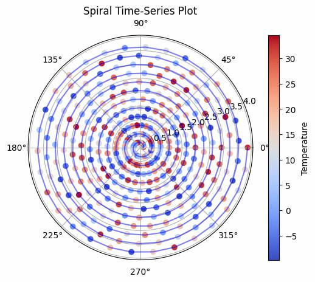

+++
author = "Yuichi Yazaki"
title = "スパイラル・チャート（Spiral Chart）"
slug = "spiral-chart"
date = "2025-10-11"
categories = [
    "chart"
]
tags = [
    "",
]
image = "images/thumb_ph_vizjp.png"
+++

スパイラル・チャートは **時間の経過や周期的な変化をらせん状（スパイラル）に表すチャート** です。一般的な円グラフやポーラー・チャートと異なり、1周で完結せず、時間を連続的に巻き取りながら複数の周期を重ねて表現することができます。これにより、**季節性や周期的なトレンドを直感的に把握できる**という特徴があります。

図に示されているように、左から順に「スパイラル・折れ線グラフ」「スパイラル・面グラフ」「スパイラル・棒グラフ」があります。これらはいずれも、時間軸を中心から外に向けて伸びる螺旋状の軌跡として描き、値の大きさを線の長さや棒の高さ、面積などで表現します。

<!--more-->

## チャートの見方

| 要素 | 説明 |
|------|------|
| 配置 | 時計の12時方向を起点として、円周に沿って時間が進行します。例えば、1日や1年を1周として設定することが一般的です。 |
| 軸 | 時間軸は螺旋状に外へ伸び、1周ごとに周期が繰り返されます。中心から外に向かうほど、時間が進行します。 |
| 表現方法 | 折れ線（値の連続変化）、面（累積や範囲の変化）、棒（離散的な値の強調）などが用いられます。 |
| スケール | 日時スケールや線形スケールを組み合わせ、名義・線形・時間データを可視化できます。 |
| 座標系 | 極座標系（polar coordinate system）を用いて配置されます。 |

スパイラルにすることで **同じ時期（例：毎年の1月）を同心円上で比較できる** という利点があります。一方で **螺旋が2周、3周と増えると重なりが生じ、値の比較が難しくなる** という欠点もあります。

## 背景と活用例

スパイラル・チャートは **季節性や周期的なトレンドを可視化する** 目的で多く用いられます。たとえば、以下のような用途に適しています。

- 気温や降水量などの季節変動データの可視化  
- 経済指標や消費動向など、周期的なサイクルを持つ時系列データの分析  
- 睡眠・運動などのライフログデータの可視化  

この形式は **デイリーやマンスリー単位での変化を年単位で比較** したい場合に特に効果的です。D3.jsやPlotlyなどの可視化ライブラリでも実装が可能であり、近年はデータジャーナリズムやサイエンス・ビジュアライゼーション分野でも多用されています。

## まとめ

スパイラル・チャートは **時間の周期性を強調したい場合に最適な時系列可視化手法** です。線・面・棒などの形式を組み合わせることで多様な表現が可能ですが、螺旋の密度が高すぎると読解性が下がる点に注意が必要です。周期の重なりを視覚的に比較することで、季節変化やサイクルの存在を一目で把握できる点が大きな魅力です。

## 参考・出典

- [Spiral Plot — The Data Visualisation Catalogue](https://datavizcatalogue.com/methods/spiral_plot.html)  
- [Spiral Plot — Data For Visualization](https://dataforvisualization.com/chart/spiral-plot)  
- [spiralize — 螺旋プロットを実現する R パッケージ／ライブラリの例](https://jokergoo.github.io/spiralize/)  
- [Spiral Histogram — Data Viz Project](https://datavizproject.com/data-type/spiral-histogram/)  
- [Creating a Temporal Range Time-Series Spiral Plot — GeeksforGeeks](https://www.geeksforgeeks.org/data-visualization/creating-a-temporal-range-time-series-spiral-plot/)  