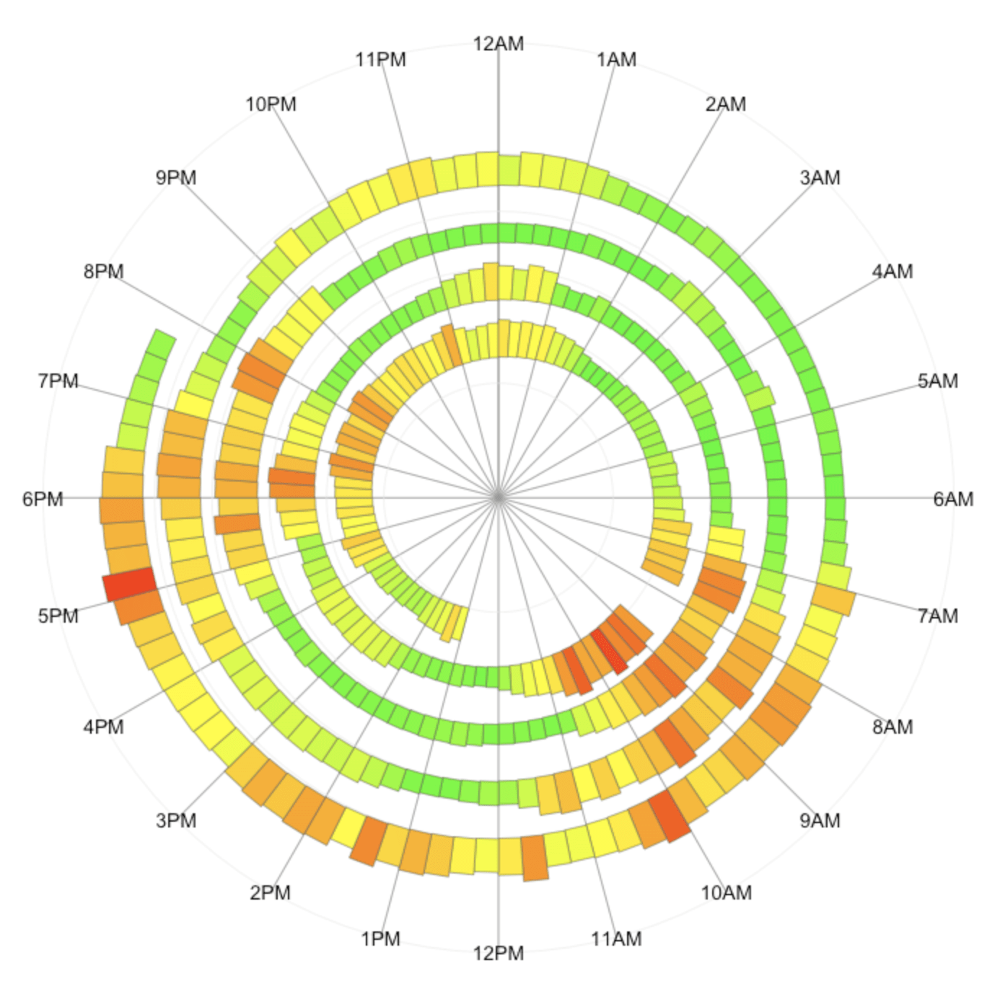
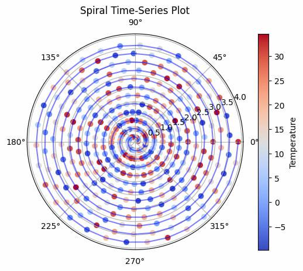

+++
author = "Yuichi Yazaki"
title = "スパイラル・チャート（Spiral Chart）"
slug = "spiral-chart"
date = "2025-10-11"
categories = [
    "chart"
]
tags = [
    "",
]
image = "images/thumb_ph_vizjp.png"
+++

スパイラル・チャート（Spiral Chart）は、**時間の経過や周期的な変化をらせん状（スパイラル）に表現する可視化手法**です。一般的な円グラフやポーラー・チャートと異なり、1周で完結せず、時間を連続的に巻き取りながら複数の周期を重ねて表現できます。これにより、季節性や周期的なトレンドを直感的に把握でき、同じ時期の異なる年を同心円上で視覚的に比較できる点が大きな特徴です。

<!--more-->


## 歴史的経緯

らせん形状を用いたデータ表現の歴史は、19世紀のインフォグラフィックスに遡ります。フローレンス・ナイチンゲールによる「ローズ・ダイアグラム」（1858年）は極座標系を用いた統計グラフの先駆的な例であり、スパイラル・チャートの思想的な源流の一つと考えることができます。

現代的なスパイラル・チャートは、コンピュータグラフィックスと情報可視化の発展とともに2000年代以降に広まりました。特に、時系列データの周期性を強調する必要がある分野（気象学、経済学、ライフログ分析など）で採用され、D3.js や R の spiralize パッケージなどの可視化ツールがその普及を後押ししました。近年ではデータジャーナリズムやサイエンス・ビジュアライゼーションの分野でも多用されています。

## データ構造

スパイラル・チャートに必要な基本的なデータ構造は以下の通りです。

| 列名 | データ型 | 説明 |
|------|----------|------|
| タイムスタンプ | 日付/時刻 | データの時点（日付、月、年など） |
| 値 | 数値 | 可視化する数量（気温、売上、アクセス数など） |
| カテゴリ | 文字列（任意） | 色分けやグループ化に使用する分類 |

## 目的

スパイラル・チャートの主な目的は、時系列データに含まれる周期的なパターンを視覚的に強調することです。

- 季節変動や周期的なトレンドを直感的に把握する
- 異なる周期（年ごと、月ごとなど）の同時期のデータを視覚的に比較する
- 長期間にわたる時系列データをコンパクトに表現する
- 周期の中でのピークや谷の位置を特定する

## ユースケース

- **気象データ分析**：気温や降水量などの季節変動データを年単位で重ねて比較します
- **経済指標の分析**：消費動向や景気指数など、周期的なサイクルを持つデータの傾向を把握します
- **ライフログの可視化**：睡眠パターンや運動量の日次・週次変動を視覚化します
- **ウェブ解析**：ウェブサイトのアクセス数の曜日・月別パターンを把握します
- **エネルギー消費**：電力使用量の季節変動を年単位で比較・分析します

## 特徴

| 視点 | 内容 |
|------|------|
| 強み | 周期性の把握に優れ、同時期のデータを同心円上で比較できる |
| 弱み | 螺旋が複数周回すると重なりが生じ、正確な値の比較が難しくなる |
| 適したデータ | 明確な周期性を持つ時系列データ（日次・週次・月次・年次） |
| 不向きなケース | 周期性のないデータや、正確な数値比較を重視する場合 |

## チャートの見方

| 要素 | 説明 |
|------|------|
| 配置 | 時計の12時方向を起点として、円周に沿って時間が進行します。1日や1年を1周として設定するのが一般的です |
| 軸 | 時間軸は螺旋状に外へ伸び、1周ごとに周期が繰り返されます。中心から外に向かうほど時間が進行します |
| 表現方法 | 折れ線（値の連続変化）、面（累積や範囲の変化）、棒（離散的な値の強調）などが用いられます |
| スケール | 日時スケールや線形スケールを組み合わせ、名義・線形・時間データを可視化できます |
| 座標系 | 極座標系（polar coordinate system）を用いて配置されます |

スパイラルにすることで、同じ時期（例：毎年の1月）を同心円上で比較できるという利点があります。一方で、螺旋が2周、3周と増えると重なりが生じ、値の比較が難しくなるという欠点もあります。




## デザイン上の注意点

- **周期の単位を明確にする**：1周が1年なのか1日なのかを明示し、読者の混乱を防ぎます
- **螺旋の周回数を制限する**：3〜5周程度に抑えると読みやすく、重なりも最小限になります
- **色やサイズで値を強調する**：棒の高さや線の太さだけでなく、色のグラデーションを併用すると周期的なパターンがより明確になります
- **目盛りや基準線を追加する**：螺旋上の位置だけでは時期を読み取りにくいため、月名や季節の区切り線を追加します
- **インタラクティブ機能を活用する**：ホバーで詳細値を表示するなど、デジタル環境での補助機能を検討します

## 応用例

- **気候変動の可視化**：地球の平均気温を年単位の螺旋で重ね合わせ、温暖化の傾向を視覚的に訴求するビジュアライゼーションが、データジャーナリズムの分野で広く共有されています
- **音楽データの分析**：音楽ストリーミングサービスの再生回数を月別に螺旋上で表示し、季節ごとの聴取傾向を分析する事例があります
- **交通データの分析**：都市の交通量を時間帯・曜日の周期で表現し、渋滞パターンの特定に活用されています

## 代替例

| チャート名 | 使い分けの目安 |
|------------|----------------|
| 折れ線グラフ | 正確な値の比較が重要で、周期性の強調が不要な場合 |
| ヒートマップ | 2つの周期（例：曜日×時間帯）の交差パターンを示したい場合 |
| ポーラー・チャート | 1周期分のデータのみを円形で表現する場合 |
| スモール・マルチプルズ | 複数の周期を別々のパネルに分けて正確に比較したい場合 |

## まとめ

スパイラル・チャートは、時間の周期性を強調したい場合に最適な時系列可視化手法です。線・面・棒などの形式を組み合わせることで多様な表現が可能ですが、螺旋の密度が高すぎると読解性が下がる点に注意が必要です。周期の重なりを視覚的に比較することで、季節変化やサイクルの存在を一目で把握できる点が大きな魅力であり、データジャーナリズムや科学的可視化の分野で効果的に活用されています。

## 参考・出典

```
- [Spiral Plot (The Data Visualisation Catalogue)](https://datavizcatalogue.com/methods/spiral_plot.html)
- [Visualize Data on Spirals - spiralize (R Package)](https://jokergoo.github.io/spiralize/)
- [Creating a Temporal Range Time-Series Spiral Plot (GeeksforGeeks)](https://www.geeksforgeeks.org/data-visualization/creating-a-temporal-range-time-series-spiral-plot/)
- [Spiral Plot (Data For Visualization)](https://dataforvisualization.com/chart/spiral-plot)
- [Spiral Histogram (Data Viz Project)](https://datavizproject.com/data-type/spiral-histogram/)
```
