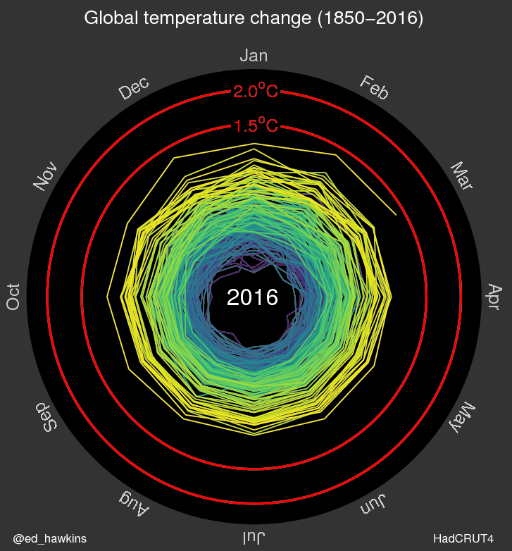
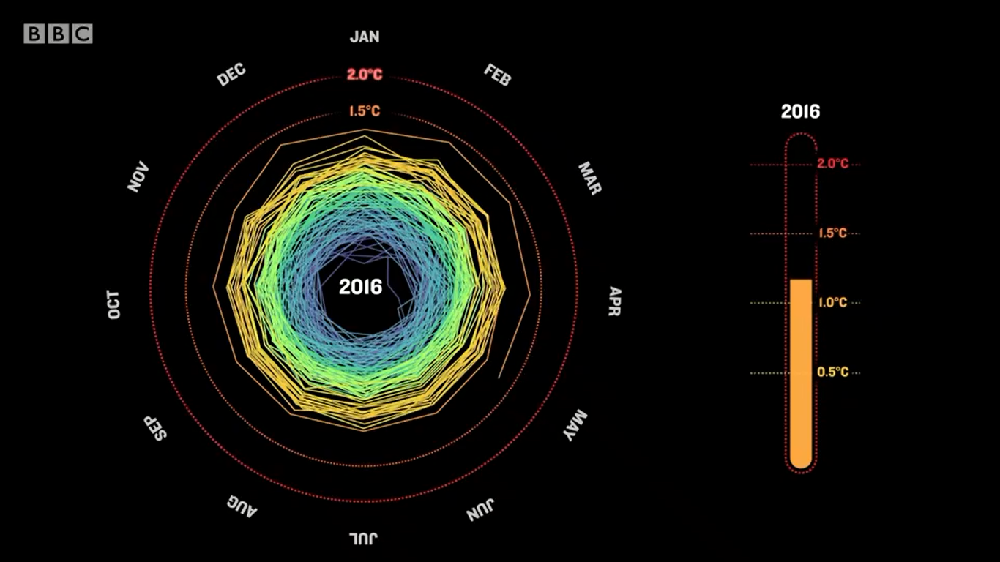

+++
author = "Yuichi Yazaki"
title = "気温スパイラルが見せる地球温暖化の軌跡"
slug = "spiralling-global-temperatures"
date = "2025-09-21"
description = ""
categories = [
    "consume"
]
tags = [
    "",
]
image = "images/01_spiral2016.png"
+++

NASA が公開している[「Climate Spiral 1880-Present」](https://svs.gsfc.nasa.gov/5190/)という映像をご存知でしょうか。
1880 年から現在までの気温変化をスパイラル状に描き、月ごとに回転しながら近年の急激な上昇を強烈に浮かび上がらせるグラフです。

教育現場やニュース番組で引用されることも多く、NASA の公式リソースとして信頼感のある可視化。しかしこの表現方法には、実はひとりの気候科学者のアイデアが源流として存在します。

<!--more-->

## 実は作者がいた ― Ed Hawkins の「Spiralling global temperatures」

2016年5月9日、レディング大学の気候科学者 Ed Hawkins が、自身のブログ Climate Lab Book に「Spiralling global temperatures」を発表しました。

https://www.climate-lab-book.ac.uk/2016/spiralling-global-temperatures/

- 制作：Ed Hawkins（レディング大学・気候科学者）
- 公開：2016年5月9日、ブログ Climate Lab Book
- データ：HadCRUT4.4（1850–2016年3月）、基準は1850–1900年平均
- 表現：月ごとの気温偏差を円周方向に配置、中心からの距離で異常値を表現。色は viridis スケールを採用し、時間経過を紫から黄へ変化させた。

結果は爆発的な拡散でした。BBC、Guardian、NYT など主要メディアで紹介され、SNS では「美しいが恐ろしい」と評され数百万ビューを記録。科学者だけでなく一般市民の目をも奪ったのです。

さらに 2016 年リオ五輪の開会式で上映され、数億人に届くビジュアルへと飛躍しました。

## ヴァージョンの展開

この可視化は一度きりの実験にとどまらず、多くのヴァージョンへ発展しました。

### 初期版 (2016)

https://www.climate-lab-book.ac.uk/2016/spiralling-global-temperatures/

### リオ五輪開会式での使用（2016）

https://www.rmets.org/metmatters/olympic-ceremony-features-uk-scientists-climate-spiral

開会式映像に組み込まれ、世界数億人の前で上映。科学的ビジュアルが大衆文化に登場した象徴的事例。

### 拡張版（2016）

https://www.climate-lab-book.ac.uk/spirals/

気温だけでなく 北極海の海氷量や大気中の二酸化炭素濃度など、複数指標ごとにスパイラルを公開。

#### 北極海の海氷量

#### 大気中の二酸化炭素濃度

### NASA Climate Spiral (2023)

https://svs.gsfc.nasa.gov/5190/

2023年11月に公開され、2025年現在も毎月更新。GISTEMP v4 データを用い、1951–1980 年を基準期間として設定。Ed Hawkins が生み出したスパイラル形式を踏襲しつつ、NASA の公式アーカイブとして継続的に拡張されている。配布形態や解像度が整備され、教育・報道の利用を前提とした「最新の公式版」といえる。

## 基準期間による「見え方」の違い

ここで注意したいのが「基準期間をどこに置くか」です。

- Hawkins のオリジナルは 1850–1900年 を基準にしており、産業革命前後を「正常な気温」とみなしています。これは長期的な温暖化を強調する見方です。
- NASA のスパイラルは 1951–1980年 を基準にしており、近代以降の安定期を「ゼロ」とする尺度です。これは科学界で標準的によく用いられる基準期間で、比較のしやすさを重視しています。

この違いによって「どこからどれだけ温暖化したか」の印象は変わります。基準期間は“データの事実”ではなく“解釈の枠組み”であるため、可視化を読み取るときには常に意識しておく必要があります。

## 反響と影響

### 称賛

- The Guardian：「比喩としてのスパイラルが文字通りのものになった」
- Vox：「これまで見た中で最も明快な地球温暖化の可視化のひとつ」
- Ed Hawkins 自身：「非科学者が現実を理解する助けになった」

### 普及

- SNS で数百万ビューを記録、BBCやNYTなど主要メディアに掲載。
- 教育現場で教材として用いられ、科学コミュニケーションの象徴的ビジュアルとなった。
- 2016年リオ五輪の開会式での採用は、科学可視化の歴史に残る出来事。
- NASA による定期更新版の公開で、「進行中の現象」をリアルタイムで追える仕組みが整った。

### 批判・懸念

- 不確実性（誤差や地域差）が表現されていない。
- 半径の拡大が「面積効果」で実際以上に大きな変化に見える可能性。
- 「恐怖を煽る過ぎる」との声も一部にあり、感情的インパクトの強さゆえの課題も指摘された。
- 学術的分析では「視聴者に不安や否定的感情を喚起する側面もある」と報告されている。

## 気温スパイラルの可視化がもたらしたもの

この気温スパイラルは、単なるデータ提示を超えて「温暖化は進行中である」という事実を直感的に伝える強力なビジュアルになりました。科学とデザイン、アートと社会が交差する地点に生まれた作品といえるでしょう。

<blockquote>
“The genius of the original was to show how the long term warming trend stood out from the noise of natural variation.” — ClimateChangeNews
</blockquote>

科学的厳密性とともに、「どう見せるか」が人々の理解や感情を左右することを示した事例でもあります。特に「基準期間の選択」が印象を変えることを理解することは、データ可視化のリテラシーに直結します。

## おわりに

気候変動の議論はしばしば数値や統計の世界に閉じこもりがちです。
「Spiralling global temperatures」が示したのは、データをどう「見せるか」がいかに重要か、ということでした。

美しく、そして恐ろしく。
このスパイラルは、私たちがどこから来て、どこへ向かおうとしているのかを、ひと目で語りかけてきます。
