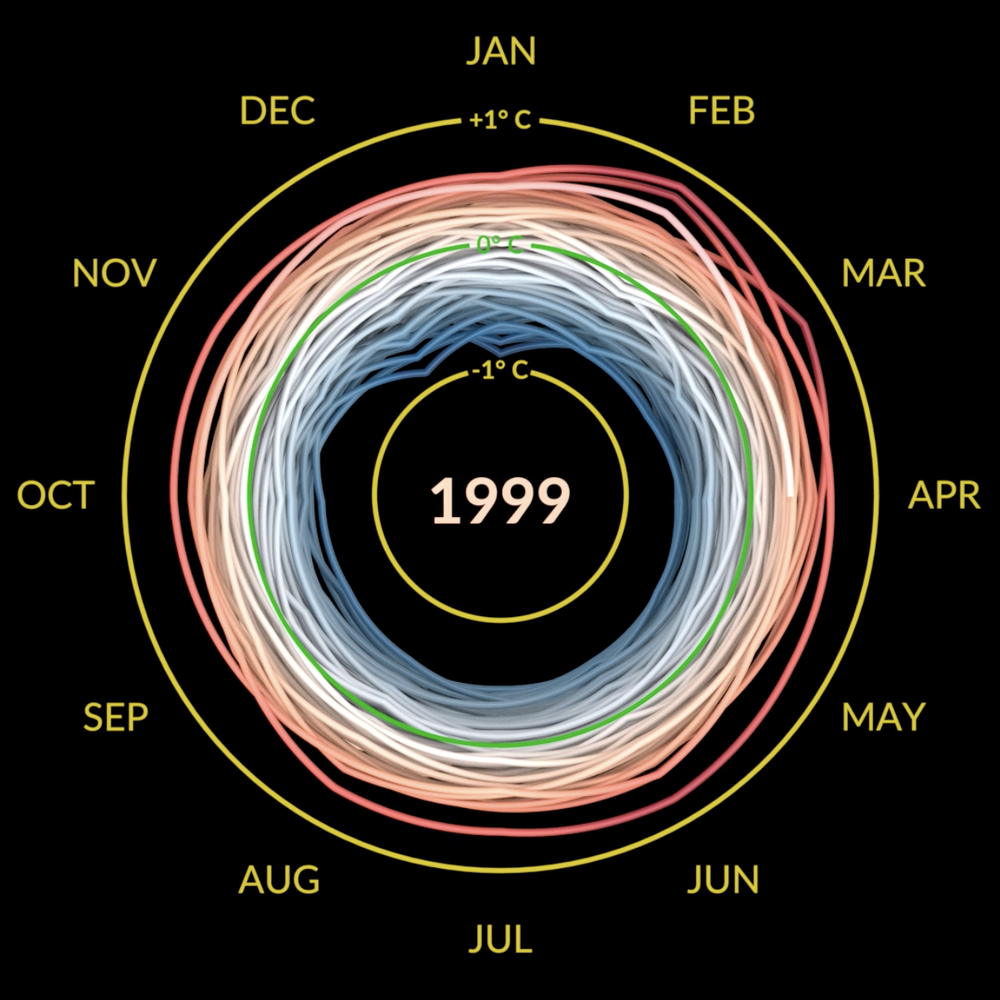
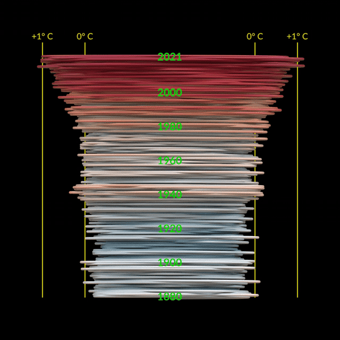
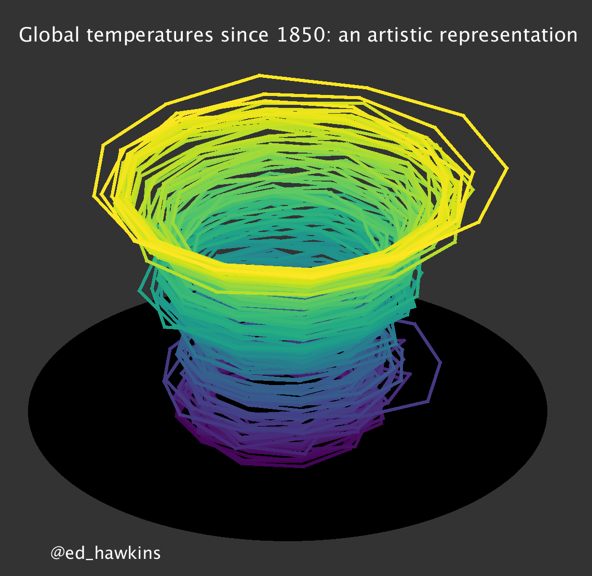
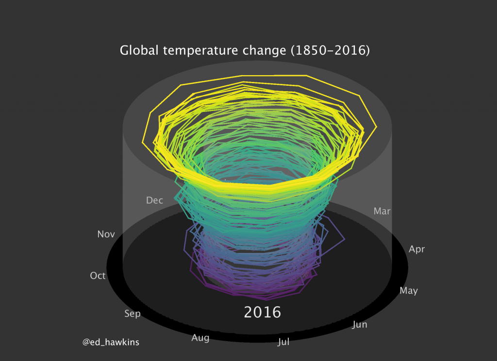
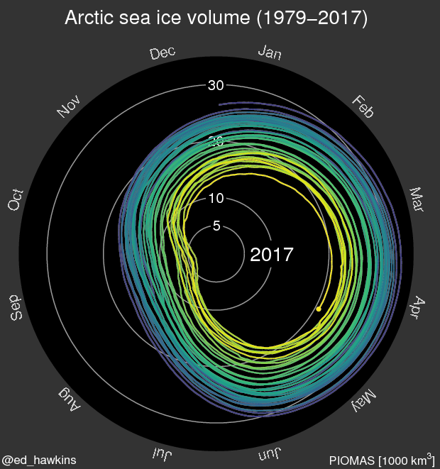
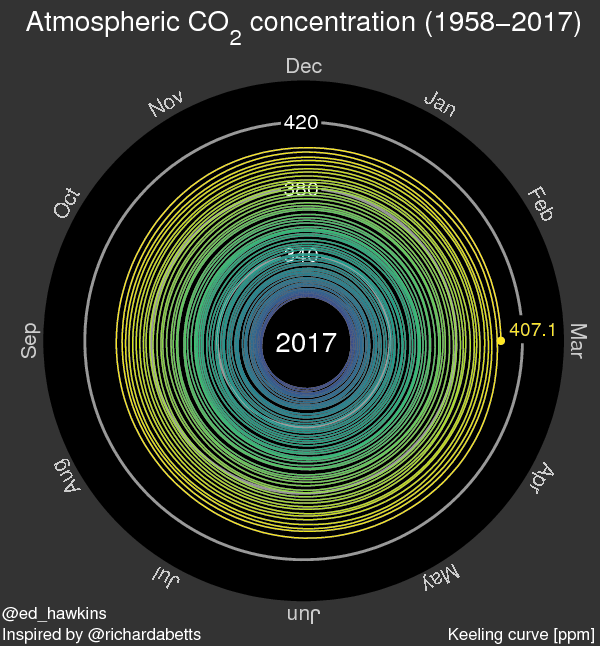

+++
author = "Yuichi Yazaki"
title = "気温スパイラルが見せる地球温暖化の軌跡"
slug = "spiralling-global-temperatures"
date = "2025-09-21"
description = ""
categories = [
    "consume"
]
tags = [
    "",
]
image = "images/cover-spiralling.png"
+++

「気候変動をどう伝えるか？」――これは科学者やメディアにとって長年の課題でした。
従来は折れ線グラフや棒グラフで示されてきた地球平均気温の変化を、一瞬で「見て理解できる」形にしたのが、気温スパイラルです。

<!--more-->

今日、NASA が公式に配布する映像として教育や報道で広く使われていますが、そのアイデアの源流はイギリスの科学者 Ed Hawkins が発表した、ひとつの GIF アニメーションにさかのぼります。

## Ed Hawkins の「Spiralling global temperatures」

https://www.climate-lab-book.ac.uk/2016/spiralling-global-temperatures/

2016年5月9日、レディング大学の気候科学者 Ed Hawkins は、自身のブログ Climate Lab Book に「Spiralling global temperatures」を公開しました。
- 公開：2016年5月
- データ：HadCRUT4.4（1850–2016年3月）
- 基準期間：1850–1900 年
- 表現：
    - 半径＝気温偏差（基準からのずれ）
    - 色＝年度の進行（紫から黄へと変化）
    - 形式：GIF アニメーション（SNS で拡散しやすい軽量形式）

発表直後から世界中で大きな話題となり、BBC、Guardian、NYT など主要メディアが取り上げました。SNS では「美しく、そして恐ろしい」と評され数百万回以上共有され、リオ五輪の開会式でも映像として上映されました。

科学者が発表した一枚の GIF が、数億人に「地球温暖化の実感」を伝えるに至ったのです。

## NASA Climate Spiral 1880–Present

この革新的な発想を取り入れ、NASA Goddard Space Flight Center は公式の映像として再構成しました。それが「Climate Spiral 1880–Present」です。

https://svs.gsfc.nasa.gov/5190/

この革新的な発想を取り入れ、NASA Goddard Space Flight Center は公式の映像として再構成しました。それが「Climate Spiral 1880–Present」です。
- 公開：2023年11月、2025年現在も毎月更新
- データ：GISTEMP v4
- 基準期間：1951–1980 年
- 表現：
    - 半径＝気温偏差
    - 色＝気温偏差（寒冷＝青、中立＝白、温暖＝赤）
    - 年の進行はアニメーションと数字で表示
    - 最後にスパイラルを「横から」見せる演出（NASA 独自の工夫）

こうして NASA は、Hawkins の形式を継承しながらも「教育・報道で直感的に伝わる表現」へと発展させました。

### NASA 版の映像演出 ― 横からの視点切替

NASA の Climate Spiral 1880–Present は、Ed Hawkins が生み出したスパイラル形式を忠実に踏襲していますが、最後に特徴的な演出を加えています。

スパイラルが広がりきった後、カメラの視点が回転し、円を「横から」眺める構図に切り替わるのです。すると、ぐるぐると回っていた輪が縦に積み重なった層へと変わり、1880年から現在までの時間が一本の「気温の柱」のように立ち上がります。

この演出は Ed Hawkins のオリジナルにはなかった NASA 独自の工夫 です。単なる 2D の図解にとどまらず、
- 過去から現在に至る温度の積み重なりを立体的に強調する
- 視聴者に「歴史の厚み」と「急激な上昇」の両方を直感的に感じさせる

といった効果をもたらしています。教育用の動画やニュース報道で使いやすいように映像的な迫力を加えた点は、NASA 版ならではの特徴と言えるでしょう。

## バージョンの展開

この可視化は一度きりの実験にとどまらず、多くのバージョンへ発展しました。

### 初期版 (2016)

https://www.climate-lab-book.ac.uk/2016/spiralling-global-temperatures/

### リオ五輪開会式での使用（2016）

https://www.rmets.org/metmatters/olympic-ceremony-features-uk-scientists-climate-spiral

開会式映像に組み込まれ、世界数億人の前で上映。科学的ビジュアルが大衆文化に登場した象徴的事例。

### 拡張版（2016）

https://www.climate-lab-book.ac.uk/spirals/

NASA 版による「円を横から眺める構図」が本家にも取り入れられていることがわかります。

そして気温だけでなく 北極海の海氷量や大気中の二酸化炭素濃度など、複数指標ごとにスパイラルを公開。

#### 北極海の海氷量

#### 大気中の二酸化炭素濃度

### NASA Climate Spiral (2023)

https://svs.gsfc.nasa.gov/5190/

https://svs.gsfc.nasa.gov/5383/

2023年11月に公開され、2025年現在も毎月更新。GISTEMP v4 データを用い、1951–1980 年を基準期間として設定。Ed Hawkins が生み出したスパイラル形式を踏襲しつつ、NASA の公式アーカイブとして継続的に拡張されている。配布形態や解像度が整備され、教育・報道の利用を前提とした「最新の公式版」といえる。

## 基準期間による「見え方」の違い

気温スパイラルを理解するうえで重要なのが 基準期間です。
- Hawkins 版：1850–1900 年を基準期間に設定 → 産業革命前後をゼロ点とし、長期的な温暖化を強調。
- NASA 版：1951–1980 年を基準期間に設定 → 近代以降の安定期をゼロ点とし、標準的な比較尺度を提供。

### 日本での気温偏差の算出方法

参考までに、日本の気象庁による、日本の年平均気温偏差（℃）とその算出方法は以下のページに記載があります。

 - [気象庁 | 日本の年平均気温偏差（℃）](https://www.data.jma.go.jp/cpdinfo/temp/list/an_jpn.html)

## Hawkins 版と NASA 版のカラースキームを比較

ここで改めて「色の役割」に注目しましょう。
- Hawkins のオリジナル
    - 色＝年度の進行
    - 半径＝気温偏差
    - 「色＝時間」「半径＝気温」という役割分担
- NASA のリデザイン
    - 色＝気温偏差（青＝寒冷、赤＝温暖、白＝基準）
    - 半径＝気温偏差
    - 年の進行はアニメーションで表現

NASA が採用した青–白–赤のカラースキームは一般的に分岐的カラースキームと呼ばれています。分岐的カラースキームは基準値を白に近い色とし、増減する数値を別々な色相で同程度に明度を変化させるカラースキームです。

図中の 0°C, ±1°C は「絶対気温」ではなく、基準期間からの差（気温偏差＝アノマリー）を示します。たとえば「+1°C」とは「基準より平均気温が 1°C 高い」という意味です。実際の地球平均気温の変化は ±1〜1.5°C 程度なので、グラフもその範囲に収まって見えるのです。

この分岐的カラースキームは、–1, 0, +1°C の目盛りとピッタリと整合しており「寒い＝青」「暖かい＝赤」という直感と数値が一致します。これにより、説明なしでも誰もが理解できる表現としてさらに表現の強度が増したのです。

### カラースキームについての補足

NASA の気温スパイラルページ自体には「色の意味（凡例）」を明示する文章はありません。しかし NASA が公開している他の気温異常可視化ページでは、以下のように公式に説明されています。

<blockquote>
“Normal temperatures are shown in white. Higher than normal temperatures are shown in red and lower than normal temperatures are shown in blue. Normal temperatures are calculated over the 30 year baseline period 1951-1980.”
（通常の気温は白、基準より高い気温は赤、低い気温は青で示す。基準は 1951–1980 年の 30 年平均）
</blockquote>

この「白＝基準、赤＝高温、青＝低温」というルールは NASA の異常値可視化全体で一貫して用いられており、スパイラルにおいても暗黙の前提として適用されていると考えられます。

## オリジナルの革新性と NASA による完成度の向上

Ed Hawkins のオリジナルは、科学データを「誰にでも直感的に伝わる」表現へと変換した点で革新的でした。色を年度に対応させるという発想と、SNS に適した GIF 形式が、世界的な拡散を後押ししました。

一方で NASA は、その形式を「公共コミュニケーション」に最適化しました。色を気温偏差に対応させ、–1, 0, +1°C のスケールと直感的に結びつけることで理解しやすくし、さらに毎月更新される仕組みを整えたのです。

こうして、Hawkins の発明は NASA のリデザインによって完成度を高め、世界中の教育現場やニュース番組で広く使われる「標準的な気候ビジュアル」へと進化しました。

## おわりに

気候変動の議論はしばしば数値や統計の世界に閉じこもりがちです。
「気温スパイラル」が示したのは、データをどう「見せるか」がいかに重要か、ということでした。

美しく、そして恐ろしく。
このスパイラルは、数字の羅列では届かなかった「地球温暖化の実感」を、誰にでも伝える力を持っています。
