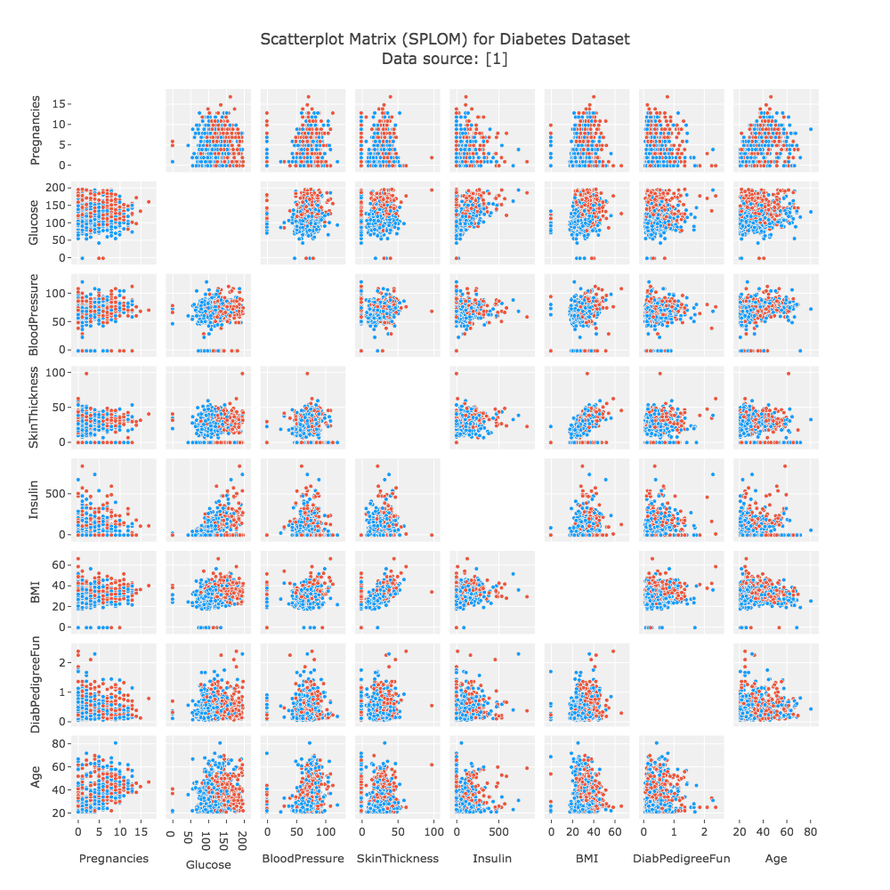

+++
author = "Yuichi Yazaki"
title = "散布図行列"
slug = "splom"
date = "2020-08-28"
description = ""
categories = [
    "chart"
]
tags = [
    "",
]
image = "images/1_bPYf9c07ZBLRvgxCbCkPSQ.png"
+++

散布図行列（Scatterplot Matrix）は、多変量データの各変数間の関係を一度に視覚的に確認できる図表です。  
縦軸と横軸に同じ変数群を並べ、行列状に散布図を配置することで、各変数ペア間の相関関係を俯瞰的に把握できます。  
特にデータ探索（Exploratory Data Analysis, EDA）の初期段階で、異常値や傾向、線形・非線形の関係などを視覚的に発見するのに有効です。

<!--more-->

## チャートの見方

散布図行列では、行列の各セルが「2つの変数の関係」を表しています。
一般的な構成は以下の通りです。

| 位置 | 内容 | 解釈のポイント |
|------|------|----------------|
| 対角線上 | 各変数自身を示す（ヒストグラムやカーネル密度推定が置かれることも） | その変数の分布形状を把握する |
| 対角線より上・下 | 2変数間の散布図 | 点の傾き・広がりから相関関係を読み取る |
| 点の密集・傾き | 正・負の相関の傾向を示す | 線形関係の強さや外れ値の有無を観察できる |
| 色やサイズ（任意） | 第3の変数をエンコードする場合あり | 多次元的な関係を一枚で表現可能 |

また、プロットの上部と下部を非対称に設定することで、一方に相関係数（例えばPearson相関）や回帰線を併記することもあります。

## 背景と用途
この可視化手法は統計分析の分野で古くから用いられており、R言語の`pairs()`関数やPythonの`seaborn.pairplot()`などで簡便に生成できます。  
多変量回帰分析や主成分分析の前処理として使われることが多く、次のような目的に活用されます。

- データの全体的な傾向・分布を確認する  
- 強い相関関係のある変数を見つける  
- 特定の変数間で外れ値やクラスター構造を見つける  
- 特徴量選択（feature selection）の指針とする  

また、次元数が多い場合は、主成分得点を用いた「縮約後の散布図行列」や「部分選択行列」を用いることもあります。

## 注意点

散布図行列は変数の数が多くなると、視覚的な過密や理解の困難さを招きます。  
そのため、分析対象の変数をあらかじめ絞り込み、補助的にヒートマップや相関係数行列と併用するのが一般的です。  
また、数値変数以外（カテゴリ変数など）は、形や色などで表現を工夫する必要があります。

## まとめ

散布図行列は、多変量データの構造を直感的に理解するための強力な手法です。  
単一の散布図では見逃されがちな相関構造や分布の偏りを、全体的に可視化できる点が大きな利点です。  
ただし、変数数が多すぎる場合には可読性を損ねるため、選択的・補助的に利用することが重要です。

## 参考・出典

- [Wikipedia: Scatter plot matrix](https://en.wikipedia.org/wiki/Scatterplot_matrix)
- [Seaborn Documentation — pairplot](https://seaborn.pydata.org/generated/seaborn.pairplot.html)
- [Plotly Express — scatter_matrix](https://plotly.com/python/splom/)
- [Vega-Lite: Repeat Charts](https://vega.github.io/vega-lite/docs/repeat.html)
- [R Documentation — pairs()](https://stat.ethz.ch/R-manual/R-devel/library/graphics/html/pairs.html)