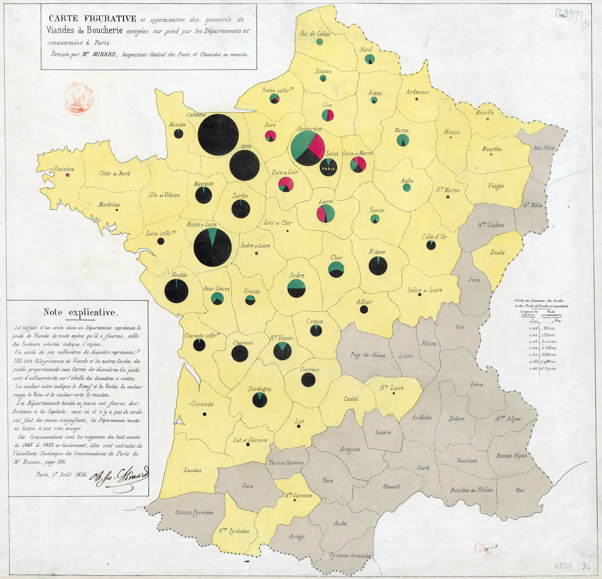
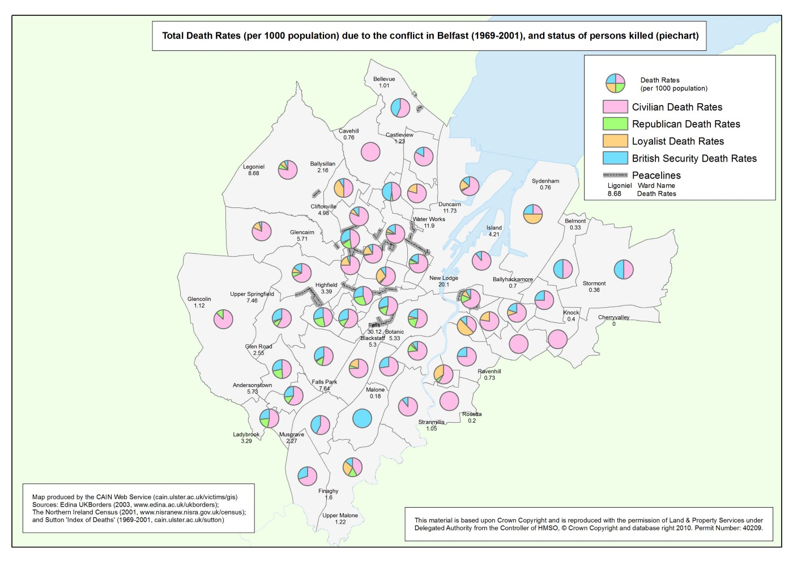
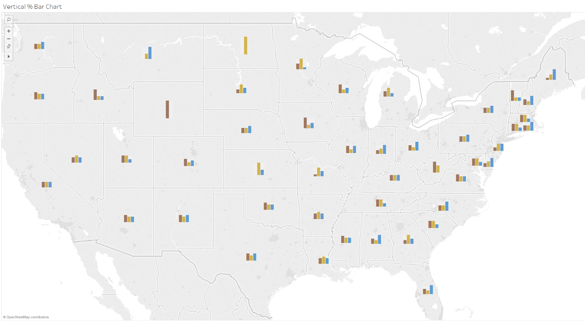
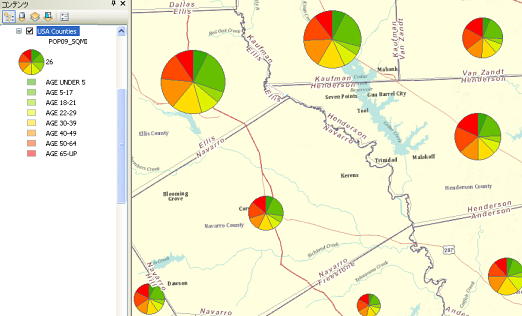
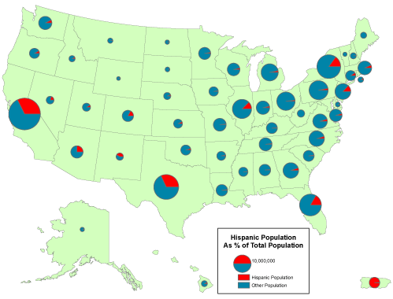
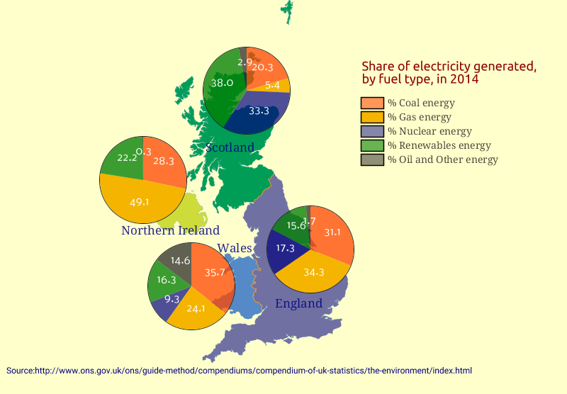
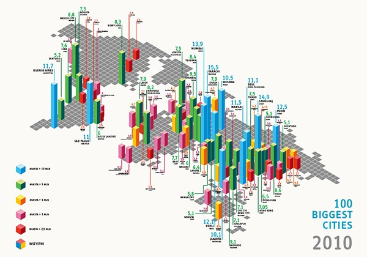

+++
author = "Yuichi Yazaki"
title = "統計記号マップ（Statistical Symbol Map）"
slug = "statistical-symbol-map"
date = "2020-08-04"
description = ""
categories = [
    "chart"
]
tags = [
    "地図",
]
image = "images/1064px-Minard-carte-viande-1858.png"
+++

統計チャートを地図上に重ねて表示することで、地理的分布と統計的分析を同時に行うことを目指したものです。

配置が上手くいかないことがあったり、比較が困難であったりと、今となっては一般的には使用を推奨することはありません。

同様の意図を実現したい場合はスモール・マルチプルを利用することを検討してみてください。

<!--more-->

## 作例

### ナショナルアトラス（日本国勢地図帳） 国および都道府県の歳入

ナショナルアトラス（日本国勢地図帳） 国および都道府県の歳入

### 各地方からパリへ送られてくる食用牛肉の量

[1858 map by Charles Minard](https://commons.wikimedia.org/wiki/Charles_Joseph_Minard)

### Pie Chart Map — Belfast

[http://cain.ulst.ac.uk/victims/gis/maps/gismaps-16.html](http://cain.ulst.ac.uk/victims/gis/maps/gismaps-16.html)

### Bar Chart on a Map — Tableau

[https://www.dataplusscience.com/BarChartMaps.html](https://www.dataplusscience.com/BarChartMaps.html)

### Pie chart on a symbol map — Tableau

[http://arunethan.com/?p=270](http://arunethan.com/?p=270)

### パイ・チャート・マップ（Pie Chart Map） — ArcGIS

[http://desktop.arcgis.com/ja/arcmap/10.3/map/working-with-layers/drawing-features-to-show-quantities-drawing-pie-ch.htm](http://desktop.arcgis.com/ja/arcmap/10.3/map/working-with-layers/drawing-features-to-show-quantities-drawing-pie-ch.htm)

[https://www.e-education.psu.edu/natureofgeoinfo/c3_p17.html](https://www.e-education.psu.edu/natureofgeoinfo/c3_p17.html
)

### パイ・チャート・マップ（Pie Chart Map） — Coloremaps

[https://coloremaps.com/visualization-map-types/chart-maps/](https://coloremaps.com/visualization-map-types/chart-maps/)

### 100 biggest cities in 2010

[https://www.behance.net/gallery/4610471/100-biggest-cities-2010-infographic](https://www.behance.net/gallery/4610471/100-biggest-cities-2010-infographic)

### コラム・チャート・マップ（Columns chart maps） — Coloremaps

[https://coloremaps.com/visualization-map-types/chart-maps/](https://coloremaps.com/visualization-map-types/chart-maps/)

## 参考文献

- 谷村 晋 (著), 金 明哲 (編集) — 地理空間データ分析 (Rで学ぶデータサイエンス 7)

