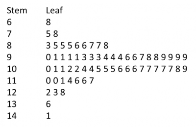

+++
author = "Yuichi Yazaki"
title = "幹葉図"
slug = "stem-and-leaf-plot"
date = "2025-10-11"
categories = [
    "chart"
]
tags = [
    "",
]
image = "images/cover.png"
+++

幹葉図（stem-and-leaf plot）は、数値データを「幹（stem）」と「葉（leaf）」に分けて表示することで、分布の形を視覚的に把握できる統計図法です。
ヒストグラムと似ていますが **個々の観測値が保持されたまま** 表示される点に特徴があります。
主に少量〜中量データの探索的分析に用いられます。

<!--more-->

## チャートの見方

幹葉図は、次のような構造を持っています。

| 要素 | 説明 |
|------|------|
| 幹（Stem） | データの上位桁（十の位・百の位など）を表す。左側に縦に並ぶ。 |
| 葉（Leaf） | データの下位桁（一の位・小数第一位など）を表す。幹の右側に横方向に並ぶ。 |
| 縦線（｜） | 幹と葉を区切る。例：「6｜3 5 7」は63, 65, 67を意味する。 |
| 凡例（Key） | 幹葉の対応関係を示す。「2｜4＝24」のように表記しておく。 |
| 空行（Gap） | 葉が存在しない幹を空白として残すことで、分布の“谷間”を視覚化する。 |

## 作成手順

| 手順 | 内容 |
|------|------|
| 1. | データを昇順に並べる。 |
| 2. | 幹と葉に分ける桁（区切り）を決める。 |
| 3. | 幹を小さい順に縦に並べる。 |
| 4. | 各幹に対応する葉を右側に並べる。 |
| 5. | 凡例（キー）を添えて図を完成させる。 |

例：  
2｜4 7
3｜1 2 5 9
4｜0 3 8

→ 「2｜4＝24」「3｜1＝31」を意味する。

## 読み取り方

| 観察点 | 意味 |
|--------|------|
| データの集中 | 葉が多い幹が、頻度の高い階級を示す。 |
| 分布の形 | 左右対称・右裾／左裾が長いなど、分布の偏りを確認できる。 |
| 最小値・最大値 | 最も左下・右上の葉がそれぞれ最小・最大を示す。 |
| 中央値 | 葉を順に数えることで中央値を求められる。 |
| 外れ値 | 幹から離れた位置に1つだけ葉がある場合、それが外れ値の候補。 |

## 背景と応用

幹葉図は、ジョン・チューキー（John W. Tukey）が提唱した **探索的データ解析（Exploratory Data Analysis）** の一環として1970年代に広まりました。  
現在では統計教育や小規模データの視覚的要約に多用され **ヒストグラム・箱ひげ図・ドットプロット** などとともに、基本的な分布可視化手法の一つとされています。

## まとめ

幹葉図は、データの値を保持しながら分布を直感的に表せる、手軽で教育的な可視化方法です。  
少数データの傾向を素早くつかみ、中心傾向や外れ値を確認する際に有効です。  
ただし、データが多すぎる場合や桁数が大きい場合は、ヒストグラムなど他の手法に切り替えるのが適しています。

## 参考・出典

- [Wikipedia: Stem-and-leaf display](https://en.wikipedia.org/wiki/Stem-and-leaf_display)
- [Statistics by Jim: How to Make and Interpret Stem-and-Leaf Plots](https://statisticsbyjim.com/graphs/stem-and-leaf-plot/)
- [Math is Fun: Stem and Leaf Plots](https://www.mathsisfun.com/data/stem-leaf-plots.html)
- [CK-12 Foundation: Stem-and-Leaf Plots](https://www.ck12.org/statistics/stem-and-leaf-plots/)
- [Study.com: Interpreting a Stem-and-Leaf Plot](https://study.com/skill/learn/interpreting-a-stem-and-leaf-plot-explanation.html)