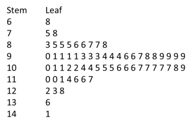

+++
author = "Yuichi Yazaki"
title = "幹葉図（Stem and Leaf Plot）"
slug = "stem-and-leaf-plot"
date = "2025-10-11"
categories = [
    "chart"
]
tags = [
    "",
]
image = "images/cover.png"
+++

幹葉図（Stem and Leaf Plot）は、数値データを「幹（Stem）」と「葉（Leaf）」に分けて表示することで、**個々の観測値を保持したまま分布の形を視覚的に把握できる統計図法**です。ヒストグラムと似た外観を持ちますが、元のデータ値が失われない点に大きな特徴があります。主に少量から中量のデータの探索的分析に用いられます。

<!--more-->



## 歴史的経緯

幹葉図は、アメリカの統計学者ジョン・チューキー（John W. Tukey）が1970年代に提唱した「探索的データ解析（Exploratory Data Analysis, EDA）」の一環として広まりました。チューキーは1977年の著書『Exploratory Data Analysis』において、箱ひげ図（Box Plot）とともに幹葉図を紹介し、データの分布を素早く視覚化するためのツールとして位置づけました。コンピュータが普及する以前の時代に、手書きで素早くデータの概要を把握できる手法として考案されたため、現在でも統計教育の入門段階で広く教えられています。

## データ構造

幹葉図で扱うデータは、以下の構造を持ちます。

| 要素 | 説明 | 例 |
|------|------|-----|
| 幹（Stem） | データの上位桁（十の位・百の位など） | 2, 3, 4, 5 |
| 葉（Leaf） | データの下位桁（一の位・小数第一位など） | 3, 5, 7, 0, 8 |
| 縦線（\|） | 幹と葉を区切る記号 | 6\|3 5 7 = 63, 65, 67 |
| 凡例（Key） | 幹葉の対応関係を示す表記 | 2\|4 = 24 |

例えば「2\|4 7」は24と27を、「3\|1 2 5 9」は31, 32, 35, 39を意味します。

## 目的

幹葉図の主な目的は以下のとおりです。

- **データの分布形状の把握**：葉の並びがヒストグラムのように横方向に広がるため、分布の偏りや集中を視覚的に確認できます。
- **個々のデータ値の保持**：ヒストグラムとは異なり、元のデータ値がそのまま読み取れるため、情報の損失がありません。
- **中心傾向と散らばりの確認**：中央値、最小値、最大値、外れ値などを素早く特定できます。

## ユースケース

| 分野 | 具体例 |
|------|---------|
| 統計教育 | データ分布の基礎的な理解と教育 |
| 品質管理 | 製品の測定値の分布確認 |
| 医療統計 | 少数の患者データの分布の概観 |
| 試験分析 | テストの得点分布の素早い把握 |
| 探索的データ分析 | 小規模データの初期的な傾向確認 |

## 特徴

- 元のデータ値を保持したまま分布を表現できる点が、ヒストグラムとの最大の違いです。
- 手書きで素早く作成できるため、コンピュータがなくてもデータの概要を把握できます。
- 葉の数を数えることで中央値を直接求められます。
- 幹に対する葉の偏りから、分布の対称性や裾の長さを直感的に判断できます。
- データ数が多い場合（概ね100件以上）は図が縦に長くなり、読みにくくなるという制約があります。

## チャートの見方

- **幹（左側の数字）**：データの上位桁を表し、縦に小さい順に並びます。
- **葉（右側の数字）**：各幹に属するデータの下位桁を表し、横方向に並びます。葉が多い行はデータの集中する階級を示します。
- **分布の形状**：葉の横方向の広がりがヒストグラムの棒に相当します。左右対称であれば正規分布に近く、一方に裾が長ければ偏った分布です。
- **外れ値**：他の幹から大きく離れた位置に1つだけ葉がある場合、それが外れ値の候補です。
- **凡例（Key）**：「2\|4 = 24」のように記載されているので、幹と葉がどの桁に対応するかを必ず確認してください。

## デザイン上の注意点

- **幹の区切り幅の設定**：幹の区切り幅を適切に設定しないと、分布の特徴が見えにくくなります。データの範囲に応じて、10単位、5単位、1単位などを選択してください。
- **葉の並び順**：各幹に属する葉は、小さい順に左から並べるのが標準です。
- **凡例の明示**：幹と葉の対応関係（桁の区切り方）を必ず凡例として記載してください。
- **空行の保持**：葉がない幹も空白行として残すことで、分布の「谷間」を正確に表現できます。
- **データ数の制限**：データが多すぎる場合は、ヒストグラムや箱ひげ図などの代替手法を検討してください。

## 応用例

- 統計学の入門授業では、クラスのテスト得点を幹葉図で整理し、得点の分布を手書きで素早く把握する演習がよく行われています。
- 品質管理の現場では、製品サンプルの測定値を幹葉図で表示し、規格値からの逸脱や外れ値の有無を確認するために使用されます。
- 背中合わせの幹葉図（Back-to-Back Stem and Leaf Plot）では、2つのグループ（例：男女、2つのクラス）の分布を幹を共有して左右に並べ、直接比較することができます。

## 代替例

| 代替チャート | 適する場面 |
|-------------|-----------|
| ヒストグラム（Histogram） | データ数が多い場合や、分布の概形を重視する場合 |
| 箱ひげ図（Box Plot） | 中央値、四分位点、外れ値を簡潔に要約する場合 |
| ドット・プロット（Dot Plot） | 個々のデータ値を点で表示する場合 |
| バイオリン・プロット（Violin Plot） | 分布の密度を滑らかに表現する場合 |

## まとめ

幹葉図は、データの値を保持しながら分布を直感的に表せる、手軽で教育的な可視化手法です。ジョン・チューキーの探索的データ解析の理念を体現する手法であり、少数データの傾向を素早くつかみ、中心傾向や外れ値を確認する際に有効です。ただし、データが多すぎる場合や桁数が大きい場合は、ヒストグラムや箱ひげ図など他の手法に切り替えることが適切です。

## 参考・出典

```
- [Stem-and-leaf display - Wikipedia](https://en.wikipedia.org/wiki/Stem-and-leaf_display)
- [Stem and Leaf Plots - Math is Fun](https://www.mathsisfun.com/data/stem-leaf-plots.html)
- [Interpreting a Stem-and-Leaf Plot - Study.com](https://study.com/skill/learn/interpreting-a-stem-and-leaf-plot-explanation.html)
```
