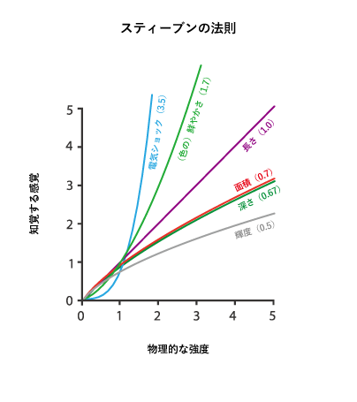

+++
author = "Yuichi Yazaki"
title = "スティーヴンスのべき法則(Stevens’ power law)"
slug = "stevens-power-law"
date = "2020-03-07"
categories = [
    "technology"
]
tags = [
    ""
]
image = "images/1_Y5WnsJQi9dPl2C-9LMtCpg.png"
+++

1975年に発表された論文で、スタンレー・スミス・スティーブンス(Stanley Smith Stevens)は、「物理的刺激の大きさ」と「その知覚される強度」との間の関係は、べき乗関数に従うことを示しました。

<figure>

<figcaption>

“Visualization Analysis and Design. Tamara Munzner, with illustrations by Eamonn Maguire. A K Peters Visualization Series, CRC Press, 2014.” 翻訳は筆者。

</figcaption>

</figure>

_S=I_**ⁿ**

Sは知覚された感覚、Iは物理的な強さを、nは感覚の種類の応じて異なる指数です。

最小は輝度の場合で0.5の線形を、最大は電流の場合で3.5の線形をとります。たとえば、視覚的な長さが1.0であり、実際と認知の差が限りなくない状態です。

それ以上に小さい指数では実際よりも過小評価し、それ以上に大きい指数では実際よりも過大評価するということになります。

つまり、面積・奥行き・輝度については実際よりも過小評価し、彩度や電気ショックについては実際よりも過大評価するということになります。

データを可視化する際、こういった人間の持つ認知の特徴を考慮する必要があります、ということを示すために、データ可視化系の文献ではよく参照される法則ですが、手法に疑問を呈する声もあるようです。

- [Psychophysics : introduction to its perceptual neural and social prospects / S. S. Stevens](https://www.researchgate.net/publication/44556872_Psychophysics_introduction_to_its_perceptual_neural_and_social_prospects_S_S_Stevens)
- [スティーヴンスのべき法則 - Wikipedia](https://ja.wikipedia.org/wiki/%E3%82%B9%E3%83%86%E3%82%A3%E3%83%BC%E3%83%B4%E3%83%B3%E3%82%B9%E3%81%AE%E3%81%B9%E3%81%8D%E6%B3%95%E5%89%87)
