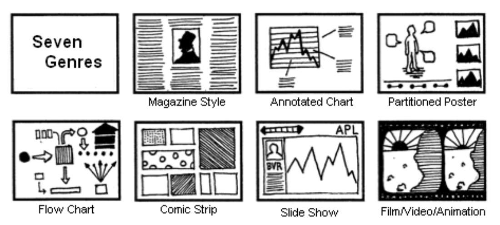
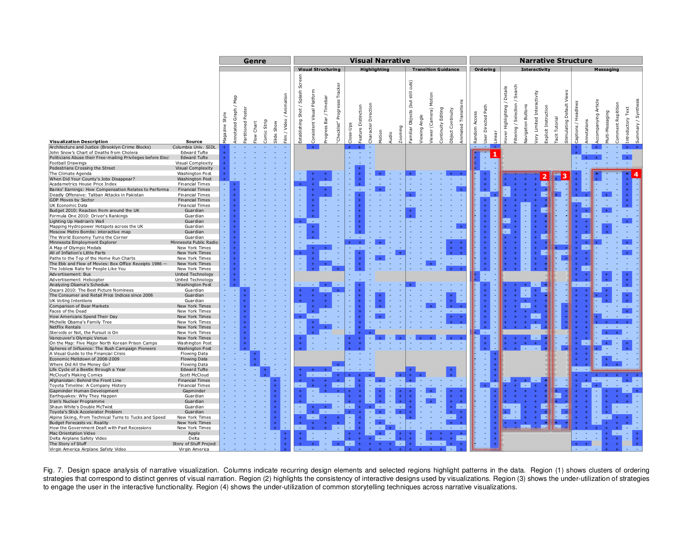

+++
author = "Yuichi Yazaki"
title = "データ・ストーリーテリングの体系化（エドワルド・シーゲルさんの分類）"
slug = "storytelling-edwardsiegel"
date = "2019-10-28"
categories = [
    "dj","technology"
]
tags = [
    "",
]
image = "images/Genres-of-Narrative-Visualization.png"
+++

データの視覚化がもたらす「データ・ストーリーテリング」は、従来の形式のストーリーテリングとは重要な点で異なるのではないか、と主要作品を分類するなかから体系化を試みた2010年の論文をご紹介します。そして、様々な切り口が登場しながらもそれらの関連付けがやや複雑かつ曖昧ですので、分類の枠組みとして参考にする程度がよいでしょう。引用する図版はすべて下記リンク先の論文からのものです。

- [http://vis.stanford.edu/files/2010-Narrative-InfoVis.pdf](http://vis.stanford.edu/files/2010-Narrative-InfoVis.pdf)

この体系化は大きくわけて3つ、（1）ジャンル（Genre）（2）「視覚的な物語」の戦術（Visual Narrative）、（3）「物語構造」の戦術（Narrative Structure）の機能区分（切り口）から成り立っています。

### (1)ジャンル

<figure>

<figcaption>

物語可視化のジャンル

</figcaption>

</figure>

視覚的な物語タイプを分類したもので、主に（a）フレームの数（時間および/または空間で多重化された個別の視覚シーン）の数、（b）視覚要素の順序、がジャンルごとに異なる、としています。また排他的ではない（一つの作品が複数のジャンルに該当することもある）とのこと。

### (2)「視覚的な物語」の戦術（Visual Narrative）

物語を支援し促進する視覚デバイスを特定します。

#### 視覚的構造化（Visual Structuring）

- Establishing Shot / Splash Screen
- Consistent Visual Platform
- Progress Bar / Time bar
- “Checklist” Progress Tracker

#### 強調表示（Highlighting）

- Close-Ups
- Feature Distinction
- Character Direction
- Motion
- Audio
- Zooming

#### トランジションのガイダンス（Transition Guidance）

- Familiar Objects (but still cuts)
- Viewing Angle
- Viewer (Camera) Motion Continuity Editing
- Object Continuity
- Animated Transitions

### （3）「物語構造」の戦術（Narrative Structure）

物語を支援や促進する非視覚的なメカニズムを特定しています。

#### 順序付け（Ordering）

- Random Access
- User Directed Path
- Linear

#### 対話性（Interactivity）

- Hover Highlighting / Details
- Filtering / Selection / Search
- Navigation Buttons
- Very Limited Interactivity
- Explicit Instruction
- Tacit Tutorial
- Stimulating Default Views

#### メッセージング（Messaging）

- Captions / Headlines
- Annotations
- Accompanying Article
- Multi-Messaging
- Comment Repitition
- Introductory Text
- Summary / Synthesis

### 以上の体系化を元に分析

オンラインジャーナリズム（71％）、ビジネス（20％）、および視覚化調査（9％）から収集された58の例を元に分析したものが以下のチャートです。

#### 現在足りていない要素は？

その上で論文では、2010年現在での作品において、不足しているデータストーリーテリングの要素を特定しています。最初の図版の（1）〜（４）の赤い矩形の箇所になります。

  （1）は、視覚ナレーションの異なるジャンルに対応する順序付け戦略のクラスターを示しています。

  （2）は、視覚化で使用されるインタラクティブなデザインの一貫性を強調しています。

  （3）は、ユーザーが対話型機能に関与するための戦略が十分に活用されていないことを示しています。

  （4）は、物語の視覚化における一般的なストーリーテリングテクニックの活用不足を示しています。

### 作者ドリブン vs 読者ドリブン

さきほどの体系化を受けて、作者ドリブン vs 読者ドリブンという切り口も提示されています。

#### 作者ドリブン

視覚化を厳密に直線的に進め、メッセージングに大きく依存し、インタラクティブ性は含まれません。  
・例：フィルム、非インタラクティブなスライドショー  
・タスク：ストーリーテリングまたは効率的なコミュニケーション

#### 読者ドリブン

規定された順序や、メッセージング、高度なインタラクティブ性はありません。  
・例：TableauやSpotfireなどの視覚分析ツール  
・タスク：データ診断、パターン検出、仮説形成

### 作者・読者ドリブンのどちらが優先されるかで、アプローチを3つに分類

#### マティーニ・グラス型

作者主導の物語が最初に機能し、次に読者主導の対話が個別に続きます。

#### インタラクティブ・スライドショー型

一般的なスライドショー形式に従いますが、各スライドの範囲内でのナレーションの中間的なインタラクションを取り入れています。作成者主導型と読者主導型のアプローチのよりバランスのとれた、物語の中期的な対話を可能にします。

#### ドリルダウン・ストーリー型

読者主導のアプローチに重点を置いており、ユーザーがストーリーをいつどのように伝えるかを決定できるようにします。
