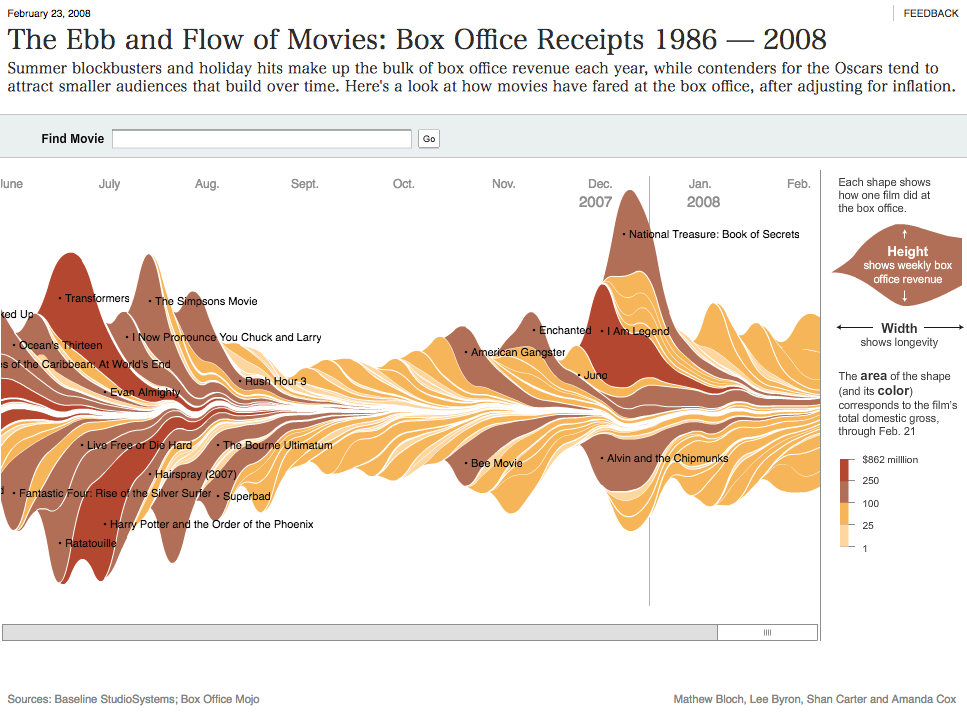
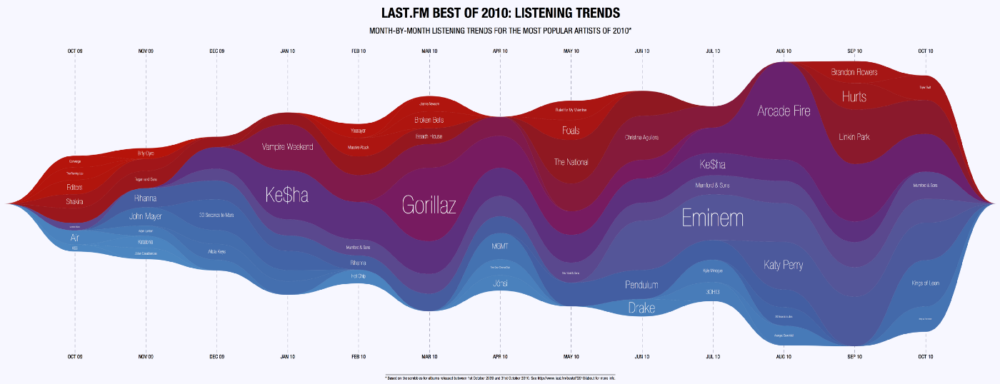
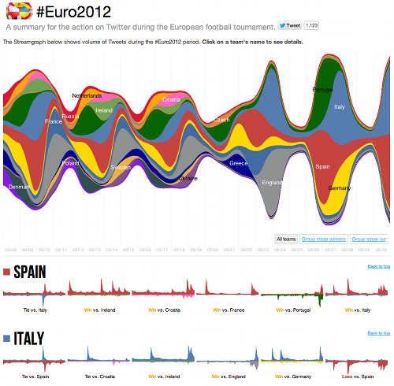
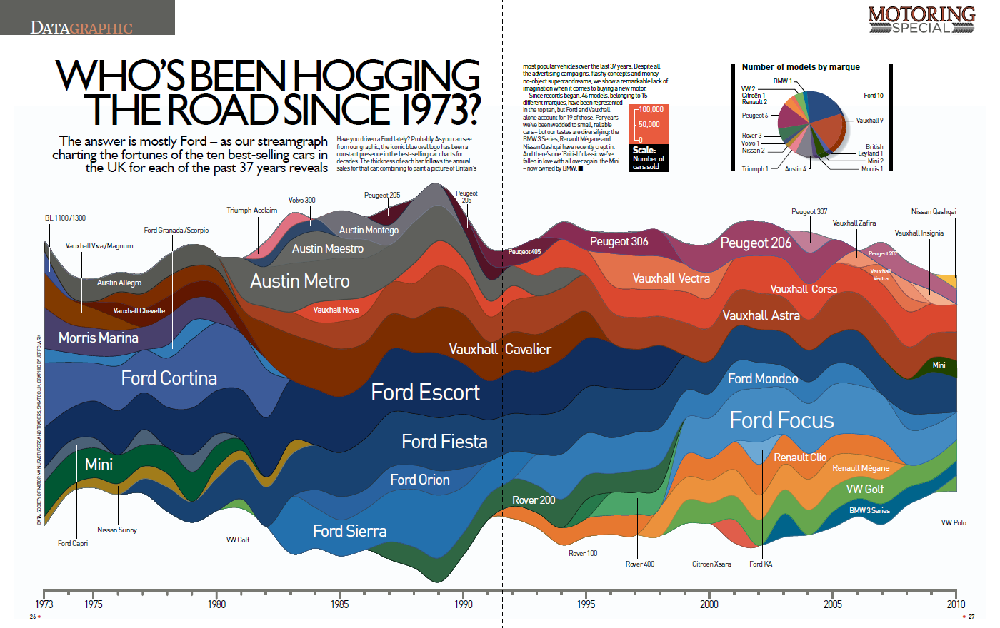
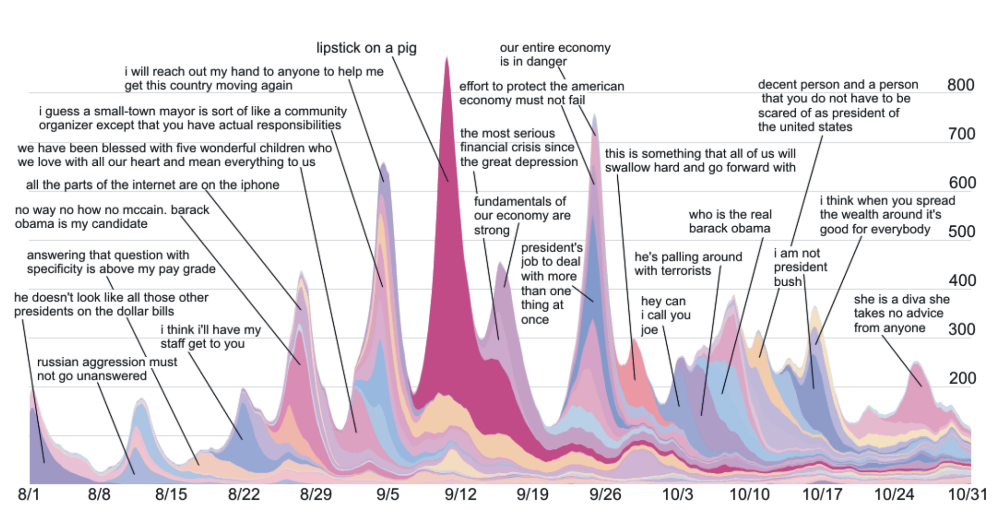

+++
author = "Yuichi Yazaki"
title = "ストリームグラフ（Streamgraph）"
date = "2020-07-07"
description = ""
categories = [
    "chart"
]
tags = [
    "",
]
image = "1_8-t2eXWZyBAQ90tCjZEfvA.png"
+++

aaa

<!--more-->

## 作例

### 「映画の辺境と流れ：ボックスオフィスの領収書 1986–2008」

[The Ebb and Flow of Movies: Box Office Receipts 1986–2008](http://archive.nytimes.com/www.nytimes.com/interactive/2008/02/23/movies/20080223_REVENUE_GRAPHIC.html)

### Stream graph of the most-played music month-by-month

[Stream graph of the most-played music month-by-month](http://blog.last.fm/2010/12/16/the-data-behind-best-of-2010)

### What A Hundred Million Calls to 311 Reveal About New York

[What A Hundred Million Calls to 311 Reveal About New York](https://www.wired.com/2010/11/ff_311_new_york/all/1/)

### 年代・性別・人種別一日の過ごし方

[How Different Groups Spend Their Day](https://archive.nytimes.com/www.nytimes.com/interactive/2009/07/31/business/20080801-metrics-graphic.html)

### Euro 2012 Streamgraph B-sides

[Euro 2012 Streamgraph B-sides](http://philogb.github.io/blog/2012/07/02/euro2012-streamgraph-bsides/)

### Top Ten Cars in the UK

[Top Ten Cars in the UK](https://www.neoformix.com/2011/TopTenCarsUK.html)

### ミームトラッキングとニュースサイクルのダイナミクス

[Meme-tracking and the Dynamics of the News Cycle](http://learning.mpi-sws.org/networks-seminar/papers/kdd09-quotes.pdf)

## 誰が作ったのか？

Susan Havreらが2000年に出願登録したThemeRiverという名称で論文を発表しています。

- [ThemeRiverTM*: In Search of Trends, Patterns, and Relationships](http://www.ifs.tuwien.ac.at/~silvia/wien/gwa/ws05/articles/Havre-InfoVis1999.pdf)

それとは別に、last.fmのユーザー・リスニング履歴を制作したLee ByronとMartin Wattenbergによって、2008年に書かれた論文が存在します。

- Stacked Graphs – Geometry & Aesthetics

- [Stacked Graphs – Geometry & Aesthetics](http://leebyron.com/streamgraph/stackedgraphs_byron_wattenberg.pdf)

現在はストリームグラフ（Streamgraph）と呼ばれることが一般的です。

